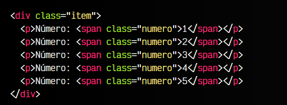

# 
¿Qué es JavaScript?

Cualquier página web de Internet está construída, como mínimo, por HTML (un lenguaje de marcas) y CSS (un lenguaje de estilos). El primero de ellos permite construir todo el marcado de la página (contenido e información) mediante etiquetas HTML y dotándo de semántica a la información mediante la naturaleza de dichas etiquetas. Posteriormente, el segundo de ellos permite darle estilo a la página y construir una interfaz visual más agradable para el usuario.

La separación bien marcada de estos dos pilares permite que si en algún momento necesitamos modificar la información (o el diseño) de la página, no tengamos también que lidiar con modificaciones en el otro.

Sin embargo, utilizar sólo y exclusivamente HTML y CSS en una página nos limita considerablemente. Si bien es cierto que con estos dos lenguajes podemos hacer un gran abanico de cosas, hay otras que serían totalmente imposibles, o al menos, mucho más fáciles de realizar si tuvieramos un lenguaje de programación a nuestra disposición. Y en este punto es donde aparece Javascript

avascript es un lenguaje de programación, o lo que es lo mismo, un mecanismo con el que podemos decirle a nuestro navegador que tareas debe realizar, en que orden y cuantas veces (por ejemplo).

Muchas de las tareas que realizamos con HTML y CSS se podrían realizar con Javascript. De hecho, es muy probable que al principio nos parezca que es mucho más complicado hacerlo con Javascript, y que por lo tanto no merece la pena. Sin embargo, con el tiempo veremos que Javascript nos ofrece una mayor flexibilidad y un abanico de posibilidades más grande, y que bien usadas, pueden ahorrarnos bastante tiempo.

Para comprenderlo, un ejemplo muy sencillo sería el siguiente:

Imaginemos que tenemos que crear una lista de números desde el 1 hasta el 500. Hacerlo solamente con HTML sería muy tedioso, ya que tendríamos que copiar y pegar esas filas varias veces hasta llegar a 500. Sin embargo, mediante Javascript, podemos decirle al navegador que escriba el primer párrafo 
, que luego escriba el mismo pero sumándole uno al número. Y que esto lo repita hasta llegar a 500.

De esta forma y con este sencillo ejemplo, con HTML habría que escribir 500 líneas mientras que con Javascript no serían más de 10 líneas.

## Dificultad.
Aunque Javascript es ideal en muchos casos, es mucho más complicado aprender Javascript (o un lenguaje de programación de propósito general) que aprender HTML o CSS, los cuales son mucho más sencillos de comprender (o al menos, su base y fundamentos).

Antes de continuar debemos conocer varias detalles:

   - Para aprender Javascript debemos conocer el lenguaje Javascript, pero no podremos hacerlo si no sabemos programar. Se puede aprender a programar con Javascript, pero es recomendable tener una serie de fundamentos básicos de programación antes para que no nos resulte muy duro.

   - Para aprender a programar antes debemos saber como «trabaja una máquina». Programar no es más que decirle a una máquina que cosas debe hacer y como debe hacerlas. Eso significa que no podemos pasar por alto nada, o la máquina lo hará mal.

   - Para darle órdenes a una máquina debemos tener claro que esas órdenes son correctas y harán lo que se supone que deben hacer. Si le indicamos a una máquina los pasos para resolver un problema, pero dichos pasos son erróneos, la máquina también hará mal el trabajo.
  
Dicho esto, es necesario tener presente que aprender a programar es una tarea que no ocurre de un día para otro. Requiere tiempo, esfuerzo, acostumbrarse a cambiar la forma de pensar y practicar mucho.

   - Puedes copiar un programa en segundos, pero eso no significa que lo entiendas.
   - Puedes comprender un programa en minutos, pero eso no significa que lo puedas crear.
   - Puedes crear un programa en horas, pero eso no significa que sepas programar.
   - Puedes aprender a programar en semanas, pero eso no significa que no cometas errores.
   - Puedes aprender a programar bien y sin demasiados errores en meses.

Pero dominar la programación es una tarea que requiere años.

Si nunca has programado hasta ahora, te aconsejo que antes de continuar, te leas los fundamentos y bases de programación. Teniéndolos claros, te resultará mucho más fácil entender luego Javascript.
