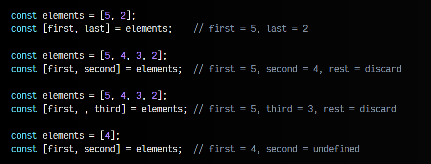
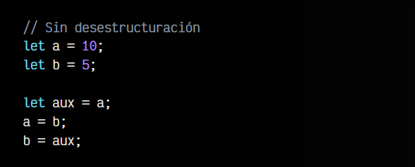
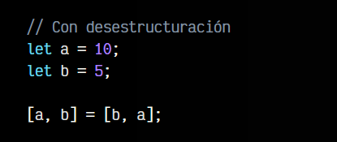
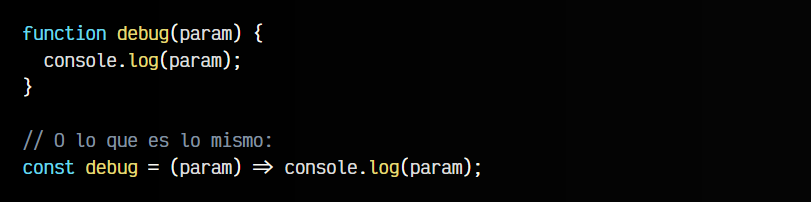
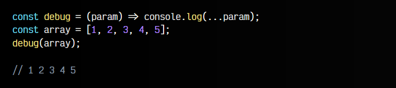
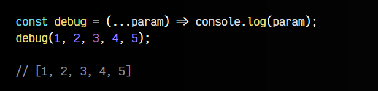
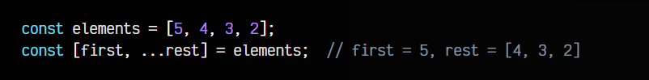
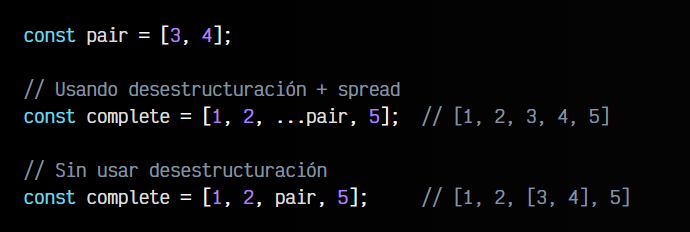

# 
Desestructuración de arrays.

Existe un concepto en Javascript denominado desestructuración. Si no estás familiarizado con esta palabra, puede ser compleja de entender, pero como su propio nombre indica, se trata de desestructurar, es decir, separar una estructura, que en Javascript es o un array o un objeto.

Empecemos por las más sencillas, que son las operaciones de desestructuración de arrays. En los siguientes ejemplos vamos a separar elementos de un array y sacarlo a variables individuales.

## Destructuración básica.
Observa los siguientes ejemplos:

En el primer caso, bastante obvio, extraemos el primer y segundo valor del array elements en una variable denominada first y otra llamada last.

En el segundo caso, hacemos lo mismo en las variables first y second, pero como el array tiene más elementos y sólo hemos indicado dos variables (first y second), el resto son descartadas.

En el tercer caso pasa muy parecido, excepto que en el segundo parámetro de la parte izquierda, no colocamos ningún elemento, por lo tanto, ese dato se descartará.

En el cuarto caso, nos pasa al contrario, y hay menos elementos que variables, por lo que first toma el primer (y único) elemento y second se queda sin ningún valor (obtiene el valor undefined).

El truco en estos cuatro casos está en que en la parte derecha utilizamos los [] para indicar que se trata de un array, pero en la parte izquierda los utilizamos para indicar que hacemos una desestructuración.

## Intercambio de variables.
Veamos otro ejemplo donde utilizamos la desestructuración. En este caso, haremos un clásico intercambio de variables, donde el valor inicial de a debe estar en b y viceversa. Sin utilizar desestructuración, debemos utilizar una variable auxiliar aux donde guardar uno de los valores temporalmente, mientras hacemos el cambio de variables:

Sin embargo, si utilizamos desestructuración, este ejemplo es mucho más sencillo:

Utilizamos la misma estrategia explicada en el apartado anterior, sólo que en este caso los arrays sólo se están utilizando para hacer la operación de una sola vez, lo único que termina existiendo son las variables a y b.

## Spread/rest (...).
Aunque es una funcionalidad individual, el spread / rest se suele utilizar mucho con la desestructuración y resulta un sistema muy cómodo y versátil en Javascript.

## Spread (Expandir).
Para explicar el spread vamos a crear una función muy sencilla e ilustrar el ejemplo. Dicha función se llamará debug() y recibirá un parámetro param, el cuál se imprimirá por consola mediante un console.log():

Como ves, muy sencillo. Sin embargo, vamos a hacer un pequeño cambio, primero en el param que pasamos por parámetro a la función, y luego en otro ejemplo, en el param que utilizamos en el console.log(), en el cuerpo de la función.

En primer lugar, colocaremos los ... en el param del console.log():

Analicemos lo que ha ocurrido. Le hemos pasado un array de 5 elementos a la función debug() la cuál ha desestructurado el array y lo ha expandido en elementos individuales (observa como lo devuelve).

## Rest (Agrupar).
Sin embargo, veamos en el siguiente ejemplo, como colocamos los ... en los parámetros de la función. Luego, al llamar a la función debug() le pasamos los 5 datos individuales:

En este caso, el ...param está agrupando esas 5 variables en un array.

Si aún no lo vemos claro, repasemos uno de los primeros ejemplos de este artículo. Ahora vamos a hacer una pequeña modificación para utilizar los ... en modo rest (agrupación de varios elementos individuales, en un array):

Observa que el primer elemento del array se guarda en la variable first, sin embargo, el resto de valores, se almacena en la variable rest y se agrupa en un array, de modo que rest contiene el array [4, 3, 2].

## Reestructuración de arrays.
Aprovechando estas características que hemos visto de desestructuración, también podríamos aprovecharlas para reestructurar un array y recrear arrays. Veámoslo con un ejemplo.

Tenemos un array de 2 elementos [3, 4] y queremos aprovecharlo para crear un nuevo array del 1 al 5. Vamos a hacer uso de la desestructuración para reaprovecharlo:

En este caso, tendríamos que complete es el nuevo array [1, 2, 3, 4, 5] que buscábamos si usamos la desestructuración, pero ten en cuenta que si no utilizaramos el ... previo al pair, conseguiríamos algo muy diferente: [1, 2, [3, 4], 5].

