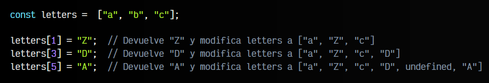

# 
¿Qué es un Array en Javascript?.

A medida que trabajamos en nuestro código, se hace necesario agrupar valores en una misma variable, para representar conjuntos de datos con cierta relación entre sí. Para ello, tenemos la opción de crear objetos, o unas variables más sencillas llamadas arrays.

## ¿Qué es un array?.

Un ARRAY es una colección o agrupación de elementos en una misma variable, cada uno de ellos ubicado por la posición que ocupa en el array. En algunas ocasiones también se les suelen llamar arreglos o vectores. En Javascript, se pueden definir de varias formas:

Por ejemplo, podríamos tener un array que en su primera posición tenemos el STRING 'a', en la segunda el STRING 'b' y en la tercera el STRING 'c'. En Javascript, esto se crearía de esta forma:

Al contrario que muchos otros lenguajes de programación, Javascript permite que se puedan realizar arrays de tipo mixto, no siendo obligatorio que todos los elementos sean del mismo tipo de dato.

OJO: Al crear un array con new Array(size) hay varios matices que merece la pena mencionar. Lo primero, si sólo se indica un parámetro numérico size, Javascript creará un array vacío de size elementos. Es decir, no es lo mismo que const a = [3], donde creamos un array con un elemento 3. Por otro lado, new Array(size) realmente crea un array vacío que aún no ha sido rellenado con nada (esto hace que sea más óptimo para arrays grandes) y aunque es equivalente, no es exactamente igual new Array(3) que [undefined, undefined, undefined].

## Acceso a elementos del array.
Al igual que los STRING, saber el número elementos que tiene un array es muy sencillo. Sólo hay que acceder a la propiedad .length, que nos devolverá el número de elementos existentes en un array:

Veamos como funcionan.

## El operador [].
Por otro lado, si lo que queremos es acceder a un elemento específico del array, no hay más que utilizar el operador [], al igual que lo podríamos hacer con los STRING para acceder a un carácter concreto. En este caso, accedemos a la posición del elemento que queremos recuperar sobre el array:

Recuerda que las posiciones empiezan a contar desde 0 y que si intentamos acceder a una posición que no existe (mayor del tamaño del array), nos devolverá un UNDEFINED.

El operador [] no sólo nos permite obtener o acceder a un elemento del array, sino que también nos permite modificar un elemento específico del array, si utilizamos la asignación:

## El método .with().
Ten en cuenta que con el nuevo método .with(), se puede hacer esto de una forma más cómoda y sin modificar el array original. Permite encadenar múltiples operaciones, pero ten en cuenta que sólo modifica, no se pueden añadir elementos que no existen antes en el array:

## El método .at().
Además del clásico operador [], también podemos utilizar el método .at(), añadido en Javascript ES2022. Con él, se puede hacer exactamente lo mismo que con [pos], sólo que además permite valores negativos, mediante los cuales se puede obtener elementos en orden inverso, es decir, empezando a contar desde el último elemento:

Esta característica hace que acceder al último elemento (o cercanos) sea bastante práctico, ya que hacer la misma operación con el operador [] era algo menos directo que en algunos casos se podría volver confuso o poco intuitivo:

El soporte del método .at() es muy bueno en navegadores actuales:

## Añadir o eliminar elementos.
Existen varias formas de añadir elementos a un array ya existente. Ten en cuenta que en todos estos casos estamos mutando (variando los elementos del array ya existente). Veamos los métodos que podemos usar para ello:

⚠️ Recuerda que estos métodos sirven para modificar (mutar) el array original.

En los arrays, Javascript proporciona métodos tanto para insertar o eliminar elementos por el final del array, como por el principio:

   - Los métodos .push() y .pop() actuan al final del array.
   - Los métodos .unshift() y .shift() actuan al inicio del array.

Veámoslos en acción:

Salvo por esto, funcionan exactamente igual. Los métodos de inserción .push() o .unshift() insertan los elementos pasados por parámetro en el array y devuelve el tamaño actual que tiene el array después de la inserción. Por otro lado, los métodos de extracción, .pop() o .shift(), extraen y devuelven el elemento extraído.

## Alternativas para crear arrays.
Aunque hemos visto las formas principales de crear un ARRAY en Javascript, existen otras que permiten generar ARRAY un partiendo de otras (y muy variadas) estructuras de datos.

Algunos de estos casos son los siguientes:

Vamos a analizar cada uno de estos métodos y poner algunos ejemplos.

## Convertir a array.
El método estático Array.from(), aunque ahora quizás no le encontremos mucha utilidad, nos resultará muy interesante más adelante. Este método se suele utilizar para convertir variables «parecidas» a los arrays (pero que no son arrays) en un ARRAY. Este es el caso de variables como Strings o de NODELIST lista de elementos del DOM:

Como se puede ver, es algo muy similar a lo que hacemos con la desestructuración de arrays. Pero no todos los elementos se pueden convertir a arrays. Por ejemplo, si intentamos convertir un undefined o un null, nos dará un error similar a Uncaught TypeError: null is not iterable.

De forma opcional, Array.from(obj) puede recibir un parámetro adicional: una función que actuará de forma idéntica a una función map(). Veamos el funcionamiento:

Observa que en este caso, la función pasada por segundo parámetro del Array.from() se ejecutará por cada uno de los elementos de text, y en este caso concretamente, la función (number) => Number(number) fuerza a convertir cada elemento en un número. La diferencia respecto al ejemplo anterior, es que en este caso obtienes un array de números, mientras que el anterior obtenías un array de textos.

## Concatenar arrays.
Al igual que en los STRING, en los ARRAYS tenemos el método concat(), que nos permite unir los elementos pasados por parámetro en un array a la estructura que estamos manejando. Se podría pensar que los métodos .push() y concat() funcionan de la misma forma, pero no es exactamente así. Veamos un ejemplo:

Ahora veamos el mismo ejemplo realizado con el método .concat():

Observa un detalle muy importante: El método concat(), a diferencia de push(), no modifica el array sobre el cuál trabajamos y al que le añadimos los elementos, sino que simplemente lo devuelve. Al margen de esto, observa que en el caso de pasar un array por parámetro, push() lo inserta como un array, mientras que concat() inserta cada uno de sus elementos.

También hay que tener cuidado al utilizar el operador + con los arrays. A diferencia de lo que quizás puede parecer intuitivo, utilizando este operador no se añaden los elementos al array, sino que se convierten los arrays en string y luego se concatenan. Veremos más sobre estas conversiones implícitas en temas posteriores.

## Separar y unir strings.
Además, también tenemos otro método con el que es posible crear un ARRAY a partir de un STRING. Se trata del método .split() que vimos en el tema de los STRING. En este caso, el método .join() es su contrapartida. Con .join() podemos crear un STRING con todos los elementos del array, separándolo por el texto que le pasemos por parámetro:

Ten en cuenta que, como se puede ver en los ejemplos, .join() siempre devolverá los elementos como STRING, mientras que .split() devolverá un ARRAY.

Observa un caso especial, en el que pasamos un cadena de texto STRING vacía al .split():

En este caso, le hemos pedido dividir el STRING sin indicar ningún separador, por lo que Javascript toma la unidad mínima como separador: nos devuelve un ARRAY con cada carácter del STRING original. Ten en cuenta que los espacios en blanco también cuentan como carácter.

 