# 
¿Qué es un Map?.

Los Map en Javascript son estructuras de datos nativas que permiten implementar una estructura de tipo mapa, es decir, una estructuras donde tiene valores guardados a través de una clave para identificarlos. Comúnmente, esto se denomina pares clave-valor.

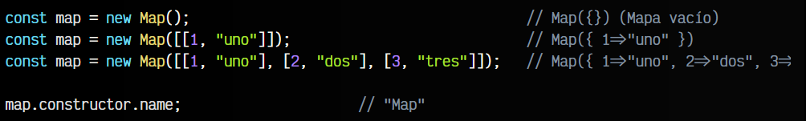

En este ejemplo, creamos un elemento map, que no es más que un mapa de pares clave-valor. El primer map se define como un mapa vacío, el segundo, es un mapa con un solo elemento, y el tercero con 3 elementos. Para inicializar los mapas con datos, se introduce como parámetro un array de entradas (un array de arrays), que en nuestro tercer caso tiene estas combinaciones:

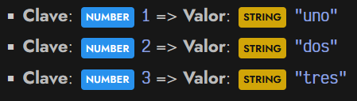

Por lo tanto, si consultamos map con la clave 2, nos devolverá un STRING "dos".

## ¿Qué son los Map?.
Los tipos de dato Map son muy similares a los Objetos de Javascript, ya que estos últimos se pueden usar como estructuras de diccionario mediante pares clave-valor. Sin embargo, los Object tienen algunas diferencias como que pueden colisionar algunos nombres de claves o que las claves deben ser o , entre varias otras.

Una estructura de tipo Map tiene las siguientes propiedades STRING o SYMBOL métodos:

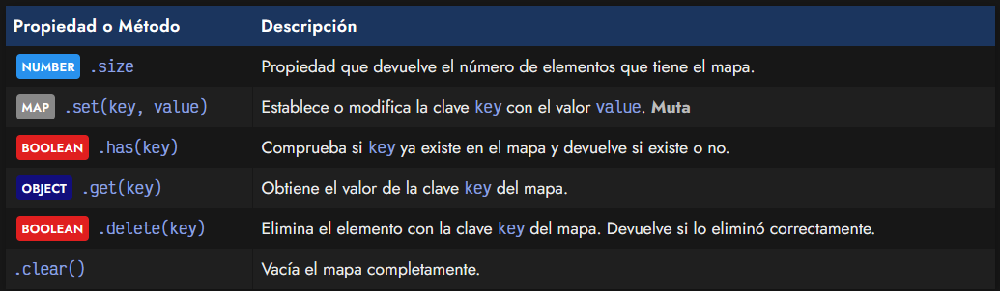

Vamos a analizar los diferentes métodos y propiedades que tienen los mapas.

## Propiedad size.
Si quieres saber cuántos elementos tiene un mapa, puedes utilizar la propiedad .size, que funciona de forma muy similar al .length de los array, por ejemplo.

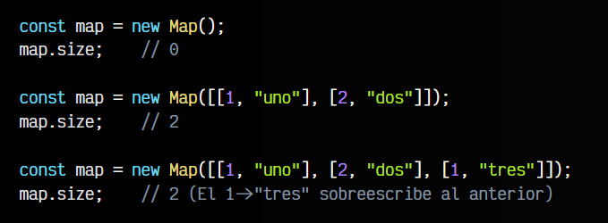

Observa que si introducimos un nuevo par clave-valor que tiene la misma clave que otro (tenemos dos que comparten la clave 1), se sobreescribirá. No pueden existir dos pares clave-valor con la misma clave.

## Métodos.
Veamos ahora los diferentes métodos que tienen las estructuras de conjuntos Map.

## Establecer elementos (set).
El método .set() fija un par clave-valor en el mapa. Observa que hay un pequeño matiz muy importante de diferencia entre el concepto «añadir» (.add()) y el concepto «establecer» o «fijar» (.set()):

   - Si usamos .set() para una clave que no existe, se añade al mapa.
   - Si usamos .set() para una clave que ya existe, la sobreescribe.

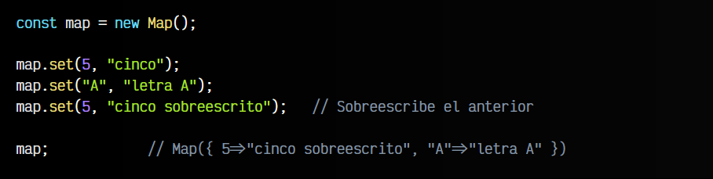

Ten en cuenta que al contrario que los OBJECT, los MAP pueden utilizar como clave cualquier tipo de dato. En el caso de los OBJECT debes utilizar un STRING o un SYMBOL.

## Comprobar si existen (has).
Para comprobar si un elemento existe en un mapa, se debe hacer a través de su clave, y se utiliza el método .has().Este método devuelve un BOOLEAN, por lo que si existe la clave, nos devolverá true, y en caso contrario, nos devolverá false.

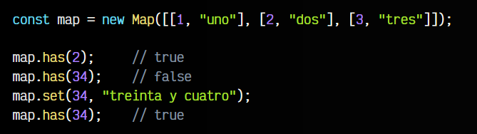

Recuerda que si estás utilizando tipos de datos más complejos como OBJECT o ARRAY, deberías tenerlos almacenados en una variable, ya que si los creas al momento de pasarlos por parámetro, estarás pasando su referencia, y podrían no ser los mismos objetos aunque los escribas exactamente igual.

## Borrar elementos (delete).
Si necesitamos borrar algún elemento del mapa, lo podemos hacer mediante el método .delete(). Devuelve un BOOLEAN a true si lo consigue eliminar, en caso contrario, devolverá false.

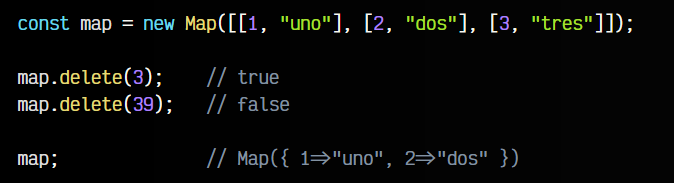

## Vacíar conjunto (clear).
Por último, utilizando el método .clear() borraremos todos los elementos del mapa, dejándolo vacío. Este método no devuelve nada.

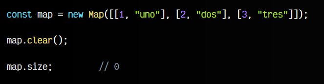

## Convertir a Arrays.
Si tenemos claro el proceso de desestructuración, podemos convertir los Map en ARRAY o incluso en OBJECT de forma muy sencilla. Eso sí, antes te recomiendo mirarte el artículo de [Iteradores en Objetos](https://lenguajejs.com/javascript/objetos/iteradores/)

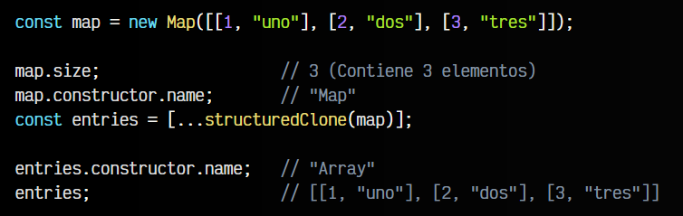

Recuerda utilizar structuredClone() para clonar la estructura si tiene elementos anidados, ya que sino sólo realizará una copia superficial y utilizará referencias para los elementos anidados.

Este array de entradas que nos da como resultado, lo podríamos utilizar para crear un nuevo map, o incluso un objeto:

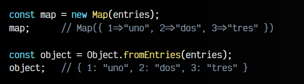

Aún así, recuerda que habría ciertos Map que quizás podrían dar conflictos al pasar a objeto, como por ejemplo, si tienes una clave toString. Más adelante comentaremos las diferencias.

## ¿Qué son los WeakMap?.
Al igual que ocurre con los Set y los WeakSet, con los Map tenemos una estructura denominada WeakMap. La idea es la misma: se trata de una estructura derivada, muy similar a los Map, pero con algunas diferencias.

## Diferencias con los Map.
Al margen de algunas diferencias que detallaremos más adelante, la diferencia principal de los Map con los WeakMap es que estos últimos, no permiten utilizar tipos primitivos (BOOLEAN, STRING , NUMBER) como clave, mientras que el Map si lo permite:

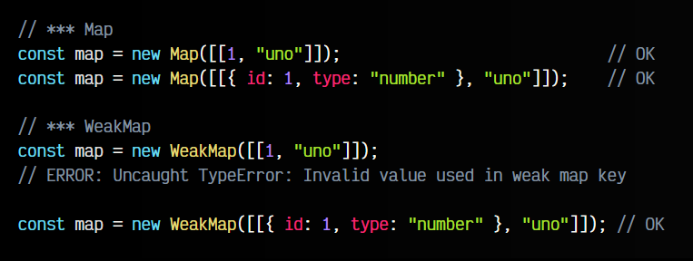

La razón de utilizar WeakMap en lugar de Map, es porque los primeros utilizan referencias débiles a un objeto, o lo que es lo mismo, si ese objeto no se utiliza (no está referenciado) en ninguna otra parte del código, se eliminará del WeakMap automáticamente y en cuanto el Garbage Collector (Recolector de basura) lo decida, lo borrará de memoria.

## Tabla de resumen de diferencias.
A continuación, una tabla resumen de las diferencias entre Map, WeakMap y Object:

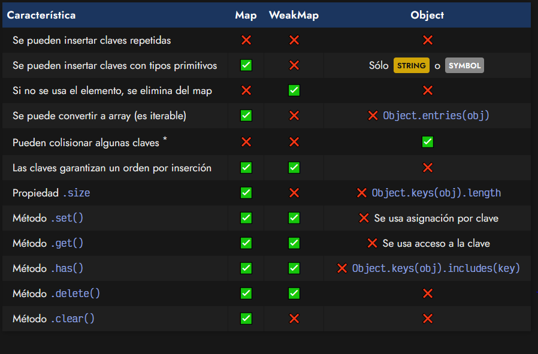

Respecto a lo que se menciona de que pueden colisionar algunas claves, es debido a que los OBJECT comparten claves y propiedades del objeto, ya que se trata de una estructura de datos que mezcla propiedades, métodos y los datos del elemento. Sin embargo, en el caso de los maps, se separa la API de la estructura de los datos almacenados.

Observa el siguiente ejemplo:

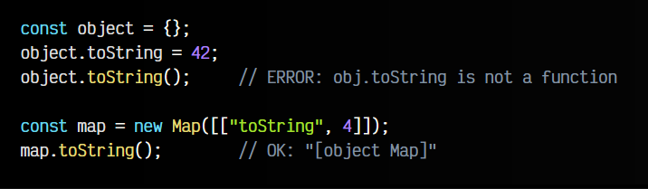

Aquí se puede ver, como almacenando una propiedad llamada toString en el objeto, colisiona con el método ya existente .toString(), sobreescribiéndolo y dando problemas a la hora de convertir el objeto a STRING. Sin embargo, con los MAP no hay problema.

