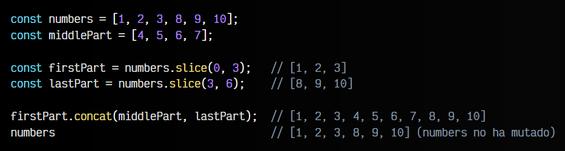

# 
Modificar o crear subarrays

Hay situaciones en las que tenemos un ARRAY y queremos crear nuevos subarrays, es decir, un pequeño fragmento del ARRAY original, o simplemente modificar el array original para hacer ciertos cambios, pero de una forma más general y no tener que hacerlo elemento a elemento.

## Crear fragmentos.
Para ello, existen varios métodos relacionados, entre los que se encuentran los siguientes:

   - ✅ El array original está seguro (no muta).
   - ⚠️ El array original cambia (muta).

Vamos a ir explicándolos uno por uno.

## El método .slice().
El método .slice() devuelve los elementos del array desde la posición start hasta la posición end, permitiendo crear un nuevo array más pequeño con ese grupo de elementos. Recuerda que las posiciones empiezan a contar desde 0. En el caso de que no se proporcione el parámetro end, se devuelven todos los elementos desde la posición start hasta el final del array.

Observa que en el primer caso, al indicar un sólo parámetro, end es la posición del último elemento del array. En el último caso, al indicar un parámetro negativo, se empieza a contar desde el final. Recuerda que en todo momento, el ARRAY original letters no sufre modificaciones.

## El método .toSpliced() o .splice().
Por otro lado, el método .splice() realiza algo parecido a .slice(). Veamos las diferencias antes de continuar:

   - Método .slice(): Obtiene un subarray desde una posición inicial a una final
   - Método .splice(): Obtiene un subarray desde una posición inicial, con un tamaño concreto

⚠️ El método .splice() tiene una gran diferencia respecto al anterior: muta el array original.

Observa que el método .splice(), en su segundo parámetro, size no es la posición final del subarray (como ocurre con slice), sino el tamaño del subarray final, es decir, el número de elementos que se van a obtener desde la posición start:

Es decir, con el método .splice() devolvemos ARRAY un con los elementos eliminados desde la posición start hasta la posición start + size. Por otro lado, el array original muta y se eliminan dichos elementos.

Si no queremos mutar el array original, podemos utilizar .toSpliced(), que es un método nuevo que funciona de forma muy similar a .spliced(), pero sin alterar el array original. Mucho cuidado a la hora de utilizarlo como reemplazo, ya que este método devuelve como queda el array final, pero no devuelve lo que hemos extraído.

Observa como funciona en este fragmento de código:

En ambos métodos, es posible también indicar una serie de parámetros opcionales después de los mencionados, que permitirán además de la extracción de elementos, insertar dichos elementos justo donde hicimos la extracción.

## Diferencias entre .slice() y .splice().
Veamos un ejemplo ilustrativo para entender bien la diferencia entre ambos:

Observa que en el último caso de .splice(), además de extraer elementos, se insertan nuevos elementos. A raíz de este último ejemplo, mencionar que también podemos insertar elementos en una posición concreta del array de dos formas alternativas:

    Utilizando .slice() y .concat() (no se muta el array original)
    Utilizando .splice() y desestructuración (se muta el array original)

Veamos un ejemplo de cada forma, primero, utilizando .slice() y .concat():

Ahora, otro ejemplo, utilizando .splice() y desestructuración. Ten en cuenta que el resultado en esta ocasión lo tendremos en la constante numbers:

Como se puede ver, se ha hecho la misma operación de dos formas diferentes.

## Alterar fragmento con .copyWithin().
Es posible tener un array al que queremos hacer ciertas modificaciones donde .slice() y .splice() se quedan cortos (o no resultan cómodos). Veamos algunos métodos introducidos en ECMAScript ES2015 que nos permiten crear una versión modificada de un array:

El primero de ellos, copyWithin(pos, start, end) nos permite alterar el array, de modo que, empezando en la posición pos, copiará los elementos que están desde la posición start hasta la posición end. El parámetro end es opcional, de modo que si no se indica, se asume que end es el tamaño del array.

Veamos algunos ejemplos que alteran sucesivamente el array letters:

Ten en cuenta que la constante letters se va alterando en cada ejecución del método .copyWithin(), ya que no sólo devuelve el array, sino que muta el original. Considera utilizar structuredClone() si quieres crear un nuevo array sin mutar el original: clonar objetos en Javascript.

Algo equivalente a lo anterior, pero sin mutar el array original, ni usar el structuredClone(), podría ser realizar lo siguiente:

   - Obtenemos el fragmento desde la posición 0 hasta la 1, es decir: ["A"]
    Le concatenamos los siguientes fragmentos.
   - Obtenemos el fragmento desde la posición 4 hasta la 6, es decir: ["E", "F"]
   - Obtenemos el fragmento desde la posición 1 más la diferencia entre 6-4 hasta el final: ["D", "E", "F"]

Esta última forma tampoco muta el array original, pero obviamente, es más compleja de escribir.

## Reducir el tamaño de un array.
También, en ciertos casos, nos podría interesar reducir el tamaño de un array para quedarnos con sus primeros elementos y descartar el resto. En el siguiente ejemplo, creamos un nuevo con .slice(). Dicho array es una versión reducida del array original que teníamos en un principio:

Sin embargo, hay una forma muy sencilla y rápida de hacer lo mismo, que es modificar directamente el tamaño del array mediante la propiedad .length. Por ejemplo, hacer un numbers.length = 4 en un array de 8 elementos, reducirá el array a los primeros 4 elementos:

En este último caso no estamos creando un nuevo array, sino que reutilizamos el que ya teníamos, reduciendo su tamaño y descartando el resto de elementos.

## Rellenar un array con .fill().
Existe un método que nos permite rellenar el ARRAY con los elementos indicados. Se le puede indicar unos parámetros opcionales start y end para establecer la posición de inicio y/o fin donde queremos rellenar, y así sólo alterar un fragmento del array.

⚠️ Ten en cuenta que con .fill() estamos alterando el ARRAY.

Veamos algunos ejemplos:

Observa que en el último caso, con new Array(5) creamos un array de 5 elementos undefined y lo rellenamos con números 5 con el método .fill().

También podríamos utilizar un enfoque más funcional y hacer algo similar con el método .map(), uno de los métodos que tienen los ARRAY. La diferencia es que en este caso, no se muta el ARRAY original, y por otro lado, devolvemos el nuevo ARRAY construido:

Si te interesa este enfoque, hablamos sobre ello más adelante, en el tema Array functions.

## Crear modificación con .with().
El nuevo método .with() nos proporciona una forma donde podemos hacer una pequeña modificación en un array, sin que alteremos el original. Observa el siguiente fragmento de código:

Hemos realizado esta tarea en varios pasos y hemos mutado la estructura original. Sin embargo, con el método with() tenemos varias ventajas, ya que podemos realizar la misma tarea de una sola vez, sin mutar el array original. De hecho, podemos incluso encadenar múltiples llamadas a .with() y realizar varios cambios, como se ve en la segunda parte:

Lo importante de usar .with() es que el array original no muta y permanece intacto, simplemente se crea un nuevo array.

