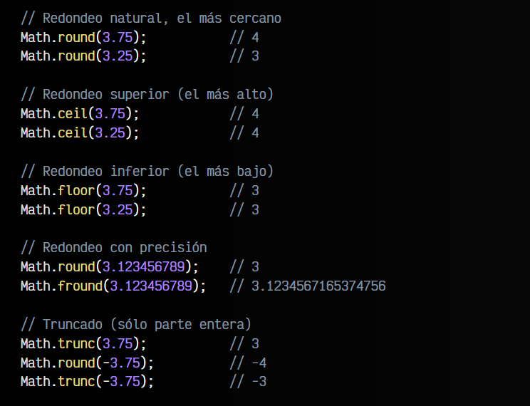

# 
 Constantes

## Constantes de Math.

Cuando trabajamos con Javascript, es posible realizar gran cantidad de operaciones matemáticas de forma nativa, sin necesidad de librerías externas. Para ello, haremos uso del objeto Math, un objeto interno de Javascript que tiene incorporadas ciertas constantes y métodos (funciones) para trabajar matemáticamente.

El objeto Math de Javascript incorpora varias constantes que podemos necesitar en algunas operaciones matemáticas. Veamos su significado y valor aproximado:

Además de estas constantes, el objeto Math también nos proporciona gran cantidad de métodos o funciones para trabajar con números. Vamos a analizarlos.

## Métodos matemáticos.
Los siguientes métodos matemáticos están disponibles en Javascript a través del objeto Math:

Veamos algunos ejemplos aplicados a las mencionadas funciones anteriormente:

Existe uno más, Math.random() que merece una explicación más detallada, por lo que lo explicamos en el apartado siguiente.

# Método Math.random().
Uno de los métodos más útiles e interesantes del objeto Math es Math.random().

Este método nos da un número al azar entre los valores 0 y 1, con 16 decimales. Normalmente, cuando queremos trabajar con números aleatorios, lo que buscamos es obtener un número entero al azar entre a y b. Para ello, se suele hacer lo siguiente:

Este ejemplo nos dará en x un valor al azar entre 0 y 5 (5 no incluido). Lo hemos realizado por pasos para entenderlo mejor, pero podemos realizarlo directamente como se ve en el siguiente ejemplo:

Como se puede ver en el segundo ejemplo anterior, utilizamos el operador a nivel de bits ~~ (doble negación) como reemplazo rápido de Math.floor(), una función que realiza un redondeo inferior, y que veremos al final de este tema.

# Métodos de logaritmos.
Javascript incorpora varios métodos en el objeto Math para trabajar con logaritmos. Desde logaritmos neperianos hasta logaritmos binarios a través de las siguientes funciones:

A continuación, unos ejemplos de estas funciones aplicadas en Javascript:

# Métodos de redondeo.
Como hemos visto anteriormente, es muy común necesitar métodos para redondear números y reducir el número de decimales o aproximar a una cifra concreta. Para ello, de forma nativa, Javascript proporciona los siguientes métodos de redondeo:

Veamos las diferencias de utilizar los diferentes métodos anteriores para redondear un número decimal y los resultados obtenidos:

# Métodos trigonométricos.
Por último, y no por ello menos importante, el objeto Math nos proporciona de forma nativa una serie de métodos trigonométricos, que nos permiten hacer cálculos con operaciones como seno, coseno, tangente y relacionados:

# Otras librerías matemáticas.
Si de forma nativa no encuentras una forma sencilla de resolver el problema matemático que tienes entre manos, no olvides que existen una serie de librerías de terceros que pueden hacernos la vida más fácil a la hora de trabajar con otros valores matemáticos.

A continuación, detallamos algunas de ellas:

Habrás comprobado que, al contrario que muchos otros objetos de Javascript, en estas ocasiones hemos indicado explícitamente el objeto, por ejemplo Math.round(numero), en lugar de hacerlo sobre la variable: numero.round(). Esto ocurre porque Math es un objeto con métodos y constantes estáticas, algo que veremos en profundidad en futuros temas.

