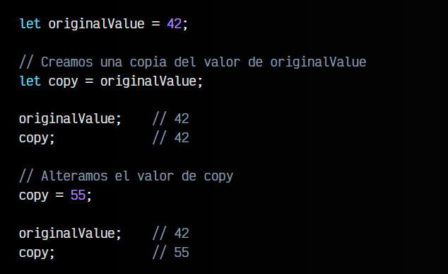
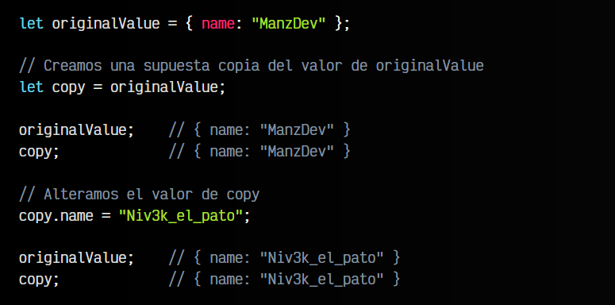
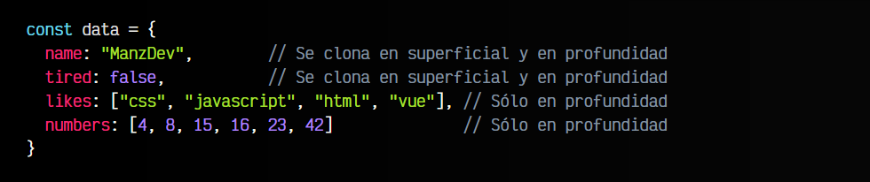
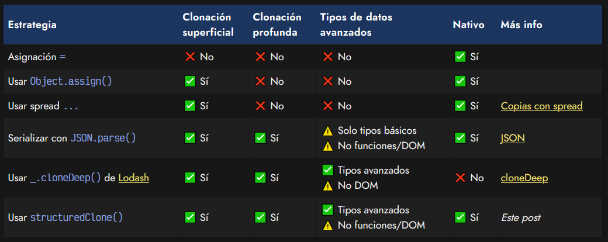
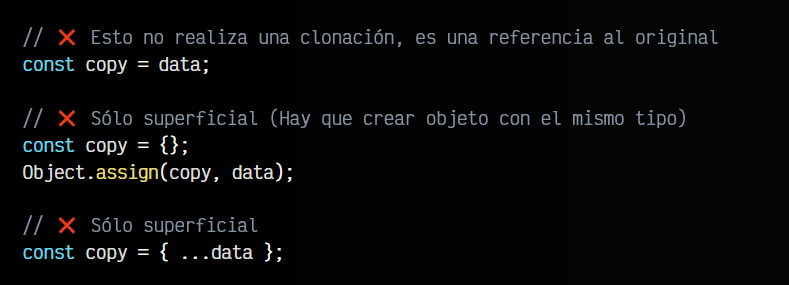
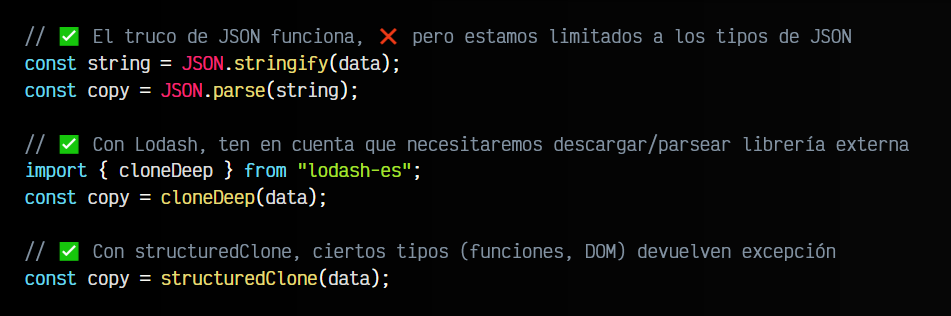
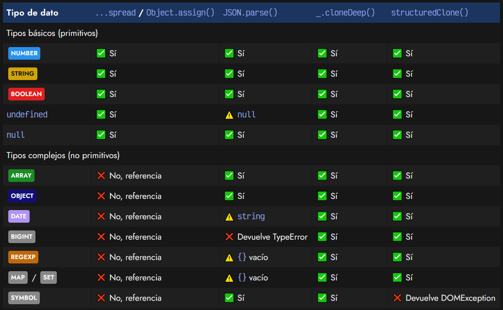
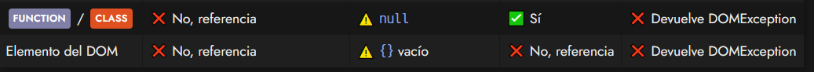

# 
Clonar objetos o elementos.

En Javascript, así como en muchos otros lenguajes, necesitaremos en ocasiones copiar o clonar elementos de nuestro código, de forma que podamos cambiar uno y dejar intacto el original. Para ello, Javascript (al igual que en otros lenguajes) tiene dos mecanismos para copiar elementos:

   - 🥂 Copia por valor (Duplica el contenido)
   - 🔮 Copia por referencia (Hace referencia a dónde está el contenido)

## Copia por valor.
El primero de ellos, la copia por valor, se realiza con los tipos de datos más básicos, es decir, los tipos de datos primitivos, es decir: NUMBER, STRING, BOOLEAN, etc. Esto ocurre así porque son estructuras simples y rápidas de copiar.

La copia por valor significa que simplemente se crea una nueva variable o constante y se asigna el mismo valor que tiene la variable original. Lo que a efectos prácticos cualquiera imaginaría como una copia:

Como puedes ver, todo ocurre de forma predecible. Al alterar el valor de copy, este es modificado y por otro lado, el valor de originalValue sigue siendo el valor original.

## Copia por referencia.
El segundo mecanismo es la copia por referencia, y es un poco más complejo. En Javascript, como en otros lenguajes, al almacenar la información en una variable, esta se guarda en una dirección de memoria.

Con estructuras de datos más complejas como ARRAYS, OBJECT u otros, esta información no se copia por valor, puesto que podríamos tener estructuras muy complejas donde pueden haber muchos niveles de profundidad (array que contiene arrays, que a su vez cada uno de ellos contienen arrays y a su vez cada uno de ellos contienen arrays...).

Para simplificar el proceso, lo que se hace con estos tipos de datos más complejos, es que la copia será una referencia al elemento original, algo que es mucho más práctico y rápido, pero con lo que hay que tener mucho cuidado:

Como puedes ver, la modificar la propiedad name de copy, también se altera la propiedad name de originalValue puesto que copy solo es una referencia a la estructura original, es decir, está ligado a originalValue. Al cambiar cualquiera de ellos, se modificará el otro.

## Clonando variables o constantes.
Y entonces... ¿Qué puedo hacer para clonar o copiar estructuras de datos complejas sin este problema? Antes de nada tenemos que conocer dos conceptos importantes:

   - 🎈 Clonación superficial (Shallow clone): Se llama así cuando realizamos una clonación de una estructura de datos y sólo se copia su primer nivel, mientras que segundo y niveles más profundos, se crean referencias.

    -🧨 Clonación profunda (Deep clone): Se llama así cuando realizamos una clonación de una estructura de datos a todos sus niveles.

Observa esta estructura de datos:

Si realizamos una clonación superficial, solo clonaríamos los tipos de datos básicos (los dos primeros). Los dos últimos, al ser estructuras complejas en sí mismas, no se realizaría una clonación, sino que sería una referencia al elemento original, modificando ambos si alteramos uno de sus elementos, como vimos anteriormente.

Si realizamos una clonación profunda, no tendríamos este problema, se clonarían todos los elementos, independientemente del nivel de profundidad.

## Clonando elementos en Javascript.
Tradicionalmente, hay varias aproximaciones, vamos a explicarlas, junto a sus ventajas y desventajas:

Veamos un ejemplo de cada uno sobre el elemento data anterior. En primer lugar, veamos las formas que permiten clonación superficial, pero no clonación profunda:

El ... (spread) o el Object.assign() pueden interesarnos si necesitamos un mecanismo rápido de clonación, tenemos estructuras de un solo nivel y no nos interesan tipos de datos avanzados, sino datos primitivos.

Ahora veamos las formas donde podemos realizar clonación profunda y copiar los elementos incluso a niveles de profundidad mayores y no sólo el primer nivel (como ocurre en la clonación superficial):

Como conclusión:

    Usa ... (spread) o Object.assign() si trabajas con datos primitivos y un sólo nivel de profundidad.
    Usa JSON.parse() y JSON.stringify() en el mismo caso. Útil si necesitas navegadores muy antiguos.
    Usa structuredClone() si quieres un clonado moderno, que soporte diferentes niveles de profundidad.
    Usa cloneDeep() de Lodash si requieres clonado de funciones y no te supone un coste incluir dependencias externas.

Por aquí tienes una tabla resumen donde puedes ver que tipos de datos puede clonar cada uno de los métodos que permiten clonación profunda:

En principio, en estructuras de datos no deberían existir elementos del DOM ni funciones, por lo que structuredClone() debería ser la mejor opción. No obstante, si lo que deseas es clonar ciertas estructuras que además contienen funciones o elementos del DOM, lo mejor sería decantarse por cloneDeep().

  Ten en cuenta que aunque puede ser atractivo el método _.cloneDeep() por soportar todos los tipos de datos, también hay que tener en cuenta que no se trata de un método nativo del navegador, sino que se trata de una librería externa, que debe cargarse, parsearse y ejecutarse y que con estructuras muy complejas puede ser lenta o pesada.

  

