# 
Formato JSON.

La desestructuración de objetos es, probablemente, una de las estrategias más utilizadas al trabajar en Javascript nativo (o en frameworks como React) debido a que en Javascript se utilizan muchísimo las estructuras de datos de objetos y es muy interesante simplificar lo máximo posible, así que veamos como funciona. 
  
 
    Antes de nada, si aún no lo has hecho, te aconsejo echar un vistazo al artículo de Desestructuración de arrays, donde contamos las bases de la desestructuración, con una estructura de datos mucho más sencilla, como los arrays.
  

## Desestructuración de objetos.
Empecemos por el caso más sencillo. Imaginemos que tenemos una estructura de datos que es un objeto. Utilizando la desestructuración de objetos podemos separar en variables las propiedades que teníamos en el objeto:

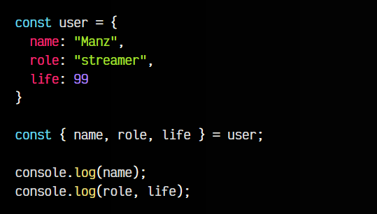

En este ejemplo, separamos las propiedades name, role y life en variables individuales, «sacándolas» de user. Observa también, que en lugar de hacer varios console.log() como tenemos en las dos últimas líneas, podemos hacer lo siguiente:

En esta línea, «volvemos a estructurar» en un objeto, uniendo las diferentes variables en un objeto a la hora de mostrarlo por consola.

Además, ten en cuenta que también es posible renombrar las propiedades si lo deseamos:

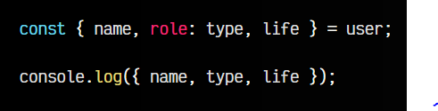

Ten en cuenta que, para los casos en los que una de esas propiedades no exista (o tenga un valor undefined), también podemos establecerle un valor por defecto como solemos hacer en los parámetros de una función, de la siguiente forma:

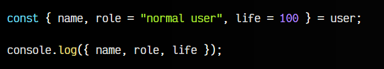

Esto hará que, si no existe la propiedad role en el objeto user, se cree la variable role con el STRING "normal user".

## Reestructurando nuevos objetos.
Esta característica de desestructuración podemos aprovecharla a nuestro favor, para reutilizar objetos y recrear nuevos objetos a partir de otros, basándonos en objetos ya existentes, añadiéndole nuevas propiedades o incluso sobreescribiendo antiguas.

Observa el siguiente ejemplo:

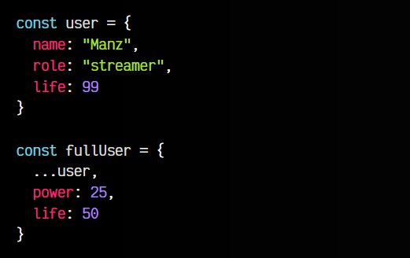

En este ejemplo, creamos un nuevo objeto fullUser con las mismas propiedades de user, sin embargo, además de poseer las anteriores, añadimos la nueva propiedad power y sobreescribimos la propiedad life con el valor 50.

    Ten en cuenta que en el caso de hacer ...user al final (en lugar de al principio), le estarías dando preferencia a las propiedades de user, que sobreescribirían las propiedades definidas anteriormente en el caso de coincidir.

## Haciendo copias de objetos.
Hasta ahora hemos puesto ejemplos muy sencillos, donde siempre entran en juego valores primitivos (números, strings, booleanos...), con los que no hay mucho problema porque en Javascript se pasan por valor. Sin embargo, valores más complejos (no primitivos: objetos, arrays, etc...) se pasan por referencia.

Vamos a explicar esto partiendo del ejemplo anterior:

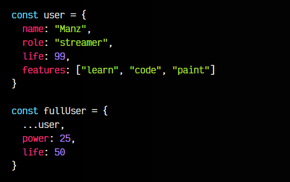

Observa que ahora tenemos en user una propiedad features que contiene un ARRAY, el cuál es un tipo de dato más complejo en Javascript. Ahora fijémonos en el objeto fullUser. Cuando hacemos la desestructuración ...user, estamos separando todas las propiedades de user y añadiéndolas a nuestro fullUser una por una.

Todas las propiedades originales se pasan por valor (se copia el valor en el nuevo objeto), sin embargo, el array es un tipo de dato complejo, y Javascript lo que hace es poner una referencia al valor original. En resumen, los tipos de datos complejos no son copias, son referencias (algo así como accesos directos).

Vamos a verlo en código, partiendo del ejemplo anterior:

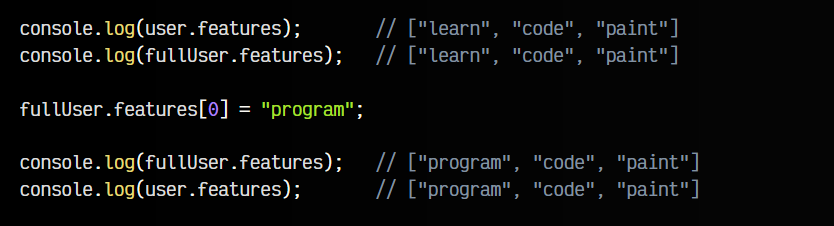

Como se puede ver, hemos cambiado el primer elemento del array features del objeto fullUser, sin embargo, si comprobamos el contenido del objeto user, comprobaremos que también ha cambiado. Esto ocurre porque realmente la propiedad features del objeto fullUser es una referencia a la propiedad features del objeto user, y es realmente la que se está modificando, alterando así ambos objetos.

Para solucionar esto, podemos hacer lo siguiente:

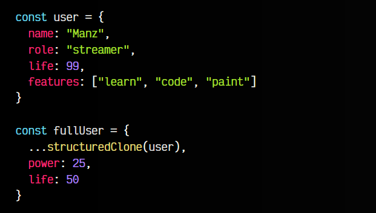

Observa que la diferencia es que, en lugar de hacer el ...user, utilizamos la función structuredClone() a la cuál le pasamos el objeto a copiar. Esta función hará, ahora si, una copia, devolviendo un nuevo objeto, y no la referencia.

Podemos comprobarlo haciendo lo mismo de antes:

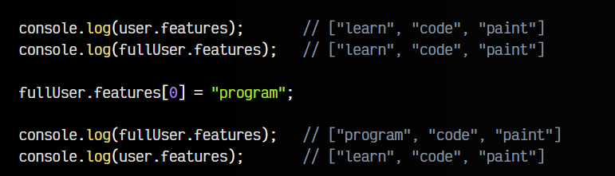

Comprueba que, ahora sí, el objeto modificado ha sido fullUser, sin embargo, user no ha sido alterado.

Si quieres aprender más sobre clonar objetos en Javascript, en este artículo hablamos más en profundidad sobre las estrategias de clonación de Javascript.

## Estructuras anidadas.
Como ves, esto suele pasar sobre todo cuando tenemos estructuras anidadas. Imaginemos que tenemos el siguiente objeto:

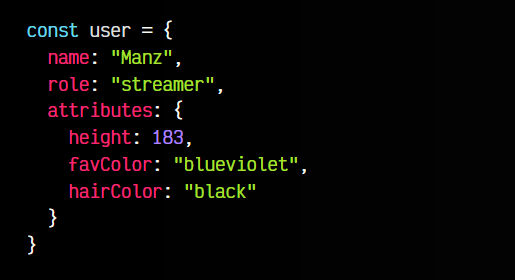

Si queremos «sacar» la propiedad attributes podríamos hacerlo como vimos anteriormente, y al ser propiamente un objeto, lo extraeríamos como tal. Sin embargo, si queremos sacar una de sus propiedades, podemos hacerlo de la siguiente forma:

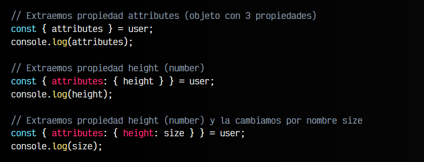

## Desestructuración (rest).
Al igual que vimos en el tema de desestructuración con arrays, podemos hacer las operaciones equivalentes con objetos. Por ejemplo, observa como hacemos una operación rest:

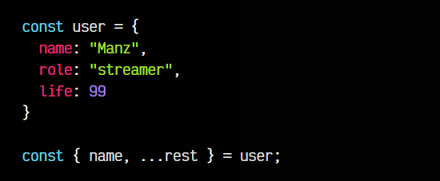

En este caso, la propiedad name la desestructuramos como variable y en el caso de rest la desestructuramos como un objeto que contiene las propiedades role y life.

## Parámetros desestructurados.
La desestructuración de parámetros es algo muy interesante a la hora de simplificar código, ya que podemos separar en variables individuales un objeto que en un ámbito específico es muy complejo de utilizar, y sería mucho más sencillo usarlo como variable.

Esto se ve mejor en un ejemplo, partamos del siguiente código:

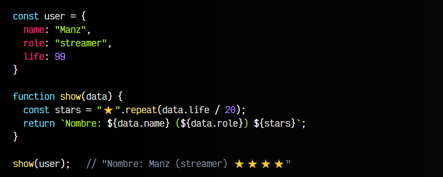

El punto clave en este ejemplo es el parámetro data de la función show(). Localiza donde se define y donde lo utilizamos en el interior de la función show. Ahora, lo que vamos a hacer es desestructurar los parámetros para que sea más fácil de escribir:

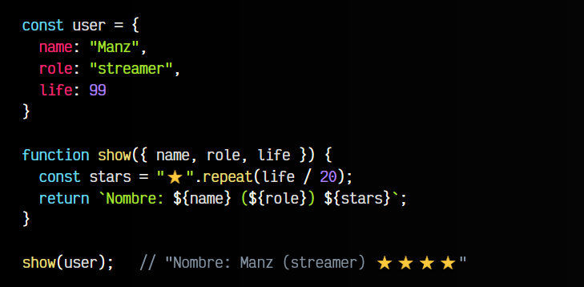

Como ves, en lugar de definir data en los parámetros, desestructuramos definiendo sólo las propiedades que vamos a utilizar, en este caso todas, por lo que establecemos { name, role, life }. Luego, en su interior, en lugar de estar indicando el prefijo data. continuamente, hacemos simplemente referencia a la variable.

Si lo necesitasemos, también podríamos usar rest en este caso.

Recuerda que la desestructuración solo funciona para estructuras de datos. Si tienes un objeto que contiene métodos o elementos del DOM, por ejemplo, no se copiarán y lanzará una excepción.
