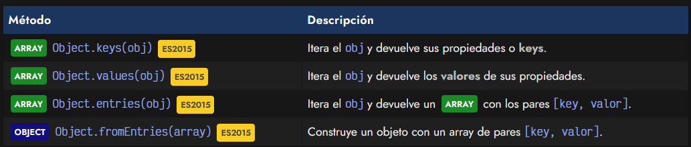
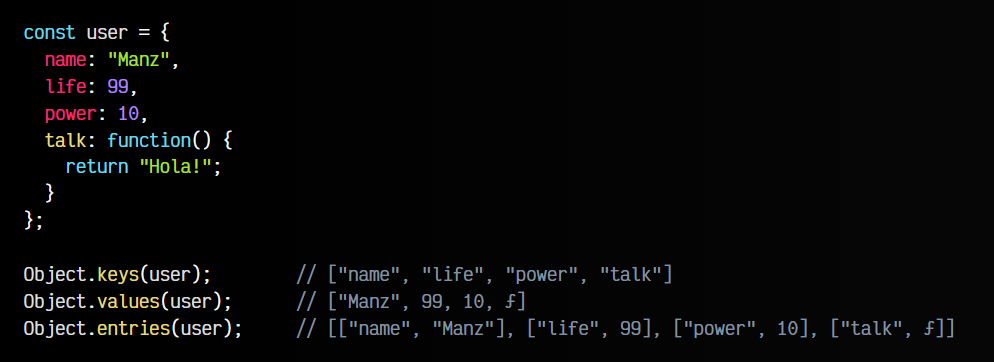
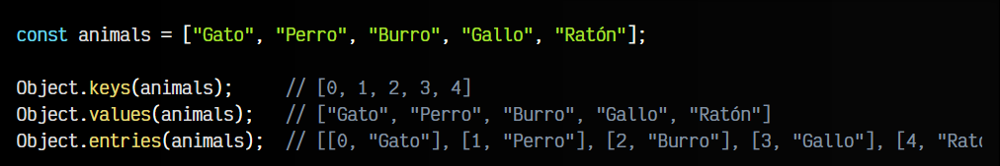
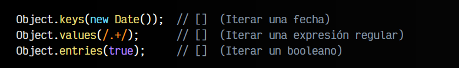
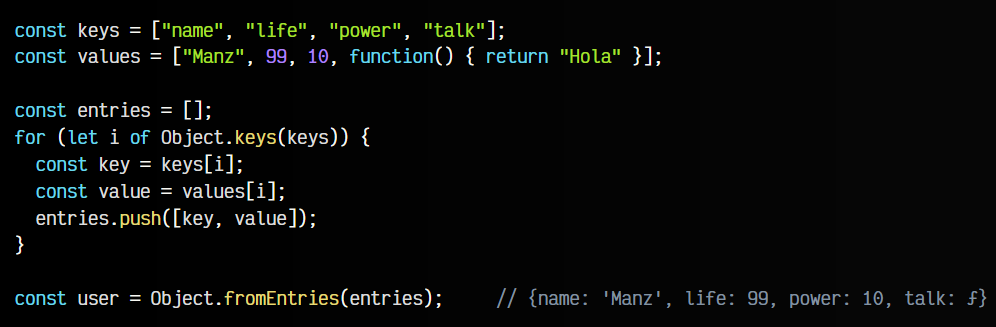
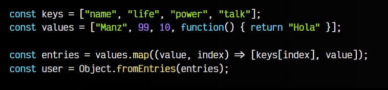

# 
Iteradores de objetos.

En Javascript ES2015, se introducen unos métodos muy útiles para utilizar como iteradores. Un iterador es un concepto que se repite, y en el ámbito de la programación, se suele referir a algo que te permite recorrer una estructura de datos por todos sus apartados o miembros.

En muchos casos, se presenta la situación en la que necesitamos recorrer un objeto, a través de las propiedades de su estructura, como si fueran los elementos de un array. Sin embargo, al ser un objeto parece que no es posible.

En cualquiera de los 3 casos, devuelven siempre un ARRAY.

## Convertir un objeto a array.
Todo esto puede parecer complejo, pero en realidad es muy sencillo. Veamos un ejemplo para entender como funcionan:

Expliquemos este código:

   - Con el método Object.keys() obtenemos un ARRAY de las claves (propiedades, índices, keys) del objeto.
   - Con el método Object.values() obtenemos un ARRAY de los valores de las claves anteriores, en el mismo orden.
   - Con el método Object.entries() obtenemos un ARRAY de entradas. Cada   entrada es un ARRAY del par clave-valor, es decir, la propiedad del objeto original y su valor correspondiente.

Ten en cuenta que como un ARRAY también es un OBJECT, podemos utilizar estos métodos también para recorrerlos, sólo que en este caso los índices del array son las posiciones (0, 1, 2, 3...). Veamos un ejemplo:

Cualquier otra estructura se podría utilizar con Object.keys(), Object.values() o Object.entries() pero devolverá un array vacío si no se puede iterar. Por ejemplo:

Así pues, los casos más interesantes suelen ser estructuras de OBJETOS y, quizás en algunos casos, de ARRAY.

## Convertir un array a objeto.
De la misma forma, también se puede hacer la operación inversa. Para ello, usaremos el método Object.fromEntries(). En esta ocasión, vamos a partir de dos ARRAY keys y values, donde el primero tiene la lista de propiedades en STRING y el segundo tiene la lista de valores.

El objetivo es, a partir de esos dos arrays (que deben ser del mismo tamaño), generar el objeto inicial user que teníamos antes:

Observa que partimos de un ARRAY vacío entries. Con Object.keys(keys) obtenemos una lista de números de 0 al tamaño del array keys. Esto nos servirá de posición para ir recorriendo los arrays keys y values en el interior del bucle for..of.

De esta forma, en cada iteración del bucle generamos un par key, value, que meteremos en un array e insertaremos en entries. De esta forma, regeneramos la estructura de entradas de Object.entries() que es la que necesitamos para que, mediante Object.fromEntries() podamos regenerar el objeto user con las keys de keys y los valores de values.

Otra forma, más compacta, pero que quizás requiere más experiencia, sería la siguiente:

En este caso hacemos exactamente lo mismo, pero utilizamos el método .map() del tema de las array functions para simplificar el bucle.

