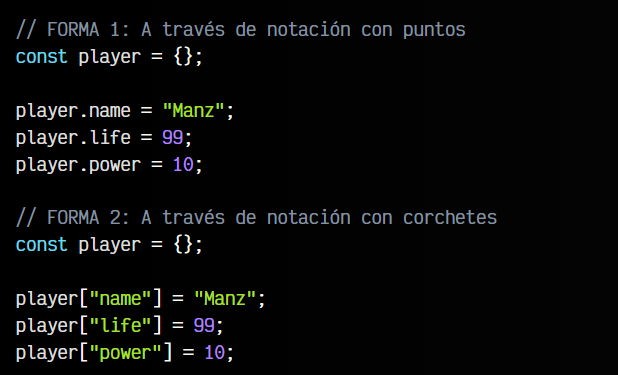

# 
¿Qué son los objetos?.

Uno de los aspectos más importantes del lenguaje Javascript es el concepto de objeto, puesto que prácticamente todo lo que utilizamos en Javascript, son objetos. Sin embargo, tiene ligeras diferencias con los objetos de otros lenguajes de programación, así que vamos a comenzar con una explicación sencilla y más adelante ampliaremos este tema en profundidad.

En Javascript, existe un tipo de dato llamado objeto . Una primera forma de verlo, es como una variable especial que puede contener más variables en su interior. De esta forma, tenemos la posibilidad de organizar múltiples variables de la misma temática en el interior de un objeto.

En muchos lenguajes de programación, para crear un objeto se utiliza la palabra clave new. En Javascript también se puede hacer, pero pospondremos su uso para cuando entremos en el capítulo de Programación orientada a objetos.

En Javascript, siempre que podamos, se prefiere utilizar la notación literal, una forma abreviada para crear objetos (u otros tipos de datos que veremos más adelante), sin necesidad de utilizar la palabra new.

## Declaración de un objeto.
Los literales de los objetos en Javascript son las llaves {}. Este ejemplo es equivalente al anterior, pero es más corto, rápido y cómodo, por lo que se aconseja declararlos siempre así:

Sin embargo, en esta ocasión hemos creado un objeto con nombre objeto que está vacío. Vamos a crear un nuevo objeto llamado player, que contenga variables con información en su interior:

## Propiedades de un objeto.
Una vez tengamos un objeto, podemos acceder a sus propiedades de dos formas diferentes: a través de la notación con puntos o a través de la notación con corchetes.

El programador puede utilizar la notación que más le guste. La más utilizada en Javascript suele ser la notación con puntos, mientras que la notación con corchetes se suele conocer en otros lenguajes como «arrays asociativos» o «diccionarios».

A algunos programadores puede resultarles confuso utilizar objetos con la notación de corchetes, ya que en otros lenguajes de programación los objetos y los diccionarios son cosas diferentes, sin embargo en Javascript ambos conceptos se mezclan en uno solo.

OJO: Hay ciertos casos en los que sólo se puede utilizar la notación con corchetes, como por ejemplo cuando se utilizan espacios en el nombre de la propiedad. Es imposible hacerlo con la notación con puntos.

## Añadir propiedades.
También podemos añadir propiedades al objeto después de haberlo creado, y no sólo en el momento de crear el objeto. Veamos un ejemplo equivalente al anterior donde crearemos las propiedades, pero tras haber creado el objeto:

Las propiedades del objeto pueden ser utilizadas como variables. De hecho, utilizar los objetos como elementos para organizar múltiples variables suele ser una primera buena práctica de organización en Javascript.

## Métodos de un objeto.
Hasta ahora, solo hemos visto como crear objetos «genéricos» OBJECT en Javascript. También hemos visto que es posible añadir propiedades a un objeto, que no son más que variables dentro del objeto en cuestión.

Si dentro de una variable del objeto metemos una función (o una variable que contiene una función), tendríamos lo que se denomina un método de un objeto:

Si alguien ya tiene experiencia en el mundo de la programación, esto le resultará muy similar a un concepto que veremos más adelante llamado Clase. De momento nos estamos saltando ese concepto, y estamos creando directamente un objeto. Más adelante abordaremos las clases y sus instancias en el apartado de Programación orientada a objetos.

## El método .toString().
Simplemente por generar una variable de tipo OBJECT, esa variable «hereda» una serie de métodos que existen en cualquier variable que sea de tipo OBJECT. Un buen ejemplo, sería el método .toString(), un método que intenta representar la información de ese objeto en un STRING .

Si creamos un objeto vacío y ejecutamos dicho método, comprobaremos que ocurre lo siguiente:

Observa que en ningún momento hemos añadido una función .toString() al objeto, pero aún así existe y la podemos ejecutar. Esto ocurre también con otros tipos de dato que a priori no son , sino por ejemplo NUMBER, BOOLEAN, REGEXP , o :

Al crear una variable de un determinado tipo de dato, la variable será siempre también de tipo , ya que todas las variables heredan de este tipo de dato. Por lo tanto, nuestra variable tendrá:

   - Los métodos que implementemos nosotros personalmente
   - Los métodos heredados de su propio tipo de dato
   - Los métodos heredados del tipo ONJECT

Observa el siguiente ejemplo:

Hemos definido una variable numérica, de tipo NUMBER, con el valor con decimales 42.5. En la siguiente línea, ejecutamos el método .toString() un método heredado de los OBJECT para mostrarlo como texto. Lo mismo ocurre con el método .toLocaleString(). Sin embargo, el método toFixed() es un método heredado del tipo de dato NUMBER , y como el tipo de dato de la variable number es NUMBER tenemos disponible ese método.

## Creando nuestro toString.
Si quisieramos, podríamos crear una variable toString dentro de nuestro objeto, que contenga una función que muestre el texto ideal para representar nuestro objeto de información. Por ejemplo:

Observa que en la función .toString() devolvemos un STRING que contiene el nombre del jugador y entre paréntesis, la vida actual del jugador y tras un / el máximo posible de vida que podría tener. De esta forma, el método .toString() representa el objeto de la mejor forma posible para este caso particular:

Aquí, el console.log() está concatenando un STRING y un objeto OBJECT. Como el objeto player no es de tipo STRING, llama automáticamente al método .toString() y obtiene un STRING para representarlo.

