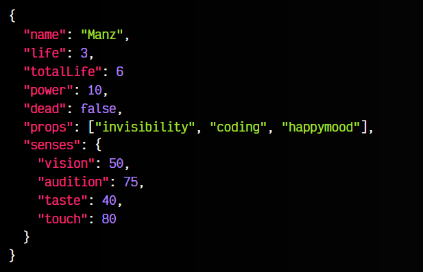
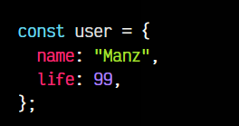
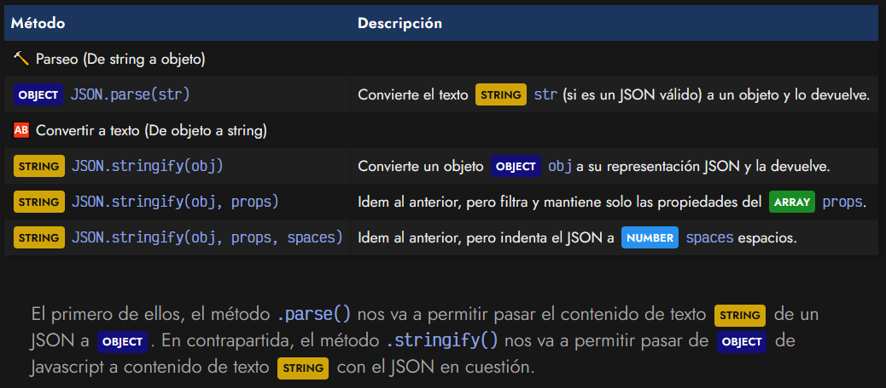
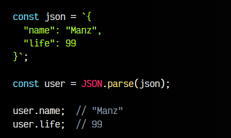
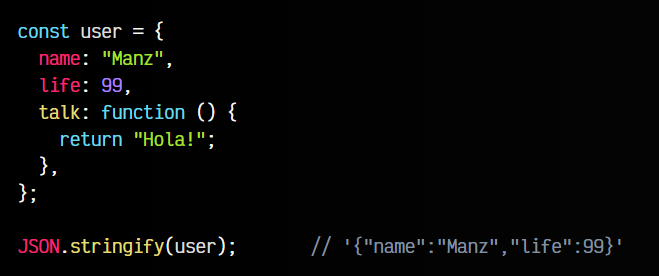
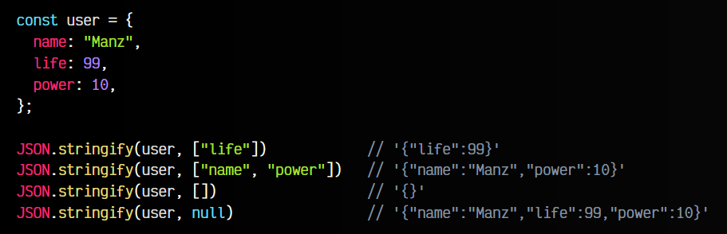
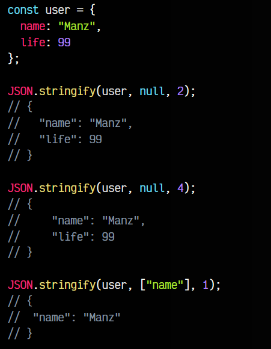

# 
Formato JSON.

Cuando trabajamos con mucha cantidad de información, se puede volver necesario separar nuestro código de programación de los datos que aparecen en él. De esta forma, podemos guardar la información en un archivo independiente, separado del archivo donde tenemos el código de nuestro programa. Así, si necesitamos actualizar o modificar datos, no tenemos que tocar el código de nuestro programa.

## ¿Qué es JSON?.
JSON son las siglas de JavaScript Object Notation, y no es más que un formato ligero de datos, con una estructura (notación) específica, que es totalmente compatible de forma nativa con Javascript. Como su propio nombre indica, JSON se basa en la sintaxis que tiene Javascript para crear objetos.

Un archivo JSON mínimo suele tener la siguiente sintaxis:

Sin embargo, su contenido puede ser simplemente un ARRAY, un NUMBER, un STRING, un BOOLEAN o incluso un NULL, sin embargo, lo más habitual es que parta siendo un OBJECT o un ARRAY. Puedes comprobar en JSONLint si algo concreto es un JSON válido o no.

Este ejemplo anterior simplemente es un objeto vacío {}. Un archivo JSON, suele contener mucha información almacenada. Vamos a modificar ese objeto vacío para que contenga más datos para ejemplificarlo:

Si comparamos un JSON con un objeto Javascript, aparecen algunas ligeras diferencias y matices:

   - Las propiedades del objeto deben estar entrecomilladas con «comillas dobles»
   - Los textos STRING deben estar entrecomillados con «comillas dobles»
   - Sólo se puede almacenar tipos como STRING, NUMBER, OBJECT, ARRAY, o null.
   - Tipos de datos como FUNCTION, DATE, REGEXP u otros, no es posible almacenarlos en un JSON.
   - Tampoco es posible añadir comentarios en un JSON.

Hay formatos derivados de JSON que sí permiten comentarios, como es el caso de JSON5. 

Mucho cuidado con las comillas mal cerradas o las comas sobrantes (antes de un cierre de llaves, por ejemplo). Suelen ser motivos de error de sintaxis frecuentemente. Existe una cómoda extensión para Visual Code llamada Fix JSON que te corrige los errores de formato de un JSON.

## ¿Cómo utilizar JSON?.

Como hemos mencionado, si analizamos bien la sintaxis de un JSON, nos habremos dado cuenta que es muy similar a un objeto declarado Javascript, pero con ciertas diferencias:

En Javascript tenemos una serie de métodos que nos facilitan la tarea de pasar de OBJECT de Javascript a JSON y viceversa, pudiendo trabajar con contenido de tipo STRING (que contenga un JSON) y objetos Javascript según interese.

Dichos métodos son los siguientes:

El primero de ellos, el método .parse() nos va a permitir pasar el contenido de texto STRING de un JSON a OBJECT. En contrapartida, el método .stringify() nos va a permitir pasar de OBJECT de Javascript a contenido de texto STRING con el JSON en cuestión.

## Convertir JSON a objeto.
La acción de convertir JSON a objeto Javascript se le suele denominar parsear. Es una acción que analiza un STRING que contiene un JSON válido y devuelve un objeto Javascript con dicha información correctamente estructurada. Para ello, utilizaremos el mencionado método JSON.parse():

Como se puede ver, OBJECT user es un objeto generado a partir del JSON almacenado en la variable json y podemos consultar sus propiedades y trabajar con ellas sin problemas.

## Convertir objeto a JSON.
La operación inversa, convertir un objeto Javascript a JSON también se puede realizar facilmente haciendo uso del método JSON.stringify(). Este impronunciable método se puede utilizar para transformar un objeto de Javascript a JSON rápidamente:

Observa que, como habíamos dicho, las funciones no están soportadas por JSON, por lo que si intentamos convertir un objeto que contiene métodos o funciones, JSON.stringify() no fallará, pero simplemente devolverá un STRING omitiendo las propiedades que contengan funciones (u otros tipos de datos no soportados).

Además, se le puede pasar un segundo parámetro al método .stringify(), que será un ARRAY que actuará de filtro a la hora de generar el objeto. Observa el siguiente ejemplo:

Observa que el penúltimo caso, no se conserva ninguna propiedad, mientras que el último, se conserva todo.

Por último, también podemos añadir un tercer parámetro en el método .stringify() que indicará el número de espacios que quieres usar al crear el STRING del JSON resultante. Observa que hasta ahora, el STRING está minificado y aparece todo junto en la misma línea.

Observa lo que ocurre en los siguientes casos:

En el primer caso, json2, el resultado se genera indentado a 2 espacios. En el segundo caso, json4, el resultado se genera indentado a 4 espacios. En el tercer y último caso, json1, se filtran las propiedades, dejando sólo "name" y se genera indentando a 1 espacio.

## Leyendo JSON externo.
Ten en cuenta que los ejemplos realizados hasta ahora, estamos convirtiendo un STRING a OBJECT y viceversa. Normalmente los contenidos JSON suelen estar almacenados en un archivo externo, que habría que leer desde nuestro código Javascript.

Para ello, hoy en día se suele utilizar la función fetch() para hacer peticiones a sitios que devuelven contenido JSON. También se podría leer ficheros locales con contenido .json. En cualquier caso, estos temas puedes encontrarlos en el tema Peticiones HTTP que encontrarás en este sitio, algunos temas más adelante.

