# 
El método console.log()

El clásico primer ejemplo cuando se comienza a programar, es crear un programa que muestre por pantalla un texto, generalmente el texto «Hola Mundo». También podemos realizar, por ejemplo, operaciones numéricas. En la consola Javascript podemos hacer esto de forma muy sencilla:

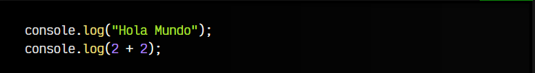

En la primera línea, veremos que al pulsar enter nos muestra el texto «Hola Mundo». En la segunda línea, sin embargo, procesa la operación y nos devuelve 4. Destacar que en este ejemplo solo hemos aportado un dato por cada línea (un texto y una operación numérica), pero console.log() y sus funciones hermanas permiten añadir varios datos en una misma línea, separándolo por comas:

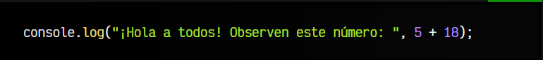

De momento nos puede parecer algo inútil, pero cuando empecemos a trabajar con variables y objetos, será muy necesario.

## Mensajes de error por niveles.
Aunque el console.log() es uno de los métodos más utilizados (a veces el único), existen muchos otros. Por ejemplo, la consola de las DevTools tiene un sistema para filtrar mensajes de error por niveles. En lugar de utilizar el popular console.log(), podemos utilizar el método console.warn(), console.error(), etc:

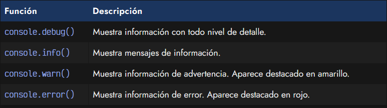

## Mostrar una traza de error.
En programación, se suele hacer llamar «mostrar una traza» a mostrar el camino que ha seguido el programa para llegar a un punto o error concreto. El método console.trace() nos permite hacer un console.log(), pero con la diferencia que además del mensaje, nos mostrará el camino de ficheros que ha seguido para llegar a este punto. Algo similar a lo siguiente:

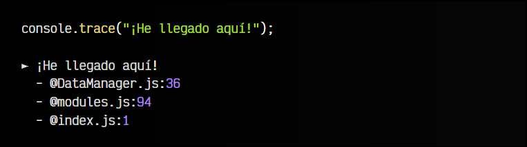

En este caso, nos aparece el mensaje de error, y justo debajo, podemos ver que el error ha pasado por el fichero index.js, luego al modules.js, para finalmente el DataManager.js y ejecutarse el console.trace(). También nos muestra la línea del fichero donde se ha quedado. Esto nos da ayuda para saber rápidamente por qué camino ha llegado.

## Truco: Mensajes con estilos CSS 
Aunque no es muy práctico y sólo se trata de pura curiosidad, se pueden aplicar estilos CSS en la consola Javascript haciendo uso de %c, que se reemplazará por los estilos indicados a continuación en el siguiente fragmento de texto:

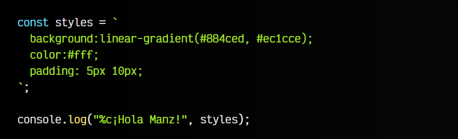

## Limpiar la consola.
En principio, pulsando el atajo de teclado CTRL+L sobre la consola de Javascript, limpia la pantalla y la despeja para seguir trabajando en ella. Esto no es más que un atajo de el método console.clear().

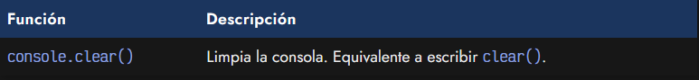

## Agrupar mensajes.
Existe una familia de métodos para agrupar mensajes de consola:

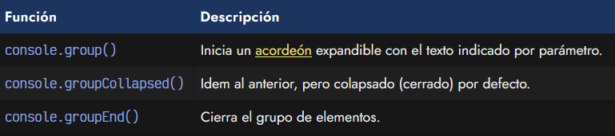

Observa el siguiente ejemplo. Con console.group() iniciamos un grupo de console.log() que estarán dentro de ese grupo. Con console.groupEnd() lo terminamos, por lo que los siguientes console.log() se encontrarán fuera de ese grupo.

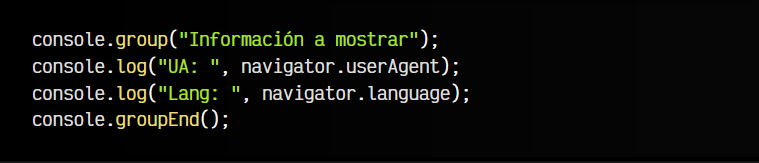

En la consola nos aparecera un ► Información a mostrar, donde podemos pulsar y expandir para ver los console.log() posteriores. Se pueden anidar varios grupos uno dentro de otro, y como hemos dicho antes, con console.groupCollapsed() iniciamos un grupo pero que está cerrado por defecto.

## El método console.table().
Un método que puede resultar muy interesante en algunas situaciones es console.table(), ya que nos permite crear una tabla con los datos a mostrar, algo que en ciertas situaciones con tipos de datos o muy extensos, es muy práctico:

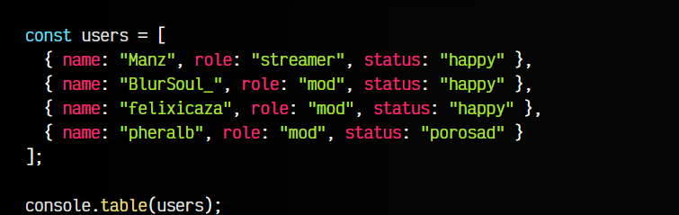

## El método console.assert().
Javascript incorpora un método de consola para realizar asertos, es decir, un console.log() especial que se realiza junto a una condición. El mecanismo de utilizar este método es que podemos indicar ciertas condiciones como puntos de control, para asegurarnos que todo ha salido correctamente.

Observa el siguiente ejemplo:

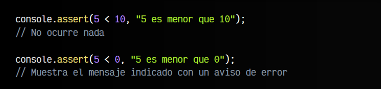

En el primer caso, no ocurre nada, ya que la condición es verdadera (5 es menor que 10). Sin embargo, en el segundo caso, la condición es falsa (5 no es menor que 0), por lo tanto el console.assert() muestra un mensaje de error con el mensaje indicado.

## El método console.dir().
En muchas ocasiones, el console.log() se suele utilizar para mostrar elementos de la página HTML, en lugar de valores de Javascript. Por ejemplo, vamos a pedirle a Javascript que nos muestre document.body que es una referencia rápida a la etiqueta <body> que siempre existe en un documento HTML:

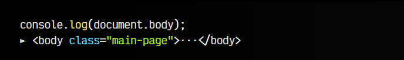

En este caso, uso el console.log() para mostrar dicha etiqueta <body>. Y eso es lo que hace, junto a una flecha desplegable para ver el interior de esa etiqueta. Sin embargo, y ya lo aprenderemos mucho más adelante, las etiquetas HTML de una página cumplen a la vez dos funciones: son una etiqueta HTML, pero a la misma vez, son un objeto Javascript.

En algunos casos nos interesa ver el contenido HTML de esa etiqueta, pero otras veces nos interesa ver las propìedades del objeto Javascript que representa:

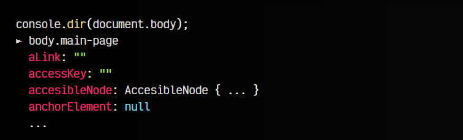

Para eso nos sirve el método console.dir(), el cuál muestra las propiedades del objeto Javascript, en lugar del contenido HTML, como hace el console.log().

## Crear benchmarks rápidos.
Es posible que necesitemos hacer tests de rendimiento, para comprobar cuanto se tarda en realizar alguna acción, o comparaciones para decidirnos por mejores formas de hacer nuestro código. Los navegadores tienen una serie de métodos interesantes para ello, divididos en tres grupos:

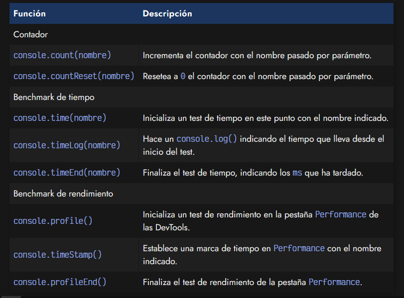

Veamos cada uno de estos grupos.

- ## Contadores.
  Con el primero de ellos, podemos crear contadores, lo que puede ser más rápido que estar creando variables y gestionándolas manualmente:

  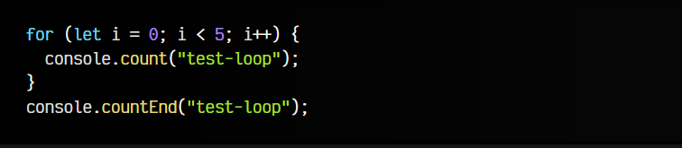

    Además, al utilizar un método de console, podemos utilizar herramientas automáticas que nos eliminen todos los console.* que utilicemos en nuestro código, como el plugin @rollup/plugin-strip de Rollup.

- ## Test de velocidad.

  Una serie de métodos muy interesantes son los que tienen relación con console.time(). Se trata de un método que nos permite iniciar un test de velocidad, para comprobar cuanto tarda en realizarse una operación:

  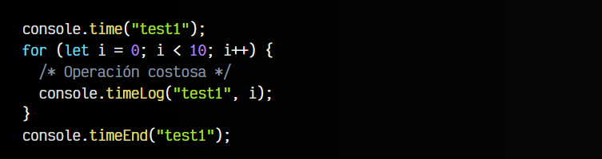

  En este caso, iniciamos un test de velocidad llamado test1. Con el método console.time() iniciamos el test y con el método console.timeEnd() lo terminamos, siempre indicando el nombre del test en cuestión, para poder hacer varios con diferente nombre. Al terminar el test, nos aparecerá el número de milisegundos que se ha tardado en hacer.

  Además, también podemos usar console.timeLog() que básicamente es un console.log() que hace un punto de control y te dice cuanto tiempo ha tardado en llegar hasta ese punto, sin detener el test.

 - ## Test de rendimiento.
   Por otro lado, los métodos console.profile() y console.profileEnd() sirven para hacer algo similar, pero utilizando la pestaña Performance de las DevTools del navegador. Esta pestaña hace un análisis de rendimiento mucho más técnico y profundo, y esto es una forma de automatizarlo para posteriormente investigar en dicha pestaña.

    El método console.timeStamp() te permite indicar un nombre por parámetro para establecer puntos de control en dicho test de rendimiento, similar al console.timeLog() del apartado anterior.

    Puedes escribir la palabra debugger en cualquier parte de tu código, y el navegador detendrá la ejecución del código y abrirá las DevTools con el debugger del navegador detenido en esa línea, lo que es muy interesante para tareas de depuracion.

    