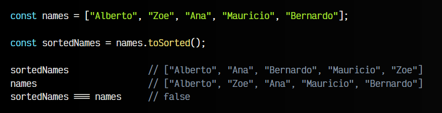

# 
Ordenación de un array

En Javascript, es muy habitual que tengamos una estructura de datos ARRAY y queramos ordenar su contenido por un criterio determinado. En este apartado, vamos a ver algunos métodos y formas para ordenar un array o realizar modificaciones para cambiar su orden:

   - ✅ El array original está seguro (no muta).
   - ⚠️ El array original cambia (muta).

Antes de continuar, establezcamos un punto de partida, donde tenemos un array de letras con cierto orden específico, en nuestro caso orden alfabético:

Ahora, vamos a modificar dicho array mediante los métodos mencionados.

## El método .toReversed() y .reverse().
En primer lugar, el método reverse() reordena los elementos del array en orden inverso, es decir, si tenemos [5, 4, 3] lo modifica de modo que obtenemos [3, 4, 5]. Veamos su funcionamiento con el ejemplo anterior, y una serie de matices que conviene aclarar:

Observa que aquí hay algo que nos puede llamar poderosamente la atención. Aparentemente, hemos creado un nuevo array reversedElements al cuál le asignamos el resultado de ejecutar el método .reverse() sobre el array elements.

En un primer vistazo, esto podría darnos a entender que se ha creado un nuevo array con el orden inverso, pero comprobemos que tanto el nuevo array reversedElements como el original elements han sido modificados. Además, en la última linea podemos ver que se trata de la misma estructura de datos. Lo que realmente ha ocurrido es que el array original elements ha mutado, y el nuevo array resultante no es más que una referencia al original.

Si queremos crear un nuevo array independiente del original, tendríamos que hacer lo siguiente:

Utilizando structuredClone(), lo que hacemos es crear una copia de la estructura original elements, y luego invertirla. Ahora si, tenemos dos arrays independientes.

Otra solución, mucho más sencilla es utilizar el nuevo método .toReversed() ES2023, el cuál funciona exactamente igual que .reverse(), pero sin mutar el original:

Tienes más información detallada en este artículo sobre las estrategias de clonación en Javascript: Object.assign(), spread, structuredClone y otras: [clonar objetos en Javascript](https://lenguajejs.com/javascript/objetos/clonar-o-copiar-elementos/).

## El método toSorted() y .sort().
Cualquier estructura de datos en Javascript tiene el método sort(). Este método realiza una ordenación de los elementos del array, con la peculiaridad que siempre realizará una ordenación alfabética:

Efectivamente, vemos que ahora el array sortedNames está ordenado alfabéticamente. Sin embargo, ocurre exactamente lo mismo que en el caso anterior. Nuevamente, tenemos que utilizar la función structuredClone() para hacer una copia y que sea independiente:

Nuevamente, otra solución mucho más sencilla podría ser utilizar la función .toSorted() ES2023, que funciona exactamente igual que .sort(), pero manteniendo intacto el array original, sin mutarlo:

Sin embargo, la ordenación anterior se realizó sobre un array de elementos STRING y todo fue bien. Veamos que ocurre si intentamos ordenar un array de elementos NUMBER, tanto utilizando el método .sort() como el método .toSorted():

Esto ocurre porque, al igual que en el ejemplo anterior, el tipo de ordenación que se realiza por defecto es una ordenación alfabética, mientras que en esta ocasión buscamos una ordenación natural, que es la que se suele utilizar con números (no nos interesa que el 32 se encuentre antes del 9).

Esto se puede hacer en Javascript, pero requiere pasarle por parámetro al sort() lo que se llama una función de comparación o función de ordenación.

## Función de comparación.
Una función de ordenación o una función de comparación, lo que hace es establecer un criterio de ordenación diferente al que actúa por defecto, personalizado a través de una función que se le pasa por parámetro al método sort() o toSorted():

Como se puede ver en este fragmento de código, hemos creado dos funciones, en formato arrow function para que sean más compactas: alphabeticOrder y naturalOrder. Cada una de ellas tiene un criterio de ordenación diferente. Observa que se las pasamos por parámetro al método toSorted() para indicarle como debe hacer la ordenación.

En el caso de alphabeticOrder, esa es la función de ordenación que tiene por defecto el método .sort() o .toSorted(), es decir, es lo mismo que no pasarle ningún parámetro. Sin embargo, en el caso de naturalOrder si que estamos alterando el criterio de ordenación, y le indicamos como hacerlo para ordenar números bajo un criterio de ordenación natural.

## Algoritmo de ordenación.
Si eres una persona de naturaleza curiosa, es posible que te preguntes que hace exactamente esa función de comparación, que a priori, parece que sólo realiza una operación. Primero, analicemos los pasos hechos hasta ahora:

Ahora, si profundizamos en la tarea que realiza el sort() o toSorted(), lo que hace concretamente es analizar pares de elementos del array en cuestión para ordenarlos. El primer elemento es a y el segundo elemento es b. Entonces, se ejecutará la función, la cuál devolverá un resultado:

Observa que la primera vez que ejecutas el toSorted(), la función de comparación tomará como b el número 8 y como a el número 4. Entonces, realizará la operación 4 + 8, que dará como resultado 12. Dependiendo de ese resultado, se realizará una acción:

   - Si la función (a,b) devuelve un número mayor que cero (>0), se fija el orden b, a (b primero).
   - Si la función (a,b) devuelve un número igual a cero (0), se mantiene igual.
   - Si la función (a,b) devuelve un número menor que cero (<0), se fija el orden a, b (a primero).

Quizás se entienda mejor cambiando un poco el código:

Sin embargo, poner la operación a + b es mucho más compacto, puesto que no nos interesa el valor devuelvo concretamente, sino sólo si es mayor, menor o igual a cero.

Esta operación se va realizando para todos los pares de elementos del array y se repite hasta que están todos ordenados según el criterio de ordenación utilizado. Esto es lo que se conoce como el [método de la burbuja](https://es.wikipedia.org/wiki/Ordenamiento_de_burbuja), uno de los sistemas de ordenación más sencillos y prácticos.

