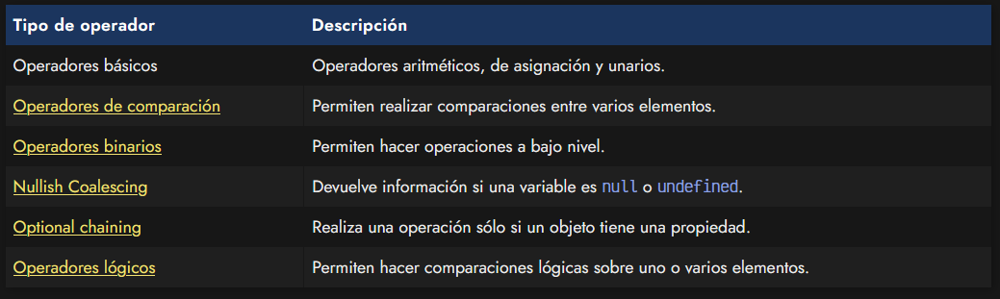
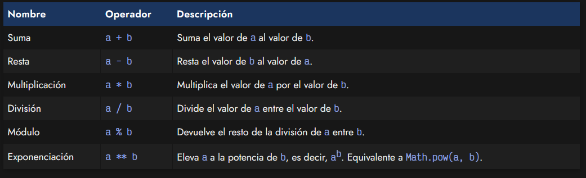
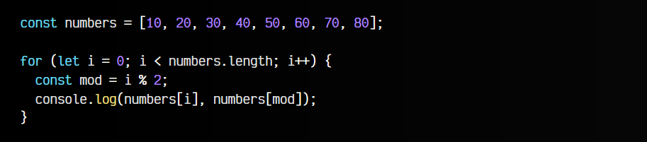
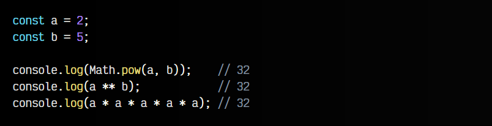
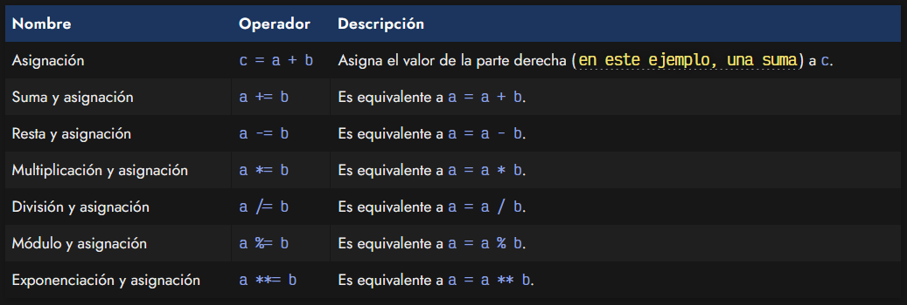
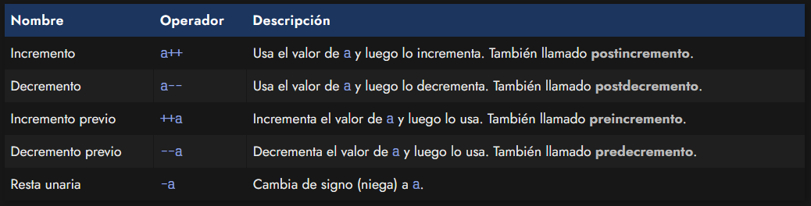
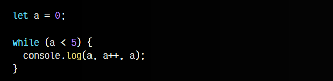
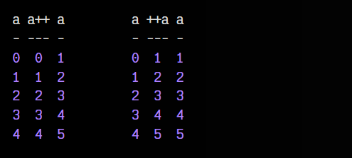

# 
Operadores básicos.

Al trabajar con Javascript (o con cualquier lenguaje de programación), es muy habitual hacer uso de los llamados operadores. Se trata de unos símbolos que nos permitirán hacer una serie de operaciones rápidas con uno o más operandos (generalmente números, aunque también pueden ser otros tipos de datos).

Sin embargo, esto se entiende mejor con ejemplos, por lo que vamos a hacer un desglose de los operadores que utilizaremos:

Así pues, en este artículo vamos a ver los operadores aritméticos, de asignación y unarios.

## Operadores aritméticos.
Vamos a centrarnos en primer lugar en los operadores aritméticos, que son los operadores que utilizamos para realizar operaciones matemáticas básicas. Los más sencillos son los cuatro primeros, que forman parte de las operaciones matemáticas básicas habituales:

Menos frecuentes suelen ser el módulo o la exponenciación, sin embargo, muy útiles en algunas situaciones.

## Operador módulo.
Observa el siguiente ejemplo donde utilizamos la operación módulo para limitar el índice:

Observa que en el console.log() estamos mostrando numbers[i] y luego numbers[mod]. Si ejecutas este código, comprobarás que en el primer caso, se van mostrando los valores del array numbers, es decir, 10, 20, 30... y así hasta 80. Sin embargo, en el segundo caso del console.log(), donde utilizamos mod como índice, se repiten los dos primeros: 10, 20, 10, 20, 10, 20....

Esto ocurre porque en la línea const mod = i % 2 hemos hecho el módulo sobre 2 y no estamos dejando que ese índice crezca más de 2, los valores que va a tomar mod en el bucle serán 0, 1, 0, 1, 0, 1..., puedes comprobarlo cambiando el console.log() y mostrando los valores i y mod.

## Operador de exponenciación.
En el caso de la exponenciación, simplemente podemos utilizar el operador **. Antiguamente, la exponenciación se hacía a través del método Math.pow(), sin embargo, ahora podemos hacerlo a través de este operador, con idéntico resultado:

En este caso, estamos haciendo la operación 25, es decir, 2 * 2 * 2 * 2 * 2

## Operadores de asignación.
Al margen de los anteriores, también tenemos los operadores de asignación. Estos operadores nos permiten asignar información a diferentes constantes o variables a través del símbolo =, lo cuál es bastante lógico pues así lo hacemos en matemáticas.

No obstante, también existen ciertas contracciones relacionadas con la asignación que nos permiten realizar operaciones de una forma más compacta. Son las siguientes:

Por ejemplo, realizar la asignación a = a + b sería exactamente lo mismo que escribir a += b, sólo que esta última está escrita de una forma más resumida.

## Operadores unarios.
Existe un tercer grupo de operadores unarios, que son aquellos que en lugar de tener dos operandos, como los mencionados anteriormente, sólo tienen uno. Es decir, se realizan sobre un sólo valor almacenado en una variable.

Una tarea muy común en programación es la de incrementar variables. Por ejemplo, si hacemos un a = a + 1, lo que estamos haciendo es incrementar el valor de a un número más grande del que ya poseía. Para hacer esto mucho más fácil y cómodo, podemos escribir a++ que es equivalente a lo anterior. Sin embargo, hay un pequeño matiz, que es lo que se denomina preincremento y postincremento.

Para ver las diferencias clave del preincremento y el postincremento observa el siguiente ejemplo:

Observa que en el console.log() primero usamos la a, luego hacemos el postincremento (es decir, la usamos y luego incrementamos), y finalmente la volvemos a mostrar por consola. Prueba a reemplazar el a++ por ++a y hacer el mismo ejemplo. Esto nos dará el siguiente resultado:

Como puedes ver, en la segunda columna de la segunda tabla (preincremento), el valor mostrado ya ha sido incrementado, sin embargo, en la segunda columna de la primera tabla, permanece el valor (postincremento), ya que como su propio nombre indica se incrementará posteriormente.

Aunque estos detalles es bueno conocerlos, lo más habitual suele ser que se use el a++ en una línea independiente, sin utilizarse, por lo que no importa demasiado si hacer preincremento o postincremento. Sólo hay que tenerlo en cuenta si se está usando o asignando.

