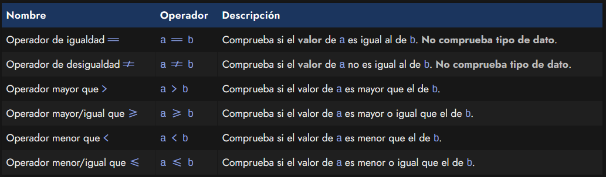
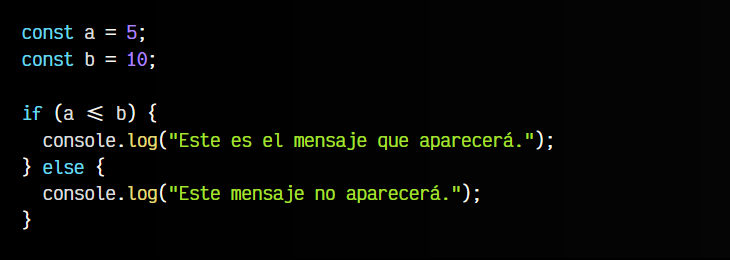
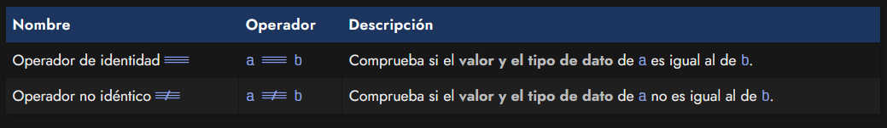
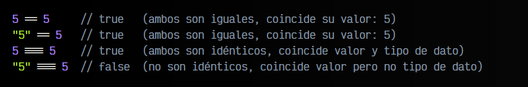

# 
Operadores de comparación.

Una tarea habitual y frecuente en programación es la de realizar comparaciones. Es necesario realizar comprobaciones continuamente para saber si debemos hacer una acción u otra diferente. Existe una serie de operadores de comparación para realizar estas comprobaciones de forma fácil y rápida.

## Operadores de igualdad.
Los operadores de comparación de igualdad son aquellos que utilizamos en nuestro código (generalmente, en el interior de un if, aunque no es el único sitio donde podemos utilizarlos) para realizar comprobaciones. Estas expresiones de comparación devuelven un booleano con un valor de true o false.

Son muy similares en otros lenguajes, por lo que si has programado alguna vez, probablemente no te resulten desconocidos:

Su utilización es muy sencilla, basta con poner los dos operandos juntos, separados por un operador:

Cómo a <= b es lo mismo que 5 <= 10 y esta condición es verdadera, se ejecutará el primer bloque del if, ejecutando el primer console.log() y mostrando el mensaje Este es el mensaje que aparecerá.. De la misma forma podríamos utilizar el resto de operadores de la tabla anterior, con resultados similares depediendo de la situación.

## Operadores de identidad.
A parte de los operadores de igualdad, Javascript es un lenguaje que también tiene operadores de identidad. Estos operadores se diferencian a los dos primeros anteriores en que en lugar de dos símbolos de igual ==, utiliza tres ===:

En Javascript no es lo mismo utilizar == (igualdad) que === (identidad). Mientras que el primero sólo comprueba el valor de la comparación, el segundo, el operador de identidad comprueba el valor y el tipo de dato de la comparación.

La diferencia se entiende muy fácil con el siguiente ejemplo:

Por esta razón, en Javascript se suele generalizar que es mucho mejor utilizar === en lugar de ==, ya que comprueba ambas cosas, valor y tipo de dato, y por lo tanto la comprobación es mucho más estricta.

