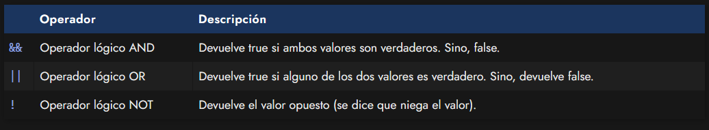
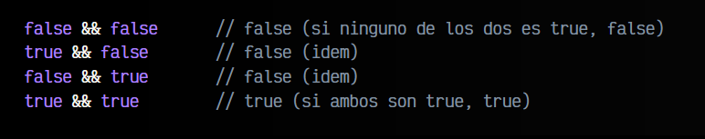
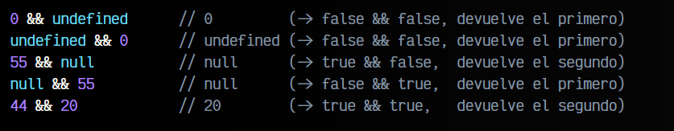
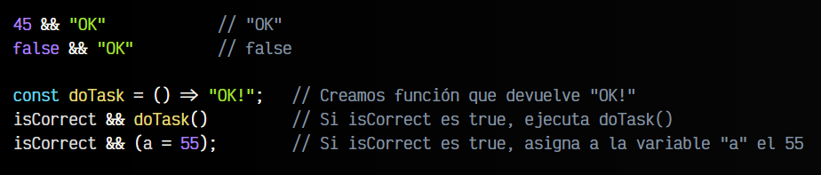
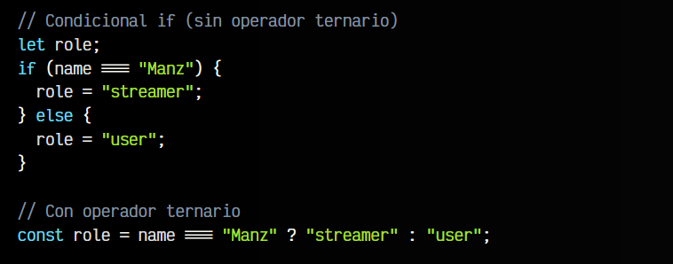
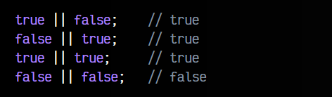
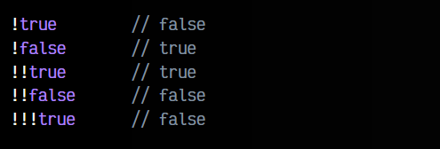
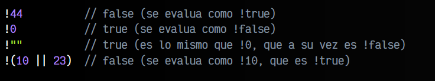

# 
Operadores lógicos.

Existen algunos operadores menos conocidos a nivel general, pero que son muy útiles para ciertas tareas. Se denominan operadores lógicos y se suelen utilizar para realizar comprobaciones rápidas:

Analicemos uno por uno para entender como funcionan.

## Operador AND lógico.
El operador lógico AND funciona de una forma que se llama cortocircuito lógico, donde:

   - 1️⃣ Si el primer valor se evalua como verdadero, devuelve el segundo valor.
   - 2️⃣ Si el primer valor se evalua como falso, devuelve ese primer valor.
   - ✅ O lo que es lo mismo: Si A es verdadero, entonces B.

Si trabajamos con podemos simplificarlo mucho: Sólo devuelve true si ambos valores comparados son true. Si uno de ellos es false, entonces devuelve false. Esto se entiende muy fácilmente con los siguientes ejemplos:

Pero también podemos utilizar el operador && con tipos de datos que no sean boolean . En este caso, recordemos que si el primer operando es false devuelve el primero, si el segundo operando es true, devuelve el segundo.

Teniendo todo esto en cuenta, este operador es una oportunidad fantástica para utilizarlo a modo de if compactos y muy legibles. No obstante, ten en cuenta que este patrón puede ser interesante en algunos casos simples, pero en otros puede complicar la legibilidad de código.

Veamos algunos ejemplos de como utilizarlo:

También ten en cuenta que en el caso de necesitar un caso else para el fin, este patrón no sería ideal. Para ese caso, echa un vistazo al siguiente, el operador ternario.

## Operador ternario.
El operador ternario es una especie de if compacto que tienen la mayoría de los lenguajes de programación, donde en lugar de utilizar un if / else tradicional, para escribir en varias líneas, podemos hacerlo mediante el operador ternario. Su estructura es la siguiente: (condición) ? valor verdadero : valor falso.

Veamos como la utilizaríamos, comparándolo con un if:

En este caso, name === "Manz" sería la condición, "streamer" el valor si la condición es verdadera, y "user" el valor si la condición es falsa. Como puedes ver, el operador ternario permite escribir código mucho más compacto en muchas situaciones.

## Operador lógico OR.
Por otro lado, el operador lógico OR funciona de la siguiente manera:

   - 1️⃣ Si el primer valor se evalua como verdadero, devuelve el primer valor.
   - 2️⃣ Si el primer valor se evalua como falso, devuelve el segundo valor.
   - ✅ O lo que es lo mismo: Si A es verdadero, A, sino B.

## Operador lógico NOT.
Por último, el operador lógico NOT es un operador unario muy frecuente y útil, que se utiliza para negar un valor, es decir, para invertir su valor booleano.

Si una variable es true, al negarla valdrá false y si una variable vale false se niega, valdrá false. Para negar una variable, se precede del símbolo !. Veamos algunos ejemplos:

También lo podemos hacer con variables con otros tipos de datos, y no sólo con booleanos, donde observa que cada valor se convierte a booleano para que sea más sencillo evaluarlo:

