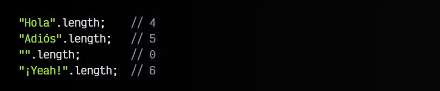
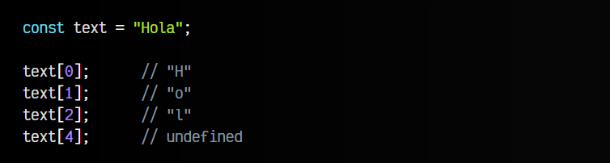

# 
Las String

## ¿Qué es un String?
En Javascript y en el mundo del desarrollo web, una de las tareas que más solemos hacer es manejar cadenas de texto y realizar tareas con ellas. Por lo tanto, tenemos que familiarizarnos con el tipo de dato String.

En programación, cuando hablamos de una varible que posee información de texto, decimos que su tipo de dato es String . En Javascript, es muy sencillo crear una variable de texto. A rasgos generales, hay dos formas principales de hacerlo:

Los String son uno de los tipos de datos básicos (primitivos), y como tal, es más sencillo utilizar los literales que la notación que utiliza la palabra clave new. Para englobar los textos, se pueden utilizar tres tipos de comillas:

   - Comillas simples: '
   - Comillas dobles: "
   - Backticks: ` (ver más adelante, en Interpolación de variables)

A continuación, un ejemplo de declaración de variables de texto en Javascript:

## Propiedades de un string.
Al crear una variable con contenido de texto String , automáticamente, esa variable pasa a tener a su disposición todas las propiedades (variables) y métodos (funciones) disponibles para este tipo de dato, por lo que podemos utilizarlos en nuestro código, como iremos viendo a continuación:

En el caso de los strings, solo tenemos una propiedad importante, .length, que se encarga de devolver el tamaño total de la cadena de texto en cuestión, como se puede ver en los siguientes ejemplos:

## Acceso a un carácter.
Si lo pensamos bien, un String está formado por carácteres, de forma que el texto "Hola", esta formado por los carácteres "H", "o", "l" y "a". Si queremos acceder a cada uno de ellos, podemos utilizar el operador [] indicando la posición a la que queremos acceder:

Si intentamos acceder a una posición (índice) que no existe, nos devolverá undefined (no está definido).

## Métodos de un string.
Pero las características más interesantes de los strings se encuentran en los métodos de dicho tipo de dato. Ten en cuenta que, en las variables de texto, los métodos se ejecutan sobre el propio texto del String, devolviendo información modificada a partir de este.

Por ejemplo, el método .repeat() está disponible en cualquier String, y básicamente repite el texto en cuestión el número de veces que le indicamos por parámetro:

A lo largo de los próximos temas, daremos un repaso a los diferentes métodos que existen en los String, separado en artículos temáticos por categorías.

## Interpolación de variables.
En ECMAScript ES2012 se introduce una interesante mejora en la manipulación general de String, sobre todo respecto a la legibilidad de código. Antes, sólo se podían definir String mediante comillas simples o comillas dobles.

Si queríamos concatenar (unir) varias cadenas de texto, teníamos que hacer algo parecido a esto:

A medida que añadimos más variables o contenido, el código se puede hacer más complejo de leer, especialmente si tenemos que concatenar elementos de un array, objetos, etc... Para evitar añadir complejidad innecesaria, se introducen las backticks (comillas hacia atrás), que nos permitirán interpolar el valor de las variables sin tener que cerrar, concatenar y abrir la cadena de texto continuamente:

Esto, a priori, es una funcionalidad muy simple, pero puede llegar a mejorar sustancialmente la legibilidad de código generado. Además, nos aporta una serie de ventajas:

   - Permite múltiples líneas, algo que no se puede hacer con las demás comillas
   - Permite interpolar expresiones Javascript (no sólo variables)
   - Permite interpolar el valor de variables (ya mencionado)

Todo esto lo hace ideal para crear plantillas reutilizables, por ejemplo, con código HTML:

Observa que validacionCard incluye el código HTML de magicalWord, algo que quizás no tiene mucho sentido aún, pero que puede cobrar mucho sentido si pensamos en crear funciones reutilizables:

