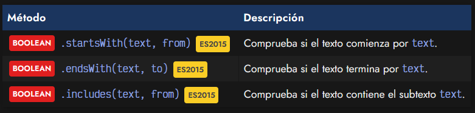
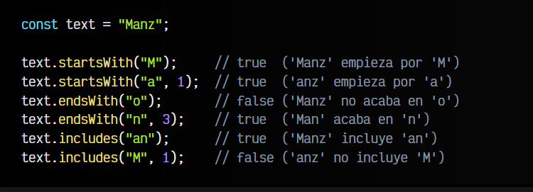
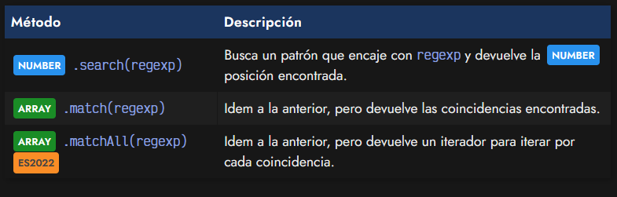
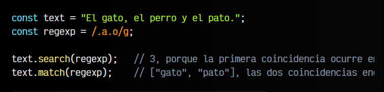
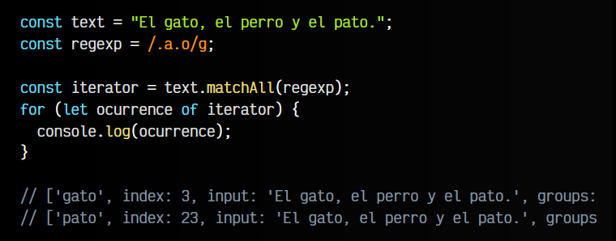
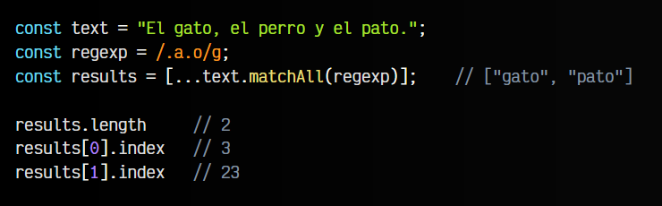
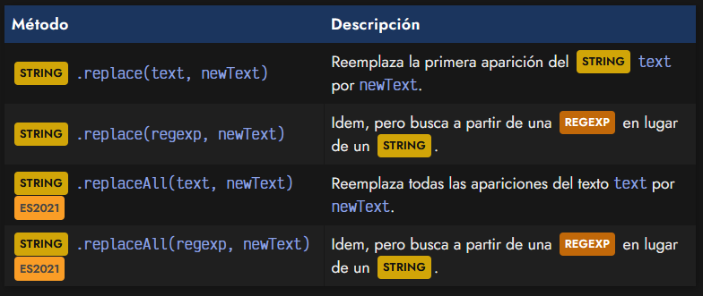
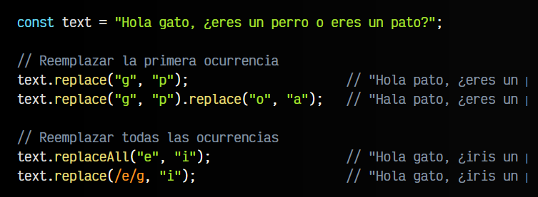
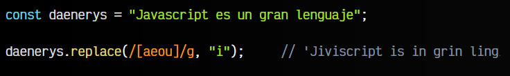
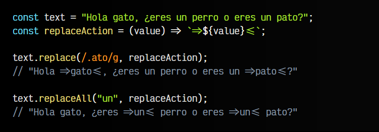

# 
Buscar y reemplazar texto.

Una operación muy frecuente y habitual en Javascript, es la de comprobar la existencia de un texto, buscar o incluso reemplazar por otro texto. Dependiendo del caso, hará falta uno u otro, por lo que lo primero que debes tener claro es saber cuál necesitas. Piensa que, aunque la sintaxis o el uso de uno de ellos te resulte más sencillo que otro, hay tareas que puede que no necesites realizar gratuitamente:

   - 🔍 Comprobación (🔍): La más ligera de las tres. Sólo comprueba si existe el fragmento de texto.
   - 🕵️‍♀️ Búsqueda (🔍+🕵️‍♀️): Busca un fragmento de texto y devuelve encontrado (posición, texto...).
   - 🔁 Reemplazo (🔍+🕵️‍♀️+🔁): Realiza una búsqueda de un texto y además un reemplazo. Suele ser más costoso.

## Comprobación en textos.
Los siguientes métodos se utilizan para realizar algún tipo de comprobación y saber si un fragmento de texto está incluído en un String :  

Observa que en cada método tienes un segundo parámetro opcional, donde se puede indicar desde donde quieres empezar a comprobar (en el caso de from), o hasta donde quieres comprobar (en el caso de to).

   - El método .startsWith() devolverá true si el String comienza por text. De lo contrario, false.
   - El método .endsWith() devolverá true si el String acaba en text. De lo contrario, false.
   - El método .includes() devolverá true si el String contiene text. De lo contrario, false.

Veamos algunos ejemplos:

Ten en cuenta que los Number del segundo parámetro, lo que hacen es acortar el String (por el inicio o por el final) antes de realizar la comprobación.

## Búsqueda de cadenas de textos.
Si necesitamos realizar una búsqueda de un texto (que muchas veces no tenemos claro como es) y queremos obtener información como la posición o las búsquedas encontradas, y los métodos del tema anterior de posiciones y substrings no nos sirven (o se nos quedan cortos), podemos utilizar alguno de los siguientes:

Estas búsquedas toman por parámetro expresiones regulares, por lo que suelen ser más potentes y flexibles que buscar sólo por texto. La diferencia fundamental entre ellas es la siguiente:

   - El método .search() devuelve la posición de la primera ocurrencia. -1 si no se encuentra.
   - El método .match() devuelve un Array con las coincidencias encontradas. null si no se encuentran.
   - El método .matchAll() devuelve un iterador para poder recorrer las coincidencias encontradas.

Veamos algunos ejemplos:

Por otro lado, el método .matchAll() es un poco más avanzado, y permite realizar la misma acción que .match() pero devolviendo un iterador, lo que nos permite recorrerlo en un bucle:

También es posible utilizar .matchAll() desestructurando su resultado, lo que nos permitirá acceder a la información de una forma más directa:

Para comprender bien el funcionamiento de este método, quizás sería mejor echar un vistazo al tema de Arrays y de Expresiones regulares, que se aborda unos capítulos más adelante.

## Reemplazar cadenas de texto.
Si lo que necesitamos es reemplazar un texto, tenemos a nuestra disposición una serie de métodos, tanto en versión donde buscas mediante un String, como en versión donde buscas mediante una Regexp:

Observa que dichos métodos se pueden resumir en lo siguiente:

   - El método replace() reemplaza solo la primera aparición de un texto (salvo se use regexp global)
   - El método replaceAll() reemplaza todas las apariciones de un texto.

Veamos algunos ejemplos para ilustrarlo mejor.

## Reemplazar textos.
En este caso, usamos los métodos .replace() y .replaceAll():

Ten en cuenta que text no cambia (no muta), es decir, el método .replace() devuelve un nuevo String con el texto original reemplazado. En los ejemplos anteriores, cada linea está actuando sobre la constante text de la primera línea.

El primer grupo, reemplaza sólo la primera ocurrencia encontrada. Observa que el segundo ejemplo del primer grupo, encadenamos varios .replace() consecutivos, por lo que se reemplaza la primera ocurrencia de g por p y del resultado, se reemplaza la primera ocurrencia de o por a.

El segundo grupo, por su parte, se utiliza .replaceAll() o .replace() con una expresión regular global, por lo que se reemplazan todas las ocurrencias.

## Reemplazar todos los textos.
Como hemos dicho, la forma más potente de reemplazar todas las ocurrencias, es utilizando .replace() con una expresión regular global. Las expresiones regulares permiten crear patrones complejos que coicindan en múltiples casos. Por ejemplo, el siguiente caso reemplaza todas las letras vocales por una letra i:

Desde ECMAScript ES2021 es posible utilizar replaceAll() para reemplazar todas las ocurrencias de un texto o de una expresión regular. Funciona exactamente igual que replace(), sólo que reemplaza todas las ocurrencias en vez de solamente la primera.

## Función para reemplazar.
Además, tanto el método .replace() como el método .replaceAll(), nos permite indicar, como segundo parámetro una Function en lugar de un String, permitiendo utilizar dicha función para realizar un reemplazo. En lugar de simplemente reemplazar por un String, se reemplaza por lo que devuelve dicha Function.

Observa ahora, la versión del .replace() donde le pasamos un segundo parámetro que es una Function que reemplaza el texto encontrado:

