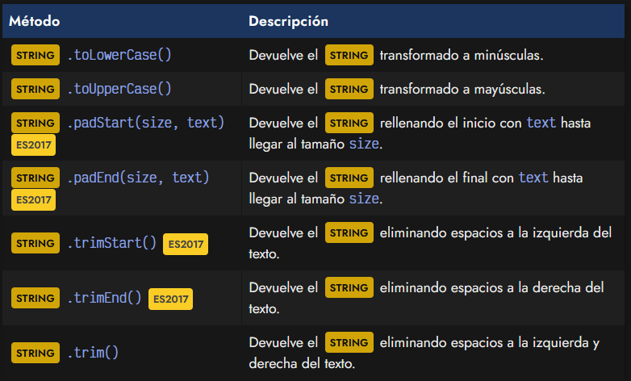
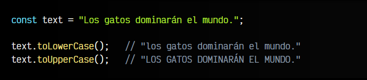
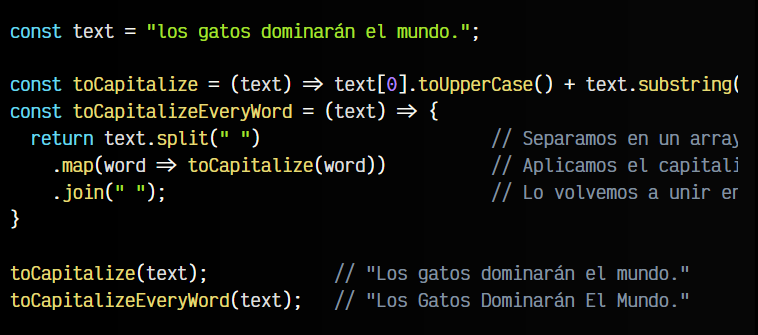
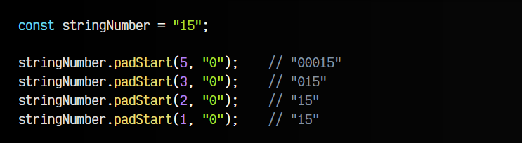
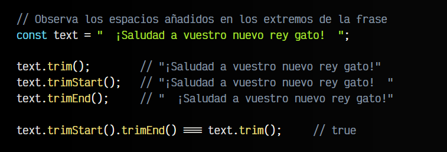
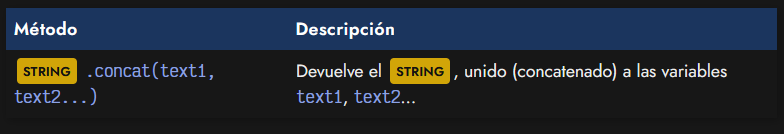
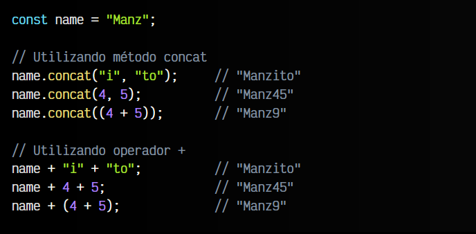

# 
Modificar strings.

Los siguientes métodos realizan algún tipo de operación de modificación sobre un String:

Observa que en todos los casos, se devuelve un nuevo String, en lugar de mutar el original.

## Mayúsculas y minúsculas.
Los métodos .toLowerCase() y .toUpperCase() devuelven el original, transformando todo el texto a minúsculas o a mayúsculas respectivamente:

## Capitalizar texto.
La palabra capitalizar se refiere a transformar a mayúsculas su primer carácter, y en minúsculas el resto del texto. En Javascript, no existe una función .toCapitalize(), pero de necesitarla se podría realizar la siguiente función de ayuda:

Observa que toCapitalize() capitaliza la frase en conjunto, mientras que toCapitalizeEveryWord() capitaliza cada una de las palabras de la frase.

## Relleno de cadenas.
Una transformación interesante que se añade en Javascript ES2017 es la resultante de utilizar métodos como .padStart(size, text) o .padEnd(size, text). Ambos métodos toman dos parámetros: size es la longitud deseada del String resultante y text el carácter a utilizar como relleno.

El objetivo de ambas funciones es devolver un nuevo String con la información original existente, pero ampliando su tamaño a size y rellenando el resto con text. Esto se realizará al principio del String si se usa .padStart() o al final si se usa .padEnd(). Veamos un ejemplo:

El método .padEnd() funcionaría exactamente igual, pero añadiendo el text al final en lugar de al principio del String.

Estos métodos resultan especialmente interesantes para formatear horas, como por ejemplo en el caso que queremos que las cifras menores a 10 aparezcan siempre en formato de dos dígitos 00, en lugar de un formato variable, donde se use un dígito 0 para números entre 0 y 9 y dos dígitos para números mayores a 9.

## Eliminar espacios sobrantes.
El método .trim() y sus métodos derivados, informalmente traducido como «afeitar» o «recortar», se encarga de devolver el original, pero eliminando los espacios sobrantes que puedan existir a la izquierda o a la derecha del texto (y sólo esos, nunca los que hay entre carácteres).

De la misma forma, .trimStart() y .trimEnd() son versiones particulares, que realizan la misma tarea, pero sólo a la izquierda o derecha, respectivamente. Veamos algunos ejemplos:

Puede que en algunos lugares te encuentres los métodos .trimLeft() (izquierda) y .trimRight() (derecha) como alternativas a .trimStart() y .trimEnd(). En principio, son una implementación obsoleta que no debería usarse, ya que algunos idiomas, el inicio no es necesariamente la izquierda y podría ser confuso. En su lugar, aunque existan y funcionen, deberían usarse siempre .trimStart() y .trimEnd().

# 
Alternativas para crear strings.

## Concatenar (unir textos).

El método .concat(text1, text2...) permite concatenar (unir) los textos pasados por parámetros al propio en cuestión. La misma operación se lleva acabo cuando utilizamos el operador +, mucho más legible y compacto en la mayoría de  situaciones. 

