# 
Posiciones y substring.

Hay dos conceptos muy importantes relacionados con todo de lo que hablaremos en este artículo, y son los conceptos substring y posición. Aunque son bastante autoexplicativos, vamos a definirlos.

   - Un substring es un fragmento más pequeño que forma parte de un String. -También se suele hacer referencia a ellos como subcadena o subcadena de texto.

   - Una posición (o índice) es un Number que representa el lugar donde está ubicado un substring, teniendo en cuenta que se empieza a contar en 0. Así pues, la primera letra del String tendría el índice 0, la segunda 1, la tercera 2, etc...

Un ejemplo para entenderlo mejor:

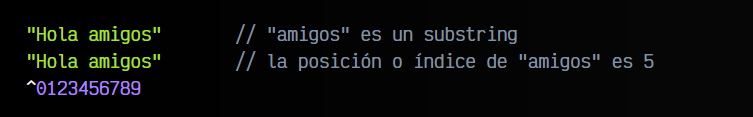

Ahora que tenemos claros estos dos conceptos, vamos a profundizar en métodos que los utilizan.

## Obtener posición o índice.
Existen varios métodos que permiten darnos información sobre la posición o ubicación que ocupa un determinado carácter o texto. Como ya hemos mencionado, esta posición también suele denominarse índice. Veamos detalladamente dichos métodos:

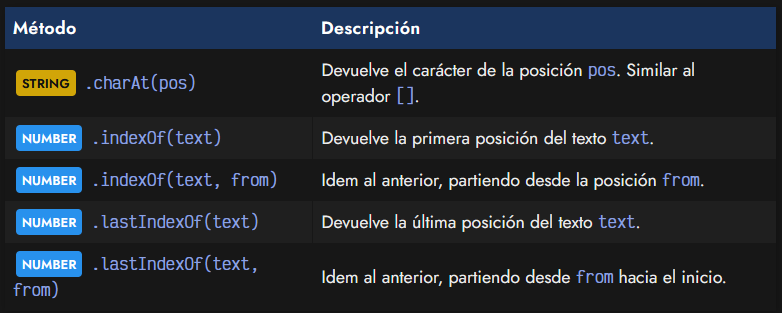

## Carácter en cierta posición.
El método .charAt(pos) nos permite comprobar que carácter se encuentra en la posición pos del texto. Este método devolverá un String con dicho carácter. En caso de pasarle una posición que no existe o imposible (negativa), simplemente nos devolverá un String vacío. El valor por defecto de pos es 0, por lo que si se omite el parámetro, obtendrá el primer elemento.

No obstante, es preferible utilizar el operador [] para obtener el carácter que ocupa una posición, ya que es más corto y rápido de utilizar y mucho más claro.

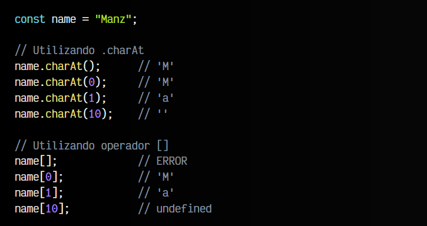

Observa que la diferencia de .charAt() y el operador [], es que para posiciones donde no existe ningún carácter, el primero devuelve "" (cadena de texto vacía) mientras que el segundo devuelve .

## Posición de cierto carácter.
El método .indexOf(text, from) realiza la función «opuesta» a charAt(). El método .indexOf(text) buscará el subtexto text en nuestro String y nos devolverá un Number con la posición de la primera aparición de dicho subtexto. En caso de no encontrarlo, devolverá -1. El parámetro from es opcional, y es la posición en la que empezará a buscar, que si no se suministra, es 0.

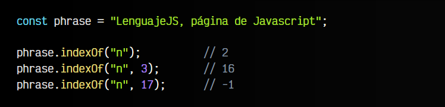

## Posición desde el final.
El método lastIndexOf(text, from) funciona exactamente igual que el anterior, sólo que realiza la búsqueda partiendo desde el final de la cadena de texto hacia el principio, de modo que busca primero las últimas apariciones, en lugar de las primeras:

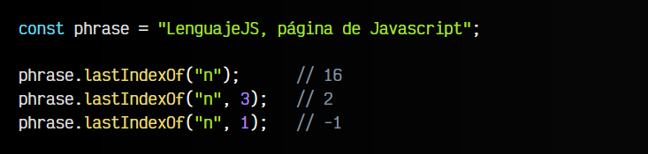

De la misma forma, se devuelve -1 si no encuentra la ocurrencia, y el parámetro from es opcional, de indicarlo, se comenzará a buscar desde esa posición, hacia el principio del String.

## Obtener fragmentos (substrings).
Javascript también posee una serie de métodos mediante los cuales podemos crear substrings formados por un fragmento del String original. Veamos de que métodos se trata:

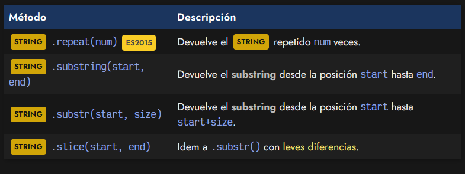

## Repetir cadena de texto.
Mediante el método .repeat() puedes repetir el texto del String exactamente el número de veces indicado por parámetro:

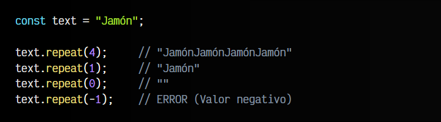

## Fragmento de texto (substring).
Otras de las operaciones fundamentales de los String es la posibilidad de extraer fragmentos de texto de un String . Para ello, tenemos dos aproximaciones: el método substring() o el método substr().

   - El método substring(start, end) devuelve un String con el fragmento de texto desde la posición start hasta la posición end. Si se omite el parámetro end, el subtexto abarcará desde start hasta el final.

   - El método substr(start, size) devuelve un String con el fragmento de texto desde la posición start, hasta la posición start+size. Dicho de otra forma, size será el tamaño del String resultante. En el caso de omitirse el parámetro size, se devuelve hasta el final.

Veamos un ejemplo ilustrativo:

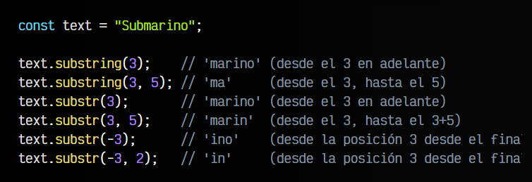

Observa que el método .substr() con un valor negativo en su primer parámetro start, empieza a contar desde el final. Esto es algo que no ocurre con el método .substring().

## Dividir un texto en partes (array).
Un método muy útil y versátil es .split(text). Permite dividir un String por el substring text utilizándolo como separador las veces que haga falta. Como resultado, devolverá un Array con cada una de las partes divididas. Es muy útil para crear arrays, o dividir textos que tienen separadores repetidos (comas, puntos, etc...) en varias partes:

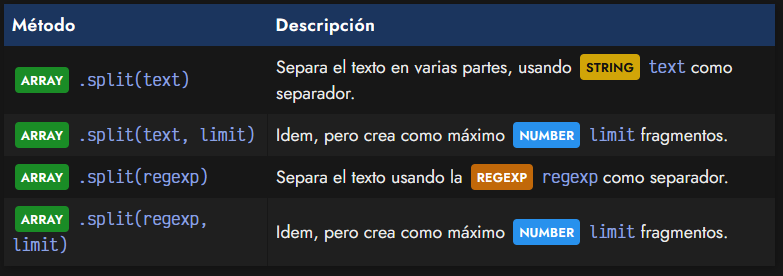

Veamos algunos ejemplos indicando un como separador:

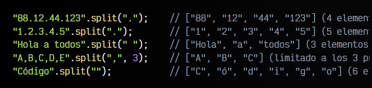

Observa que en el último ejemplo, el separador es una cadena vacía, es decir, «separar por la unidad más pequeña posible». Al indicar esto, .split() realiza una división carácter por carácter.

Por otro lado, ten en cuenta que también es posible indicar una Regexp como primer parámetro y no sólo un String, lo que permite realizar separaciones más versátiles y flexibles. Por lo demás, es exactamente igual a los ejemplos anteriores:

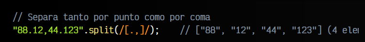

