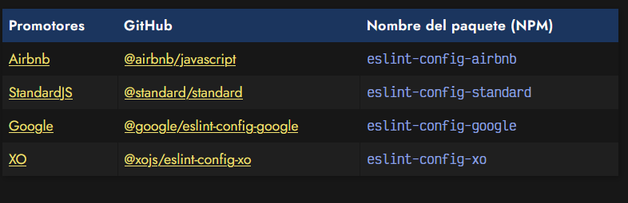

# 
ESLint: Linter Javascript

Aprender a programar en Javascript (o en cualquier lenguaje, en realidad) es una tarea que requiere irse perfeccionando continuamente. Una vez hemos aprendido las bases y fundamentos de lenguaje, una estupenda recomendación sería la de utilizar una herramienta llamada linter.

Los linters se encargan de examinar el código del programador y lo ayudan a avisarlo cuando detectan errores de sintaxis, código incorrecto, malas prácticas o incluso ayudarlo a seguir unas normas de estilo. Esto favorece escribir código de calidad y acostumbra al usuario a solventar ciertos problemas comunes en fases tempranas (y no tan tempranas) como programador.

Hay que tener claro que un linter no sólo busca errores que hacen que nuestro código no funcione, sino que también nos ayuda a corregir malos hábitos que desembocan en problemas. Un programa puede ser válido y funcionar, pero aún así, ESLint puede encontrar errores en él.

## ¿Qué es ESLint?.
[ESLint](https://eslint.org/) es un linter para código Javascript. Ayuda a detectar que se cumplan unas ciertas normas y criterios (personalizables por el programador) para que el código Javascript escrito siga unos estándares y estilos de calidad, favoreciendo la escritura de código correcto, coherente y consistente. Aunque existen otros linters Javascript (JSHint, JSLint, etc...), ESLint se ha establecido como herramienta estándar de facto.

[ESLint](https://eslint.org/) es totalmente configurable y puedes indicarle que criterios (llamados reglas) quieres que utilice y cuales prefieres que ignore, adaptándose a las necesidades de cualquier empresa, programador o equipo de trabajo.

## Instalación de ESLint.
ESLint requiere como mínimo Node 12.22+ para funcionar, sin embargo, siempre recomendamos tener la última versión estable de Node instalada, para lo cuál puedes seguir nuestro tutorial de [Instalación de NVM](https://lenguajejs.com/npm/introduccion/instalacion-node-con-nvm/), un control de versiones que hará que la tarea sea muy cómoda y flexible.

Para instalar ESLint en nuestro proyecto haremos lo siguiente:

Este comando se encargará de ejecutar un asistente de instalación y configuración de ESLint. Te preguntará una serie de cuestiones y a partir de ellas creará un archivo de configuración e instalará los paquetes necesarios (que dependen de las respuestas del asistente).

El comando npx es una herramienta para ejecutar comandos que viene incorporada junto a npm, en la instalación de Node. Si no la conoces, lee esta sección: [¿Qué es npx?](https://lenguajejs.com/npm/administracion/instalar-paquetes-npm/#el-comando-npx).

## Configuración inicial de ESLint.
Al arrancarse el asistente para configurar ESLint en nuestro proyecto, nos preguntará algunas cuestiones sobre el proyecto a revisar. Hagamos un repaso rápido por las opciones que nos aparecen:

## Modo de ESLint.
Esta opción nos permite seleccionar el modo en el que funcionará el linter. Se recomienda utilizar la última opción, la más completa de todas:

La primera opción, revisa sólo la sintaxis de nuestro código. La segunda opción, además ayuda a encontrar potenciales problemas en el código. Por último, la tercera opción y la opción recomendada, hace todo lo anterior y además sigue unas determinadas normas de estilo para ayudar al programador a corregir malos hábitos o malas prácticas y hacer el código más coherente y legible.

## Módulos Javascript.
Esta opción nos permite seleccionar la forma en la que importamos código Javascript desde otros archivos. Si estamos utilizando las palabras clave import y/o export en nuestro código, deberemos seleccionar la primera, ya que estamos utilizando [módulos ESM](https://lenguajejs.com/javascript/modulos/que-es-esm/),./imagenes-eslint/sin embargo, si utilizamos require o module.exports, deberemos utilizar la segunda por que estamos utilizando módulos de NodeJS:

Si tienes más dudas, echa un vistazo al artículo [Diferencias entre módulos ECMAScript (ESM) y CommonJS](https://lenguajejs.com/automatizadores/introduccion/commonjs-vs-es-modules/).

## Framework Javascript.
Esta opción nos da la posibilidad de indicar si estamos utilizando un framework Javascript específico como React o Vue.js y así poder adaptarse a la sintaxis correspondiente de estos frameworks. Si no fuera el caso, seleccionamos None of these:

## Soporte de TypeScript.
Si estamos transpilando nuestro código de Typescript a Javascript, podemos indicar en el linter que estamos utilizándolo. De lo contrario, simplemente indicamos que no lo utilizamos.

## ¿Javascript cliente o servidor?.
Ojo con esta opción. Las opciones no son exclusivas, sino que podemos marcar una o varias (utilizando SPACE). Con esta opción enfocamos el linter para revisar código teniendo en cuenta si va dirigido exclusivamente a navegadores (sin Node), si es código Javascript de NodeJS o un híbrido donde se usan ambas:

## Guía de estilo Javascript.
Esta es una de las opciones más importantes, ya que con ella nutrimos al linter con la información necesaria para saber como corregir nuestro código Javascript. La opción recomendable es la primera, donde le decimos que utilice una guía de estilo popular. Posteriormente, ESLint nos ofrecerá una de las tres más famosas (aunque se pueden utilizar otras fuera del asistente).

La segunda opción, Answer questions about your style, nos preguntará una serie de cuestiones sobre nuestro código para ir creando una serie de reglas de forma manual. La última opción, Inspect your JavaScript file(s), es posible que no aparezca en algunos casos. Se encarga de analizar los ficheros de código .js existentes para inferir una configuración a partir de ellos.

## Use a popular style guide.
Si seleccionamos la primera opción en el punto anterior, ESLint nos dará a elegir una guía de estilos de las siguientes, consideradas las más populares y extendidas:

Cada una de ellas, tiene una serie de reglas preconfiguradas que luego, puedes modificar o cambiar si lo deseas. También puedes crear/modificar tu propio conjunto de reglas, aunque eso te llevará un poco más de tiempo.

Además de estos paquetes del asistente, existen muchos otros como eslint-config-react-app, eslint-config-prettier, eslint-config-eslint, eslint-config-jest-enzyme (u otros) que puedes buscar en NPM con un simple npm search eslint-config e instalar con un npm install seguido del nombre del paquete.

Aunque el asistente de ESLint instala y configura los paquetes necesarios automáticamente, si queremos hacerlo con una guía de estilo diferente no basta con hacer el npm install, sino que además hay que modificar el archivo de configuración como veremos más adelante.

## Formato de configuración.
Esta opción nos pregunta en que formato queremos guardar la configuración de ESLint. Podemos utilizar formato .js, formato .yaml o formato .json. Los más extendidos suelen ser el formato .js y el formato .json. Por lo que puedes elegir cualquiera de los dos:

Quizás, el formato más flexible es el formato Javascript .js, ya que podemos meter lógica Javascript de NodeJS para modificar la configuración. Por esta razón, es de las más frecuentes.

## Instalación de paquetes NPM.
Por último, y dependiendo de las opciones escogidas, el último mensaje que nos aparecerá será el siguiente, en el que nos dice los paquetes de NPM que necesita instalar y si queremos que lo haga por nosotros. Respondemos que sí y nos ahorramos hacer un npm install manualmente:

## Cuestiones sobre nuestro estilo.
En el caso de que no queramos utilizar un paquete de reglas preconfiguradas, ESLint permite crear uno desde cero mediante unas pocas preguntas que nos irá realizando y determinarán la base del estilo que utilizaremos:

Podemos irlas respondiendo una por una y determinar cual será el estilo principal de nuestro código. A continuación, una tabla donde explicamos cada una de las preguntas que nos aparecen en el asistente de ESLint, con esta opción:

Obviamente, estas no son sino las preguntas principales y más importantes para tener un fichero de configuración de reglas mínimo para comenzar. Puedes encontrar todas las reglas que tiene ESLint (son muchas) en esta página: [reglas de ESLint](https://eslint.org/docs/latest/rules/).

## Inspeccionar ficheros Javascript.
Si por otro lado, hemos seleccionado la opción Inspect your JavaScript file(s), ESLint se basará en una revisión de tus archivos Javascript para determinar cuál sería la guía de estilo que deberías utilizar, siguiendo las normas que se utilizan en los archivos Javascript actuales.

## El fichero .eslintrc.js.
Independientemente de las opciones elegidas en el asistente, siempre se nos preguntará en que formato queremos guardar la configuración de ESLint. Ten en cuenta que el proceso del asistente, lo que hace realmente es generar un fichero de configuración con [reglas de ESLint](https://eslint.org/docs/rules/) que luego podrás modificar y personalizar.

En principio, puedes utilizar el formato que más te guste. Si existen varios archivos de configuración diferentes, tendrá preferencia en el orden de la siguiente lista:

  - Javascript: Un archivo de configuración llamado .eslintrc.js
  - YAML: Un archivo de configuración llamado .eslintrc.yaml o .eslintrc.yml
  - JSON: Un archivo de configuración llamado .eslintrc.json. Aunque en el formato .json no se permiten comentarios, ESLint sí soporta comentarios de tipo /* */.

También es posible utilizar un objeto eslintConfig dentro del package.json de nuestro proyecto.

Antiguamente se utilizaba un fichero .eslintrc sin extensión (que realmente era un YAML o JSON). Sin embargo, ESLint marca esta posibilidad como obsoleta, por lo que se recomienda utilizar una de las tres opciones anteriores.

Por último, comentar que también es posible crear un fichero .eslintignore donde podemos indicar archivos o globs (patrones de archivos, comodines, etc...) que se ignorarán a la hora de realizar una comprobación de ESLint. También se pueden añadir comentarios, con líneas que comiencen por el caracter #.

## Configuración de ejemplo.
A continuación, tenemos un fichero de configuración de ejemplo de ESLint denominado eslint.config.mjs, con las opciones recomendadas y ciertas reglas personalizadas y comentadas:

En el apartado rules es donde podremos modificar el comportamiento de las reglas y adaptarlo a nuestra guía de estilo particular. Aquí puedes encontrar todas las reglas de eslint, aunque concretamente estamos utilizando 4 reglas:

   - [Indentación a 2 espacios](https://eslint.org/docs/latest/rules/indent)
   - [Finales de línea de UNIX](https://eslint.org/docs/latest/rules/linebreak-style)
   - [Uso de comillas dobles para strings](https://eslint.org/docs/latest/rules/quotes)
   - [Uso de punto y coma obligatorio](https://eslint.org/docs/latest/rules/semi)

Podemos guardar este fichero con nombre .eslintrc.js en la carpeta raíz de nuestro proyecto y escribir en una terminal el siguiente comando para que nos revise los errores de nuestro código (asumiendo que queremos revisar un archivo llamado index.js):

También se pueden usar globs como *.js o similares.

Observa que en la opción extends del archivo de configuración se están utilizando dos fuentes de datos. Por un lado, las recomendaciones básicas oficiales de ESLint, y por otro lado, la guía de estilo eslint-config-standard. En el caso de querer seguir añadiendo más guías sólo necesitaríamos añadir el nombre del paquete, omitiendo el fragmento eslint-config-.

## Autofix con ESLint.
Una de las características más interesantes de ESLint, es utilizar la característica autofix, es decir, que ESLint se encargue de corregir los errores automáticamente, sin que tengamos que hacerlo nosotros manualmente, simplemente siguiento las reglas preconfiguradas.

Esto hará que ESLint revise el archivo src/js/index.js y corrija todos los errores posibles del código de forma automática. Sin embargo, lo práctico sería que nos lo corrija en el VSCode al guardar, no tener que hacerlo desde una consola. Para conseguir esto, necesitamos seguir los siguientes pasos:

   - Paso 1: Configurar ESLint con el asistente o el fichero de configuración (visto anteriormente)
   - Paso 2: ![Instalar el plugin] (https://marketplace.visualstudio.com/items?itemName=dbaeumer.vscode-eslint) en VSCode
   - Paso 3: Añadir las siguientes líneas de configuración en VSCode, pulsando 

y seleccionando Settings (JSON):

Esto es el equivalente a escribir el comando anterior npx eslint --fix src/js/index.js al guardar el fichero. Recuerda que no todos los errores son autocorregibles, por lo que puede que ciertos errores no se arreglen de forma automática.

## Plugins de ESLint.
Ten en cuenta que en esta guía hemos visto como configurar ESLint como herramienta de terminal. Sin embargo, podría ser mucho más cómodo (e incluso común) configurarlo en el editor de código que utilicemos, para que nos muestre las recomendaciones y errores a medida que vamos escribiendo nuestro programa, sin necesidad de estar mirando la terminal, o ejecutando los comandos.

También puede ser interesante tenerlo configurado con algún [automatizador](https://lenguajejs.com/automatizadores/) como WebPack, Gulp, ViteJS (o similares) y que nos aparezca cuando estemos trabajando con él.

A continuación tienes una lista de editores o automatizadores con algunas de las extensiones o plugins que puedes instalar para usar ESLint:

