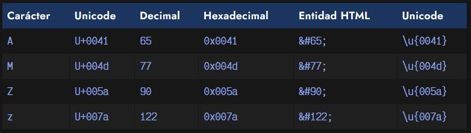
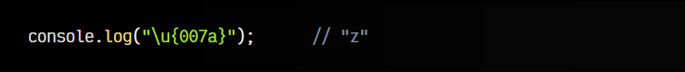
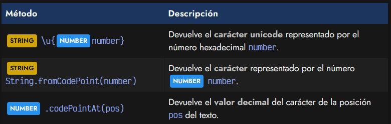
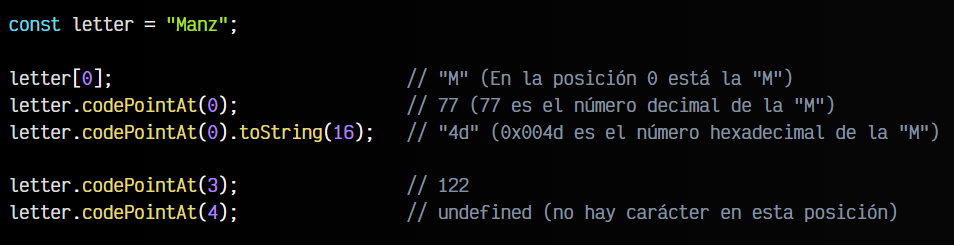
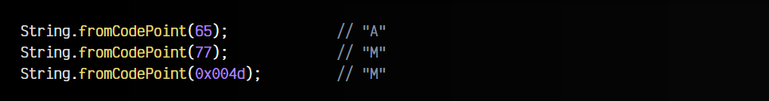
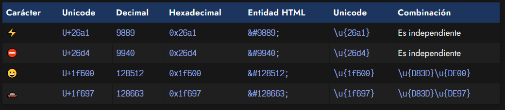
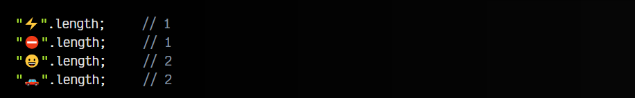
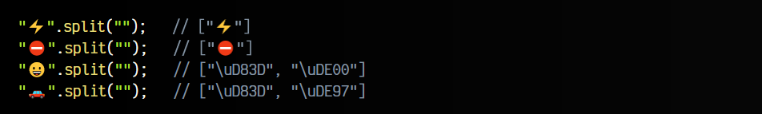
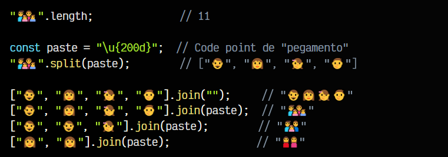
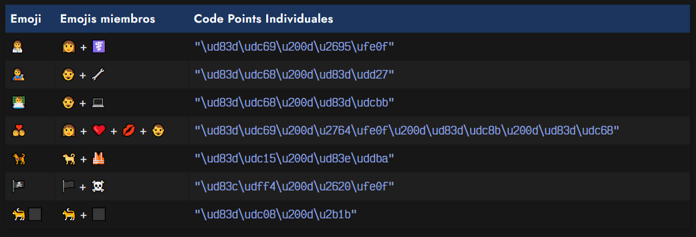

# 
Contenido de texto unicode.

## ¿Qué es Unicode?.
Unicode es el nombre por el que se conoce al sistema moderno de codificación de carácteres que se usa en informática. A grandes rasgos, cada carácter como podría ser la A, la B (o cualquier otro), tiene su representación Unicode, que se basa en un código o code point.

Por ejemplo, tomemos como ejemplo el carácter A (mayúsculas). Este carácter corresponde al código Unicode U+0041, el cual se forma por el indicativo U+ seguido del número hexadecimal, que en este caso es 0x0041, o 65 si hablamos de números decimales. Con esto, podemos representar esos caracteres en HTML o en texto, pero para verlo más claro, observa la siguiente tabla con algunos ejemplos:

Si no lo ves claro, escribe en el código HTML la entidad &#122; o en una consola Javascript del navegador lo siguiente:

Comprobarás que efectivamente, este código representa el símbolo o carácter que simboliza visualmente. Hay una gran cantidad de code points, que están en el rango de U+0000 hasta U+10FFFF, de modo que cualquier símbolo existente tiene su su representación en Unicode.

En Javascript, tenemos dos métodos interesantes relacionados con este tema:

Vamos a verlo con varios ejemplos para entender su utilización.

## Código Unicode de un carácter.
Desde Javascript es muy sencillo convertir un carácter a su representación en Unicode. Es tan sencillo como utilizar el método .codePointAt(), al que se le debe pasar la posición del carácter a analizar:

## Carácter de un código Unicode.
Si queremos realizar el paso inverso, es decir, teniendo un número decimal o hexadecimal, obtener el carácter que representa, podemos hacerlo de la siguiente forma, utilizando el método estático String.fromCodePoint(), al que se le pasa el número en cuestión:

Observa que en el último caso, le pasamos el número en hexadecimal. Funciona perfectamente también, ya que 0x004d y 77 son el mismo número, sólo que representado en otra base numérica.

## Emojis (emoticonos).
Una parte muy importante de Unicode es la representación de emojis, donde lo mencionado anteriormente se complica un poco. Antes de continuar, aclarar que un Emoji es una representación visual y gráfica de un concepto. Quizás, su forma más conocida son los emojis de WhatsApp, o los emojis de redes sociales, pero tienes que saber que el concepto es universal, sólo que las diferentes plataformas (WhatsApp, Twitter...) o sistemas operativos (Windows, Linux, Mac, Android...) pueden dibujarlos de diferente forma.

Siguiendo la misma explicación anterior, podemos encontrar que con los emojis ocurre lo mismo. Sin embargo hay algo que cabría destacar. Observa que aparece una última nueva columna, con los dos primeros emojis de ejemplo sin datos, pero con los últimos con dos bloques \u{___}:

Esto ocurre porque los primeros emojis que se crearon funcionan exactamente como los caracteres o símbolos que explicamos anteriormente, sin embargo, a medida que comenzamos a necesitar más emojis y se fueron creando más, los siguientes empezaron a formarse a partir de varios códigos unicode.

Esto se puede ver muy fácilmente de la siguiente forma:

Ahora, vamos a intentar separarlos utilizando el método .split() que aprendimos en temas anteriores. Te encontrarás con que los emojis «más antiguos» sólo tienen su propio elemento, mientras que los posteriores, los descompone en dos code points combinados.

Esto permite que se puedan crear muchos más emojis realizando combinaciones, ya que observa que los dos últimos emojis, comparten el primer code point \u{D83D}, sin embargo, varía el último.

## Emojis combinados.
Quizás no lo sepas, pero hay algún que otro giro de guión interesante con los emojis, más concretamente con los más recientes. Nada mejor que demostrarlo con un ejemplo de código, que luego explicaremos:

En primer lugar, observa que el emoji de la familia nos dice que tiene un tamaño de 11. Si investigamos un poco, y hacemos una desestructuración con [..."👨‍👩‍👧‍👦"], veremos que el truco es que está combinado por varios emojis individuales, que tienen mucho sentido al combinar.

Observa que si unimos los cuatro emojis individuales por una cadena vacía "", obtenemos los cuatro emojis individuales unidos en un String, sin embargo, si utilizamos el code point \u{200d} como "pegamento", esos emojis se unen formando un emoji individual que forma una familia. De hecho, podemos incluso ir cambiando los emojis individuales que lo forman, y veremos que se refleja en el resultado.

Existen varios emojis de este tipo, que permiten hacer combinaciones. Algunos ejemplos:

Recuerda que los carácteres Unicode se definen de forma universal, y hay muchos y muy variados, sin embargo, cada sistema operativo es la responsable de definirlos, y cada plataforma puede modificarlos o crear los suyos propios.

Con el tiempo, van surgiendo nuevos emojis, por lo que es posible que algunos emojis muy recientes no puedas verlo en un sistema Mac pero si en un sistema Windows (o viceversa). Con esta forma de crear emojis combinables, en el caso de que el emoji de la bandera 🏴‍☠️ no esté listo en tu sistema, siempre verías los anteriores 🏴☠️, por lo que tienes un fallback interesante que te da a entender el concepto.

