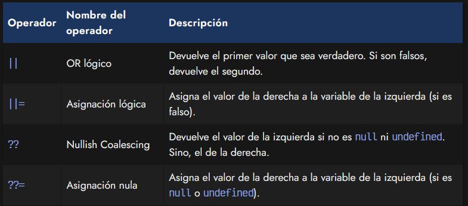
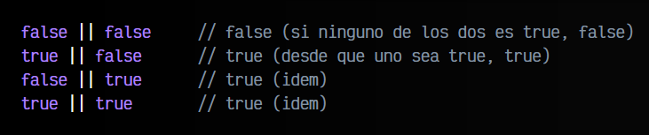
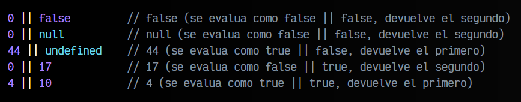
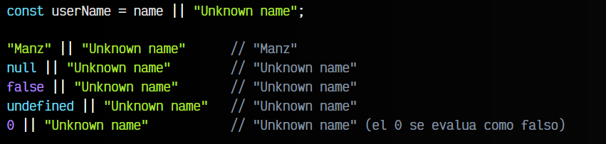
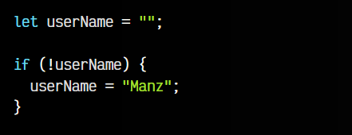
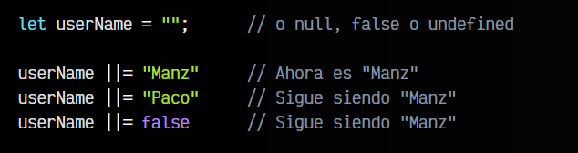
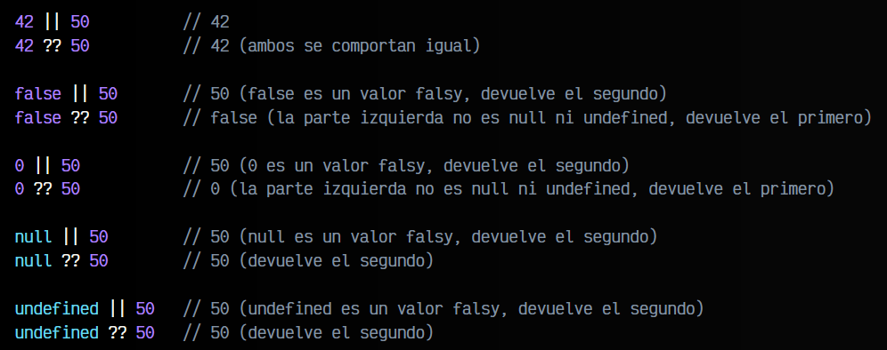
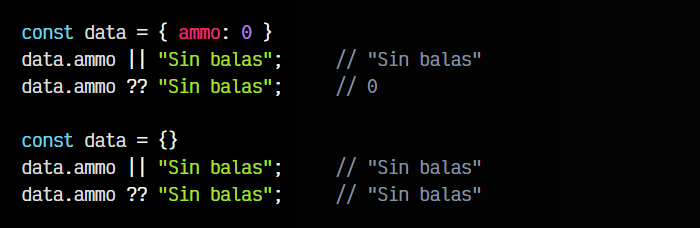
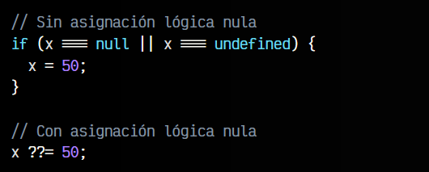
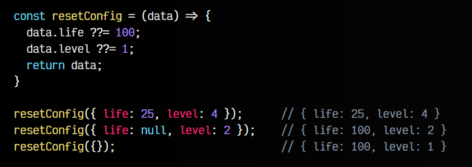

# 
Operador Nullish Coalescing.

Aunque el título del artículo es el Nullish Coalescing, en este artículo vamos realmente a hablar de cuatro operadores diferentes, que tienen bastante relación entre sí:

Veamos sus características y profundicemos en ellos.

## Operador OR lógico.
El operador lógico OR (||) establece una condición donde devolverá el primer valor si es true o el segundo si el primero es false. Esto se puede leer de forma sencilla de la siguiente forma: «devuelve a (si es verdadero), o si no, b».

Veamos algunos ejemplos reales, primero con boolean que es más sencillo de entender:

Sin embargo, ten en cuenta que podemos utilizar este operador con otros tipos de datos y no sólo con . En el anterior, los valores repetidos no hay que diferenciarlos: si false || false te da igual que false devuelva, simplemente es false.

Esto no ocurre con otros tipos de datos. Recuerda que en programación, cualquier valor numérico superior a 0 es considerado true como y que cualquier valor que sea 0 o falsy, es false.

Veamos algunos ejemplos:

Teniendo todo esto en cuenta, el operador || nos podría venir bastante bien para situaciones donde, por ejemplo, tenemos una variable name que no sabemos a ciencia cierta si está definida y queremos crear una nueva variable userName con el valor de name, o sino, un valor por defecto "Unknown name":

OJO: Ten presente que en algunos casos te puede interesar esta funcionalidad, sólo que 0 es un valor válido que tiene sentido para ti. En ese caso, es mejor utilizar el operador de unión nula ?? (nullish coalescing) que explicaremos a continuación.

## Asignación lógica.
Igual que tenemos la posibilidad de realizar asignaciones como += que son la mezcla de una asignación con una operación de suma, también podemos hacer lo propio con el operador lógico de asignación ||=, que une un operador lógico con una asignación.

Observa el siguiente fragmento de código:

Este código, podemos simplificarlo utilizando el operador lógico OR de asignación ||=:

Con ||= conseguimos que si el valor inicial de userName es un valor que se evalua como falso como null, undefined, 0, false o "", entonces realizará la asignación con el valor de la derecha. En caso contrario, si ya tiene un valor establecido que no es falso, no hará nada.

## Operador Nullish coalescing.
El operador nullish coalescing (unión nula) es un operador lógico muy similar al operador OR, pero con ciertos matices y diferencias. A grandes rasgos, se puede decir que el operador a ?? b devuelve b sólo cuando a es undefined o null.

Dicho de otra forma, funciona igual que el operador OR, pero sólo para valores que sean undefined o null, en lugar de la amplia gama de valores que se pueden evaluar como falso.

Veamoslo con un ejemplo para ver la diferencia con el anterior:

Dependiendo del caso, podría interesarnos utilizar el operador ?? o el operador ||. Veamos un ejemplo algo diferente. Imagina que tenemos un objeto data donde tenemos almacenado la cantidad de balas que le quedan a un personaje de un videojuego.

Si necesitamos mostrar al usuario visualmente en el menú que se ha quedado sin balas, quizás nos podría interesar utilizar el operador ||. Por otro lado, si lo que queremos es mostrar el total numérico de balas, quizás nos interesaría más utilizar el operador ??.

Ten en cuenta que en el segundo caso, la propiedad ammo es undefined, ya que no está definida.

## Asignación lógica nula.
Al igual que pasó con el operador OR lógico, también tenemos una mezcla del nullish coalescing y una asignación. Este operador es bastante interesante para algunas operaciones muy frecuentes en Javascript.

Existen ciertos casos donde, si una variable tiene valores null o undefined (valores nullish) y sólo en esos casos, queremos cambiar su valor. Veamos como se haría sin utilizar la asignación lógica nula y como podríamos resumirlo utilizándola:

Como puedes ver, utilizando el operador ??= podemos simplificar mucho nuestro código. Recuerda que a ??= b es equivalente a a ?? (a = b). Esto puede ser super útil para simplificar casos como el siguiente:

Observa que la función resetConfig() obtiene un objeto por parámetro y en el caso de tener una de las propiedades life o level a null o no existir (o valer undefined), las reseteará al valor indicado.

