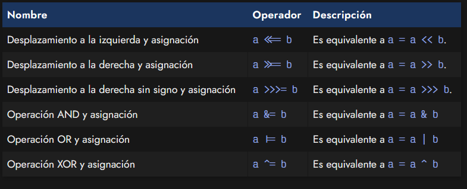

 # 
Operadores bit a bit (BitWise).

 ## Operadores bitwise.
 Aunque en el ecosistema Javascript no es algo que se utilice de forma frecuente, existen los denominados operadores a nivel de bit o «bitwise». Se trata de una serie de operadores que nos permiten realizar operaciones o cálculos básicos, pero trabajando a un nivel más bajo.

 Los operadores bitwise permiten realizar operaciones que se hacen más «cerca de la máquina», por lo que son más eficientes. Esto es ideal si necesitamos realizar operaciones intensivas de forma masiva, ya que al llamarlas gran cantidad de veces, una mejora de rendimiento se vuelve notable.

Veamos algunos de estos operadores:

Por ejemplo, los tres primeros suelen ser los más habituales, donde podríamos crear las llamadas tablas de verdad. En las columnas a y b tenemos los valores de dos operandos. A la derecha, tenemos el resultado de realizar la operación AND, OR, XOR, etc. con esos dos operandos:

Por ejemplo, la operación 1 AND 1, es decir, 1 & 1 toma como resultado 1, mientras que la operación 0 OR 0, es decir, 0 | 0 toma como resultado 0.

Sin embargo, ten en cuenta que los operadores a nivel de bit son más complejos y pueden utilizarse en Javascript con valores diferentes de 0 y 1.

## Asignación a nivel de bit.
De la misma forma que anteriormente vimos que tenemos a nuestra disposición unos operadores de asignación compactos para realizar tareas más verbosas, tenemos de la misma forma una serie de operadores de asignación a nivel de bit.

Son los siguientes:

Existen muchos otros operadores en Javascript, pero los iremos viendo poco a poco en siguientes artículos temáticos.

