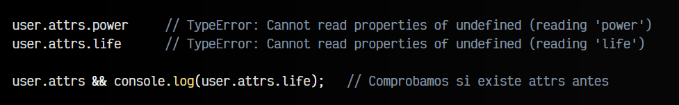

# 
Optional chaining.

En muchas situaciones es posible que nos encontremos ante un código que asume que tenemos un dato concreto (o una estructura de datos) y al intentar realizar una tarea sobre dicha estructura, obtengamos un error inesperado.

Por ejemplo, observa este fragmento de código:

Simplemente accedemos a la propiedad life del objeto attrs. Ahora, analiza el siguiente ejemplo donde asumimos que existe un objeto attrs, cuando realmente no lo tiene:

En este caso, al acceder a user.attrs nos devolverá undefined, ya que no existe el objeto attrs. Por lo tanto, si intentamos acceder a la propiedad life de undefined nos devolverá un error, ya que no podemos acceder a una propiedad de algo que no existe:

Este error en Javascript es muy frecuente. Una forma de solucionar este error sería ser más estricto con las estructuras de datos y nuestro código en general y utilizar herramientas como TypeScript para que así nuestro código sea más predecible. Si no es nuestro caso (que no lo es en este punto de nuestro aprendizaje), lo ideal sería comprobar si ese elemento existe antes de intentar acceder a un método o propiedad:

Aquí no tendríamos problemas ya que en el if estamos comprobando si existe la propiedad attrs en user, y de existir, ejecutariamos el código en cuestión. Sin embargo, el código se complica y se hace más verboso de leer. Esto se puede evitar con Optional chaining.

## ¿Qué es el Optional chaining?.
Un operador muy interesante es Optional chaining (encadenamiento opcional). Este operador nos permite acceder a propiedades o métodos, aunque su elemento padre no exista, ya que realiza una comprobación previa.

Nuevamente, seguimos con nuestro ejemplo anterior donde el objeto user no tiene una propiedad attrs. Sin utilizar Optional chaining podríamos hacer lo siguiente:

En esta última línea, estamos haciendo algo similar al if que hicimos antes, pero ahora lo hacemos con un operador lógico AND (&&).

Con el optional chaining añadimos una interrogación ? justo antes del punto de la propiedad a la que queremos acceder. Esto lo que hará es indicar a Javascript que esa propiedad es opcional y puede que no exista:

Como puedes ver, ahora podemos hacer el intento de acceso sin que nos lance un error. En el caso de que esa propiedad attrs no exista, nos devolverá undefined, pero si attrs existe, entonces nos devolverá el valor de life o power (o undefined si no existen).

