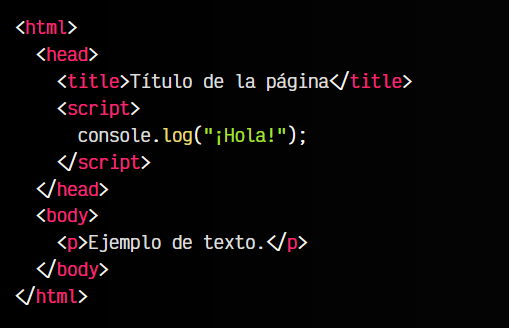
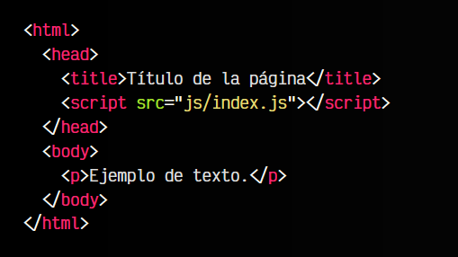
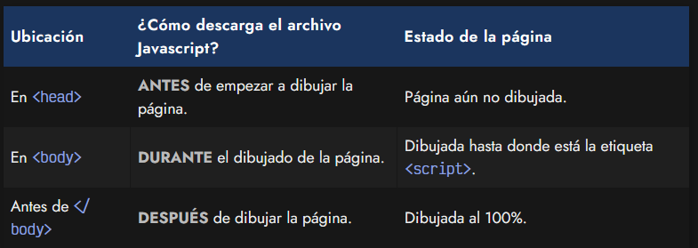

# 
¿Cómo funciona Javascript?

El esquema general de una página web es un documento HTML donde están todas las etiquetas HTML de la página. A lo largo de ese documento, pueden existir referencias o relaciones a otros documentos, como archivos CSS o archivos Javascript.

Por ejemplo, si dentro del documento HTML se encuentra una referencia a un archivo CSS, el navegador lo descarga y lo aplica al documento HTML, cambiando su apariencia visual. De la misma forma, si encuentra una referencia a un archivo Javascript, el navegador lo descarga y ejecuta las órdenes o acciones que allí se indican.

## Script en línea.
En este primer y sencillo ejemplo, sólo tenemos un documento: el archivo HTML. En él, existe una etiqueta script que contiene las órdenes o líneas de Javascript que le indican al navegador que tiene que hacer (en este caso, mostrar un "¡Hola!" en la consola):

Este método de escribir scripts se denomina Javascript en línea (inline), y significa que el Javascript está escrito directamente en el código HTML. Nos puede servir como ejemplo inicial, pero no es la forma recomendable de escribirlo, ya que lo ideal es separar el código HTML del código Javascript (en archivos diferentes) para organizarnos mejor.

## Script externo.
Esta otra forma de incluir Javascript en una página tiene la ventaja de, en el caso de necesitar incluir el código Javascript desde varios documentos HTML, no tendremos que volver a escribir dicho código, sino simplemente referenciar el nombre del mismo archivo Javascript a incluir en todas las páginas HTML.

Para relacionar un documento Javascript desde una página web, igual que antes, utilizaremos la etiqueta script, sólo que en este caso, haremos referencia al archivo Javascript con un atributo src (source), como se ve en el siguiente ejemplo:

El texto js/index.js no es más que una referencia a un archivo index.js que se encuentra dentro de una carpeta js, situada en la misma carpeta que el documento HTML del ejemplo. Si en este archivo Javascript, incluímos el console.log() de mensaje de bienvenida, ese mensaje debería aparecer en la consola Javascript al cargar esta página.

## Ubicación de la etiqueta script.
Si te fijas, en el ejemplo anterior, la etiqueta script está situada dentro de la etiqueta head de la página, es decir, en la cabecera de metadatos. Esto significa que la página web descargará el archivo Javascript antes de empezar a dibujar el contenido de la página (etiqueta body).

Es posible que te hayas encontrado ejemplos donde dicha etiqueta esté ubicada en otra parte del documento HTML. Veamos las posibilidades:

Ten en cuenta que el navegador puede descargar un documento Javascript en cualquier momento de la carga de la página y necesitamos saber cuál es el más oportuno para nosotros.

   Si queremos que un documento Javascript actúe antes que se muestre la página, la opción de colocarlo en el head es la más adecuada.

    Si por el contrario, queremos que actúe una vez se haya terminado de cargar la página, la opción de colocarlo justo antes del </body> es la más adecuada. Esta opción es equivalente a usar el atributo defer en la etiqueta <script>, sin embargo, esta opción es además compatible con navegadores muy antiguos (IE9 o anteriores) que no soportan defer.

Tienes más información sobre [etiquetas <script>](https://lenguajehtml.com/html/scripting/etiqueta-html-script/) en la página de LenguajeHTML.

