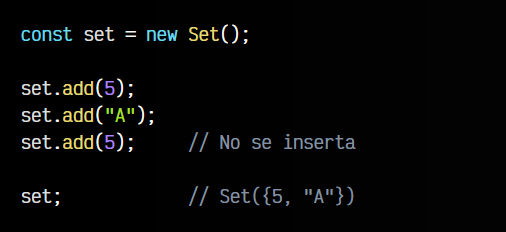
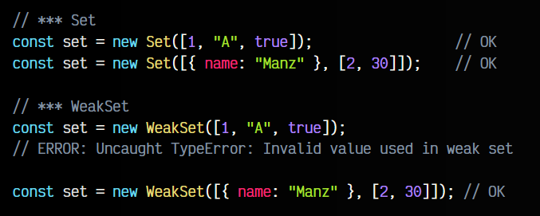

# 
¿Qué es un Set?

Los Set en Javascript son estructuras de datos nativas muy interesantes para representar conjuntos de datos. La característica principal es que los datos insertados no se pueden repetir.

En los sets se puede incluir cualquier tipo de elemento, sin embargo, existe otra estructura derivada de los Set que veremos más adelante que tiene ciertas diferencias y restricciones.

## ¿Qué son los Set?.
Como hemos dicho, la característica principal de los conjuntos es que es una estructura que no permite valores repetidos, por lo que si intentamos insertar un valor que ya existe, no se insertará de nuevo y, por lo tanto, puedes tener la seguridad que un Set nunca tendrá el mismo elemento almacenado, despreocupándote por ejemplo, si tienes que asegurarte de que no existan elementos duplicados, ya que es un caso que no puede ocurrir.

Vamos a analizar los diferentes métodos y propiedades que poseen los conjuntos.

## Propiedad size.
Si quieres saber cuántos elementos tienes en el conjunto, puedes utilizar la propiedad .size, que funciona de forma muy similar al .length de los array, por ejemplo.

# 
Métodos

Veamos ahora los diferentes métodos que tienen las estructuras de conjuntos Set.

## Añadir elementos (add).

En primer lugar, el método .add() permite añadir un elemento al conjunto. Recuerda que aunque hasta ahora hemos utilizado sólo números, en el conjunto pueden insertarse otros tipos de elementos.

Observa que si intentamos añadir un elemento ya existente, no nos dará error, pero simplemente no se volverá a insertar. El método .add() devuelve el set con la inserción realizada, es decir, devuelve una referencia al conjunto.

## Comprobar si existen (has).
Para comprobar si un elemento existe en un conjunto, podemos utilizar el método .has(). Este método devuelve un BOOLEAN, por lo que si existe, nos devolverá true. De lo contrario, false.

## Borrar elementos (delete).
Si necesitamos borrar algún elemento del conjunto, podemos utilizar el método .delete(). Al igual que el anterior, devuelve un BOOLEAN. Si el borrado se realizó con éxito, devolverá true, si no pudo realizarse (no existe el elemento), devolverá false.

## Vacíar conjunto (clear).
Si por otro lado, queremos hacer un borrado completo de los elementos, utilizaremos el método .clear(), que no devuelve nada. Simplemente borrará todos los elementos del conjunto y lo dejará vacío.

## Convertir a Arrays.
Una de las cosas más interesantes y útiles de los Set, es que al ser una estructura iterable (se puede recorrer), es muy sencillo utilizar [desestructuración](https://lenguajejs.com/javascript/arrays/desestructuracion-arrays/) y convertirlo a un array (o viceversa):

Cuidado cuando tengas conjuntos con tipos de datos más complejos con elementos anidados (arrays, objetos, etc...). Recuerda que son referencias y modificar un elemento referenciado, modificará el original.

Para evitar esto de forma sencilla, puedes utilizar la función structuredClone():

Además, también puedes hacer la operación inversa, para convertir un array en un Set:

## ¿Qué son los WeakSet?.
A grandes rasgos, los WeakSet son otro tipo de estructura de conjuntos, muy similar a Set (también impide introducir elementos duplicados), sin embargo, tiene algunos matices y diferencias. Veamos esas diferencias.

## Diferencias con los Set.
Los Set son una estructura de datos poco restrictiva, ya que puedes insertar cualquier tipo de elemento. Los WeakSet no permiten insertar datos primitivos:

Por otro lado, los WeakSet utilizan referencias débiles a un objeto, es decir, si ese objeto no se utiliza (no está referenciado) en ninguna otra parte del código, se eliminará del WeakSet en cuanto el Garbage Collector (Recolector de basura) lo decida para liberar memoria:

Observa que la penúltima línea, reasignamos a null la variable element. En ese caso, la zona de memoria donde está guardada la información { name: "Manz" } no está referenciada en ninguna otra variable, por lo que Javascript considera que ya no es útil, y la borra del WeakSet y de memoria.

 OJO, es muy posible que al ejecutar este código y reasignar a null, la información aún permanezca en el set. Esto ocurre porque la recolección de basura es un proceso que no ocurre instantáneamente, sino que se dispara cuando el navegador lo considera oportuno y necesita o necesitará memoria adicional.

 ## Tabla de resumen de diferencias.
 A continuación, una tabla resumen de las diferencias entre Set y WeakSet:

 

