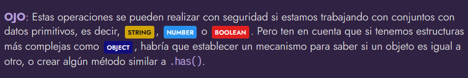

# 
Set: Operaciones de conjuntos

Ahora que ya conocemos la [estructura de datos](https://lenguajejs.com/javascript/set-map/que-es-set-weakset/) Set y sabemos para que sirve, podría interesarnos hacer operaciones de conjuntos con elementos Set. Javascript no lo soporta de forma nativa, sin embargo, es muy sencillo emularlas si conocemos los [métodos funcionales de los array](https://lenguajejs.com/javascript/arrays/array-functions/).

## Operaciones de conjuntos.
Lo primero, repasemos las operaciones de conjuntos para entender lo que vamos a hacer. Observa la siguiente imagen, en ella tenemos 4 operaciones: Unión, Intersección, Diferencia y Exclusión. Cada una de ellas, está formada por un conjunto A y un conjunto B (en azul). Sin embargo, al realizar una operación, la parte en color negro es la resultante de la operación:

Así pues:

   - Unión: Es la suma de todos los elementos del conjunto A y el conjunto B.
   - Intersección: Es la parte común de los elementos del conjunto A y el conjunto B.
   - Diferencia: Son los elementos del conjunto A quitándole los comunes del conjunto B.
   - Exclusión: Son los elementos del conjunto A y el conjunto B que no están en ambos.

# 
Con datos primitivos

## Unión de conjuntos.
La primera de las operaciones sería realizar la unión, es decir, crear un conjunto Set que tenga los elementos del primer conjunto y los del segundo conjunto, sin repetir:

Como los Set son estructuras de datos que no admiten repetición, no hay que preocuparse de ese detalle. Simplemente, desestructuramos los elementos de los conjuntos en un ARRAY, y se los pasamos al nuevo conjunto.

## Intersección de conjuntos.
La segunda operación sería realizar la intersección, es decir, crear un conjunto que tenga los elementos comunes entre el primer y el segundo conjunto:

En este caso, primero hacemos una desestructuración del primero conjunto para convertirlo en un ARRAY. Al ser un array, tenemos disponible el método .filter(), que es un método que permite crear un nuevo array, filtrando sus elementos bajo un criterio específico.

Ese criterio, no será más que comprobar los elementos del primer conjunto, que estén incluidos en el segundo conjunto, utilizando el método .has(). Finalmente, creamos un nuevo Set basándonos en el resultado de la operación anterior.

## Diferencia de conjuntos.
Ahora le tocaría el turno a la diferencia de conjuntos, es decir, los elementos del primer conjunto que no están en el segundo conjunto.

Este es similar al anterior, sólo que invertimos la condición, añadiendo un ! antes para negarlo. Es decir, en lugar de establecer la condición del apartado anterior: «filtrar si el elemento está en el segundo conjunto», en este caso hacemos la condición «filtrar si el elemento NO está en el segundo conjunto».

## Exclusión de conjuntos.
Por último, vamos a realizar la exclusión de conjuntos. Esto es, quedarnos con aquellos elementos que no están en ambos conjuntos, es decir, que están sólo en el primer conjunto, o que están sólo en el segundo conjunto:

En este caso, hemos obtenido primero los elementos del primer conjunto que no están en el segundo, y luego los elementos del segundo que no están en el primero. Finalmente, los desestructuramos y los pasamos en un array para crear el conjunto resultante.

## Con datos complejos.
Como hemos comentado, si tuvieramos conjuntos algo más complejos, las operaciones se vuelven más complicadas y requieren una implementación más detallada. Vamos a cambiar nuestros conjuntos de NUMBER, por conjuntos de OBJECT para entender cuál es el problema.

Ahora tenemos un conjunto firstSet con elementos OBJECT que se utilizan en el frontend, mientras que en el conjunto secondSet tenemos elementos OBJECT que se utilizan en el backend:

Si intentamos hacer la intersección que explicamos anteriormente con estas estructuras, comprobaremos que no funciona correctamente, ya que obtenemos un conjunto vacío. No nos ha detectado los objetos { name: "JSON" } como repetidos:

Esto ocurre porque aunque el objeto { name: "JSON" } del conjunto del frontend y el objeto { name: "JSON" } del conjunto del backend parecen tener la misma información, se trata de objetos diferentes: no son el mismo objeto (realmente está comparando sus referencias, el lugar de memoria donde se está guardando).

## Posibles soluciones.
Teniendo claro el problema anterior, la forma más sencilla de solucionar el problema es crear una lista de elementos únicos, ya sea ARRAY u OBJECT, donde se garantizará que se encuentran referenciados de forma única. Así, al crear los conjuntos, se hará referenciándolos y permitiendo que se detecten repetidos:

Observa que ahora, el elemento { name: "JSON" } es exactamente el mismo en ambos conjuntos (misma referencia a memoria), por lo que si lo detecta como elemento común.

Existen otras formas más potentes de solucionar el problema con una implementación algo más profunda, pero se escapa del tema que abordamos en este artículo. Entre algunas soluciones posibles estarían las siguientes:

   - Crear una clase (wrapper) que implemente las operaciones por debajo
   - Crear una clase (elemento) que extienda el Set e implemente las diferencias
   - Delegar el trabajo a una librería de terceros como cset

