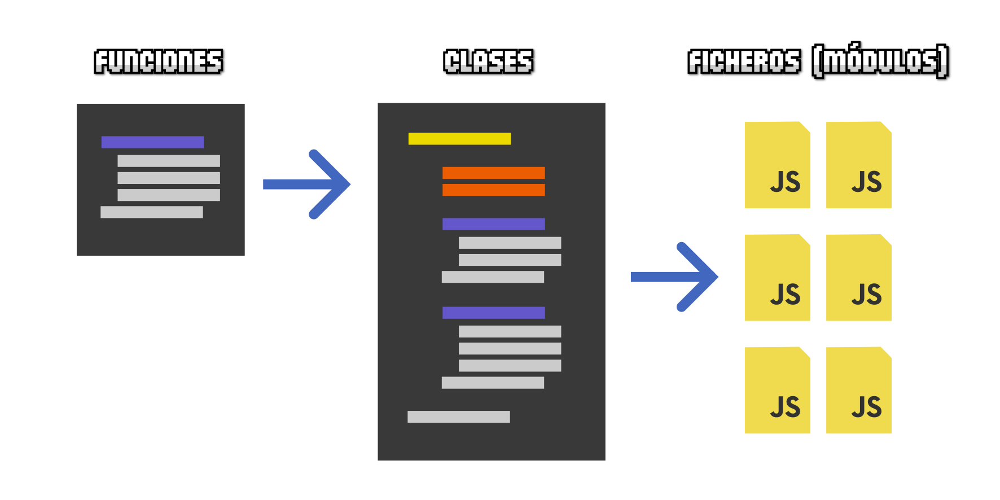
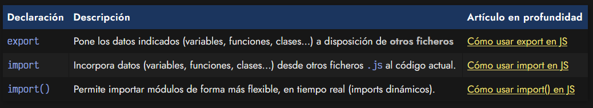
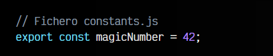
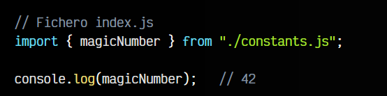
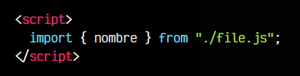
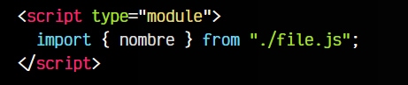

# 
¿Qué son los módulos (ESM)?

Uno de los principales problemas que ha ido arrastrando Javascript desde sus inicios es la dificultad de organizar de una forma adecuada una aplicación grande, con muchas líneas de código. En muchos lenguajes de programación, cuando un programa crece, se comienza a estructurar en funciones. Posteriormente, se traslada a clases, que contienen variables (propiedades) y funciones (métodos). De esta forma organizamos de forma más lógica el código de nuestro programa. Sin embargo, no será suficiente.

Tener todo el código en un sólo fichero Javascript se vuelve confuso y complejo en cuanto el código crece. En la mayoría de los lenguajes de programación, el código se divide en ficheros diferentes de modo que, por ejemplo, cada clase está localizada en un fichero separado. De esta forma, todo queda mucho más organizado e intuitivo, y es fácil de localizar, cambiar y mantener, aunque crezca con el tiempo.

En el Javascript del «lado del cliente» (navegador), esto se complica un poco, ya que presenta algunas problemáticas que no existen en otros lenguajes de programación. Hay que tener bien presente que cuando accedemos a una página o aplicación web, estamos accediendo a un servidor, desde donde se está descargando el código Javascript (hacia nuestro navegador) y una vez descargado, se ejecuta en nuestro cliente.

## Historia de los módulos.
Al principio, Javascript no tenía ninguna forma de cargar código desde otros archivos Javascript. Todo el Javascript se tenía que escribir en un sólo archivo .js. La única forma de separar en diferentes archivos de forma nativa y oficial, era incluir varias etiquetas script desde nuestra página HTML.

De esta manera, podíamos tener varios ficheros Javascript separados, cada uno para una finalidad concreta (librerías, funcionalidades, etc...). Sin embargo, este sistema tenía varias desventajas: resultaba lento, era complejo interactuar entre archivos, sobrecargaba al cliente con múltiples peticiones que podían bloquear la carga de la página, etc...

Con el tiempo, se desarrollaron sistemas no oficiales que permitían crear módulos para organizar en varios archivos:

    CommonJS: Un sistema de módulos adaptado y popularizado por NodeJS
    AMD: Un sistema de módulos, donde la más popular fue RequireJS.

    Cada uno tenía sus particularidades, virtudes y desventajas. Si quieres saber más sobre ellos, echa un vistazo al artículo CommonJS vs ECMAScript modules, donde explico un poco de su historia y sus diferencias.

## ¿Qué son los módulos ES?.
A partir de ECMAScript ES2015 se introduce una característica nativa denominada Módulos ES (ESM), que permite la importación y exportación de fragmentos de datos entre diferentes ficheros Javascript, eliminando las desventajas que teníamos hasta ahora y permitiendo trabajar de forma más flexible en nuestro código Javascript.

Para trabajar con módulos tenemos a nuestra disposición las siguientes palabras clave:

Mediante la palabra clave export crearemos lo que se llama un módulo de exportación que contiene datos. Estos datos pueden ser variables, funciones, clases u objetos más complejos (a partir de ahora, elementos). Si dicho módulo ya existe, podremos ir añadiendo más propiedades.

Por otro lado, con la palabra clave import podremos leer dichos módulos exportados desde otros ficheros y utilizar sus elementos en el código de nuestro fichero actual.

Veamos un ejemplo sencillo para ver el funcionamiento de import y export en su modo más básico. Tenemos un fichero constants.js donde vamos a exportar una constante numérica:

Por otro lado, en el fichero index.js, vamos a traernos esa constante numérica para utilizarla en el fichero actual:

Obviamente, esto es sólo la modalidad básica de importación y exportación de elementos, pero existen múltiples modalidades, matices y diferencias que iremos viendo en los siguientes artículos.

## Antes de usar módulos.
Antes de empezar, recuerda que para poder utilizar export o import en nuestro código Javascript que se ejecuta directamente en el navegador, debemos cargar el fichero .js con la etiqueta y atributo script type="module" para indicarle que utilizaremos módulos. Si no lo hacemos, obtendremos el siguiente error:

Al añadir el atributo type="module" a nuestra etiqueta script estaremos avisando al navegador que estamos cargando un módulo en el que podemos utilizar import y export:

Algunos frameworks utilizan automatizadores que pueden «oscurecer» esto, ya que puede parecer que no es necesario, ya que los automatizadores lo hacen internamente, o convierten a otros sistemas de módulos, como CommonJS (NodeJS).