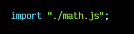

# 
Importar módulos.

En los artículos anteriores, hemos visto como crear módulos de exportación mediante export. En el artículo actual vamos a ver como realizar la operación inversa, utilizar la palabra clave import para cargar elementos de módulos de exportación de ficheros externos y utilizarlos en el fichero actual.

## Importación de módulos.
En Javascript, podemos utilizar import para hacer la operación inversa a export. Si habíamos mencionado que con export ponemos datos o elementos de un fichero .js a disposición de otros, con import podemos cargarlos y utilizarlos en el código de nuestro fichero actual.

Existen varias formas de importar código utilizando la palabra clave import:

Al igual que hacíamos en la exportación, también puedes renombrar elementos con import utilizando as seguido del nuevo nombre. Los import deben hacerse siempre desde las primeras líneas del fichero Javascript y no se pueden incluir dentro de bucles, funciones o determinados contextos.

## Importación con nombre.
La forma más habitual de importar elementos es a través de la denominada importación nombrada, donde utilizamos la palabra clave import indicando el nombre de los elementos a importar en el interior de las llaves { }, todo ello desde el módulo de exportación del fichero file.js.

En este fragmento de código se realizan 3 importaciones:

   - En la primera línea, estamos importando el elemento nombre desde el módulo del fichero file.js.
   - En la segunda línea, importamos varios elementos: number y element.
   - En la tercera línea, importamos el elemento brand, renombrándolo a brandName.

Todos ellos, deben haber sido exportados en el módulo de exportación del fichero file.js.

## Importación por defecto.
Hasta ahora, hemos utilizado importaciones con nombre, donde indicamos en todo momento el nombre de los elementos que queremos importar. Sin embargo, si hemos visto el artículo de [export en Javascript](https://lenguajejs.com/javascript/modulos/export/) habremos comprobado que es posible exportar/importar elementos por defecto.

Una importación por defecto lo único que hace es buscar el elemento llamado default e importarlo con el nombre indicado en el import:

Observa que en este caso, la diferencia es que no hemos indicado las llaves { } al indicar el nombre del elemento, lo que hará que importe el elemento default y lo renombre a nombre. En el caso de que no exista ninguna propiedad default en el módulo de exportación se generará un objeto vacío.

    Las importaciones por defecto suelen estar ligeramente mal vistas por algunos desarrolladores. Una exportación nombrada suele ser más intuitiva y predecible a la hora de utilizar en nuestro código.

## Importación masiva.
Otra modalidad de importación interesante es aquella donde podemos hacer una importación masiva. Es decir, si utilizamos el símbolo * a la hora importar, estaremos indicando que se deben cargar todos los elementos del módulo de exportación del fichero indicado.

En esta modalidad, es obligatorio utilizar el as seguido del nombre del elemento, ya que debemos indicar un nombre para crear un objeto que contendrá todos los elementos importados:

En este caso, creamos un OBJETO module que incluye todos los elementos del módulo de exportación de file.js.

## Importación de código.
Existe una última forma de importar código que no es tan frecuente encontrarla, al menos en el mundo de los frameworks Javascript. Sin embargo, si se utiliza bastante en el mundo de los Web Components.

Se trata de la importación de código sin importar elementos, simplemente ejecutando el código del fichero indicado:

Si realizamos un import donde únicamente establecemos el fichero a importar, lo que estaremos haciendo es indicar que el navegador debe leer el código de ese fichero y procesarlo, sin importar ningún elemento como en los casos anteriores.

A efectos prácticos, esto sería exactamente lo mismo que si tuvieramos el código de ese otro fichero en el fichero actual, no obstante, de esta forma se puede organizar y separar en ficheros diferentes.

## Importaciones remotas.
Aunque en los ejemplos anteriores siempre indicamos ficheros .js locales, también es posible indicar ficheros remotos, es decir, que estén en un dominio diferente al nuestro:

Por ejemplo, en este caso, estamos descargando desde el dominio [unpkg](https://unpkg.com/).com la librería [lodash.js](https://lodash.com/), desde la cuál importaremos el elemento ceil de su módulo de exportación.

Hay que tener en cuenta varias cosas de las importaciones remotas:

   - Disponibilidad: Ten en mente que al hacer una importación remota dependemos del dominio indicado. Si dicho dominio no está disponible o no podemos conectar a él, no podremos descargar el fichero ni procesarlo, por lo que puede ser conveniente tener esos ficheros en nuestro sitio web.

   - Descarga: Para importar el elemento del módulo indicado, primero es necesario descargar el fichero, por lo que si la velocidad de conexión es lenta y el tamaño del fichero .js es grande, puede ralentizar la carga de la página.

   - ECMAScript modules: Ten en cuenta que para poder hacer importaciones de este tipo, es necesario que la librería utilice los módulos ESM. Existen repositorios como [cdnjs.com](https://cdnjs.com/), [jsdelivr.com](https://jsdelivr.com/) o [skypack.dev](https://skypack.dev/) donde puedes encontrar librerías y proyectos Javascript subidos a un CDN, listos para utilizar.

## Metadatos de módulos.
Cuando nos encontramos en un fichero .js que es un módulo, podemos acceder a la propiedad import.meta, la cuál es un objeto que contiene metadatos del módulo en cuestión. Por ejemplo, una propiedad url que nos devuelve la ruta completa del módulo en cuestión:

Esto puede ser realmente útil en ocasiones que queremos saber en que fichero nos encontramos en tiempo de ejecución.

## Bare imports.
Como habrás comprobado, en todos los ejemplos de importación anteriores, hemos utilizado la palabra clave from seguida de la ubicación de un fichero Javascript. Estos ficheros siempre empezarán por . o por / si son ficheros locales, o por http si son ficheros remotos:

   - "./math.js": El fichero math.js en la carpeta actual.
   - "../math.js": El fichero math.js en la carpeta padre.
   - "/math.js": El fichero math.js en la raíz del proyecto.
   - "https://web.com/math.js": El fichero math.js está alojado en una web.

Sin embargo, existe un tipo de importación denominada bare import (imports desnudos), que son aquellos que se realizan indicando en from un STRING que no comienza por ., / ni http, sino directamente por el nombre de una carpeta o paquete:

En este ejemplo, en lugar de utilizar ./howler.js (o un nombre similar), se indica el string howler. Esta característica no es estándar y fue un invento popularizado por NodeJS a través de [NPM](https://lenguajejs.com/npm/introduccion/que-es/).

Cuando usamos un bare import nos referimos a un paquete de npm, es decir, se buscará un paquete previamente [instalado con npm](https://lenguajejs.com/npm/administracion/instalar-paquetes-npm/) con ese nombre en la carpeta node_modules, accediendo al fichero .js principal de dicho paquete.

Si en nuestro código estamos utilizando este sistema, es probable que estemos utilizando algún bundler o automatizador como Webpack, Vite o similar, ya que esta característica no es estandar y no funciona directamente en el navegador.

Sin embargo, se ha desarrollado una característica llamada Import Maps que nos permite también utilizarla desde el navegador, sin necesidad de depender de Node. Tienes más información sobre esta característica y los Bare imports en [Import Maps](https://lenguajejs.com/javascript/modulos/import-map/).

## Importación CommonJS (legacy).
Es posible que en algún fragmento de código te hayas encontrado una sintaxis parecida a import, pero utilizando require como en el código siguiente:

Este sistema no forma parte de los módulos oficiales de ECMAScript que se explican en este artículo, sino que es un sistema de módulos utilizado en NodeJS (Javascript de servidor) conocido como CommonJS (CJS). El require() y el module.exports no funcionan en navegadores de forma nativa, por lo que se desaconseja su uso a favor de export, ya que incluso las últimas versiones de Node lo soportan.

Si lo estás utilizando en un código de frontend, es muy posible que se esté utilizando junto a NodeJS o haya alguna herramienta o automatizador que utilice NodeJS y esté transpilando (convirtiendo) tu código.

Si quieres saber más sobre CommonJS y sus diferencias con ECMAScript Modules, echa un vistazo a este artículo, del apartado de automatizadores: [CommonJS vs ECMAScript Modules.](https://lenguajejs.com/automatizadores/introduccion/commonjs-vs-es-modules/)

