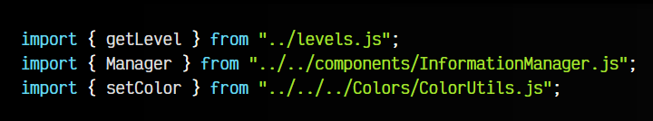
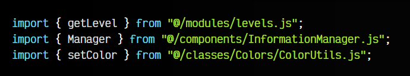
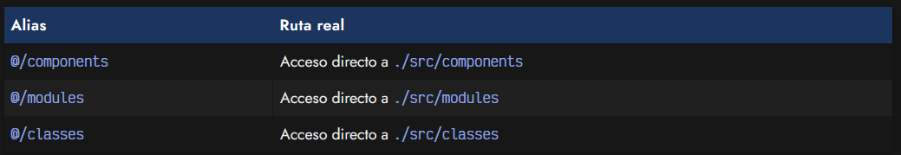
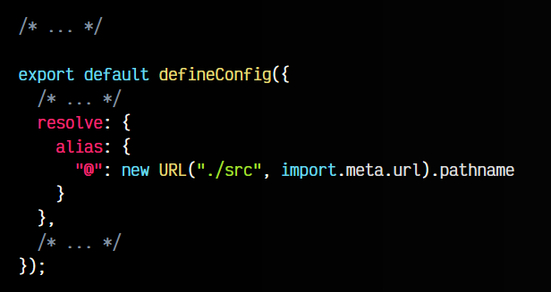
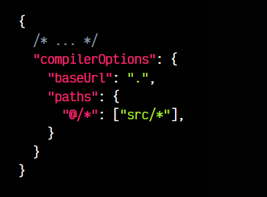
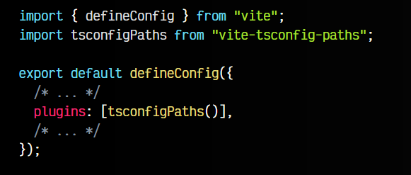
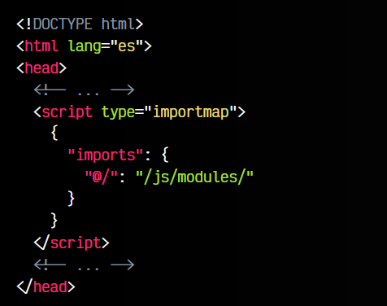
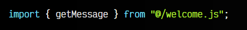

# 
Evita las rutas relativas.

En el día a día programando en Javascript, necesitamos hacer importaciones desde diferentes ficheros, y a medida que la aplicación web o página crece, crecerá también su cantidad de ficheros y carpetas. Por lo tanto, será muy común necesitar hacer muchas importaciones.

## El problema de las rutas relativas.
El problema, a la hora de las importaciones suele llegar cuando tenemos que utilizar un tipo de ruta para indicar los ficheros. Como solemos trabajar a diferentes niveles de carpeta, suelen ocurrir cosas como estas:

Como se puede ver, las rutas están a diferentes niveles y no queda muy legible desde donde estamos obteniendo la información. Al estar trabajando en desarrollo, muchas veces las rutas que utilizamos no son las mismas en la web final, por lo que tampoco podemos utilizar rutas absolutas.

Vamos a ver varios mecanismos que tenemos a nuestra disposición, para hacer que este código de importaciones, pase a ser más legible, algo como el siguiente fragmento de código:

Como puedes ver, @/ apunta a la ruta principal de nuestra estructura de ficheros Javascript, y queda mucho más claro y legible la estructura de carpetas de esta forma.

## Formas de solucionarlo.
Esto se puede conseguir de varias formas, dependiendo de las herramientas que estemos utilizando. Vamos a ir comentándolas una por una, para que puedas decidir según sea tu caso, y se adapte lo mejor posible.

Lo primero es tener claras las rutas que vamos a crear. Veamos algunos ejemplos:

En nuestro caso, para simplificar lo máximo posible, vamos a resumirlo todo en una sola ruta ./src, ya que la intención principal es eliminar los cambios de niveles con ../ (o similares). El desarrollador, sin embargo, puede crear las rutas que considere convenientes para su caso.

## Mediante Vite.
Vite es una herramienta que sirve de automatizador de tareas de desarrollo frecuentes, haciendo que escribir código sea algo mucho más cómodo, menos tedioso y más automático.

Si estás utilizando Vite para hacer frontend, puedes crear o modificar el fichero vite.config.js e incluir o modificar la propiedad resolve de su configuración, añadiendo las rutas que quieres utilizar. En nuestro caso, haríamos lo siguiente:

Observa que hemos creado un alias, donde le hemos dicho que al encontrarse un @ en la ruta de una importación, lo modifique por la ruta del fichero en cuestión, que está dentro de la carpeta src, por lo que siempre buscará a partir de ahí.

   - ✅ Fácil y rápido de configurar (Sólo modificar un fichero de configuración)
   - ✅ Funciona si escribes Javascript para front-end con Vite
   - ❌ No funciona el autocompletado de rutas en VSCode
   - ❌ Puede no servir si escribes Javascript para back-end

En este artículo tienes más información sobre [cómo empezar con Vite](https://lenguajejs.com/automatizadores/vite/guia-tutorial-inicial-de-vite/) 

## Mediante Typescript.
Si estás utilizando Typescript en lugar de Javascript, puedes aprovechar las capacidades de Typescript para evitar los puntos negativos del apartado anterior. Sin embargo, esta modalidad requiere más configuración.

En el archivo tsconfig.json añadimos lo siguiente:

En los paths es donde vamos a añadir las rutas que queramos. En el punto anterior lo hacíamos en los alias de la configuración de Vite. En este caso, lo hacemos en el fichero de configuración de Typescript, y le decimos a Vite que los lea de ahí, utilizando el plugin vite-tsconfig-paths que habrá que instalar con npm/pnpm:

De esta forma, podemos utilizar las rutas con @/ en nuestros archivos .ts y no necesitamos tener el apartado resolve / alias en nuestro fichero vite.config.js, ya que este plugin lo crea por nosotros.

   - ✅ Funciona si escribes Javascript para front-end con Vite
   - ✅ Funciona el autocompletado de rutas en VSCode
   - ✅ Funciona si escribes Javascript para back-end
   - ❌ Opción orientada a proyectos con Typescript (si usas JS, ver siguiente)
   - ❌ Requiere más configuración y dependencias

## Mediante Javascript.
Si no trabajamos con Typescript, no hay necesidad de complicarse ya que sigue existiendo una pequeña posibilidad de utilizar estos aliases. En lugar de tener un fichero tsconfig.json, creamos un fichero jsconfig.json con exactamente el mismo contenido del tsconfig.json del apartado anterior. A grandes rasgos, es como tener un tsconfig.json con la propiedad allowJs a true.

Este fichero hará que editores como VSCode puedan usar ciertas características de Typescript sin necesidad de tenerlo en el proyecto.

Por otro lado, aunque no utilicemos Typescript, necesitamos también tener instalado y configurado el plugin de vite vite-tsconfig-paths, exactamente como en el apartado anterior.

Las ventajas y desventajas son las mismas que el anterior, sólo que en este caso si lo podemos utilizar con Javascript, aunque no utilicemos ficheros .ts de Typescript.

## Mediante Import Maps.
Si estamos en un caso en el que no utilizamos Typescripts, y ni siquiera utilizamos un automatizador como Vite, podemos hacer uso de una característica llamada Import Maps. Se basa en crear un JSON en el index.html a modo de índice con las librerías o rutas que queremos utilizar.

Ahora, en nuestro código, podemos escribir importaciones a esa ruta @/ ficticia, consiguiendo que importe realmente un fichero de la carpeta /js/modules/:

Ten en cuenta que este caso no es equivalente a los anteriores, donde trabajabamos en desarrollo. En este caso, las rutas van a ser reales, por lo que quizás sea más interesante utilizar rutas absolutas como /js/modules/. No obstante, crear atajos puede ser algo interesante si tenemos rutas muy largas o queremos cambiarlas de forma transparente al desarrollo.

► En este artículo tienes más información sobre los [Import Maps](https://lenguajejs.com/javascript/modulos/import-map/).

