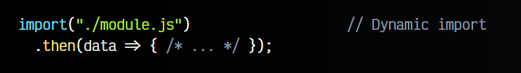
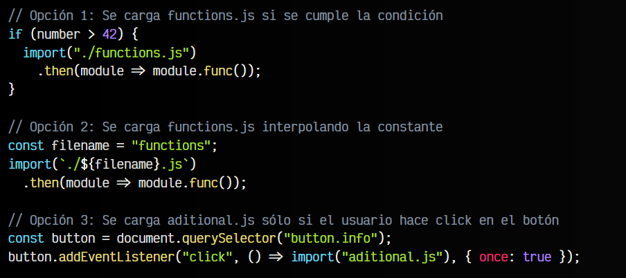

# 
Import dinámico en Javascript.

En apartados anteriores hablamos de las exportaciones e importaciones de los módulos ESM en Javascript utilizando las palabras clave export e import. Mediante este mecanismo se nos permite exportar datos desde un fichero a otro, reutilizando contenido, haciendo el código más modular y organizando mejor nuestras aplicaciones o webs.

## Import estático vs dinámico.
En dicho capítulo, tratamos la palabra clave import que es lo que se conoce como un import estático, una forma de importar módulos de ficheros externos. Se colocan en la parte superior del fichero Javascript y son algo similar a lo siguiente:

Sin embargo, existe otro tipo de importación en Javascript, popularmente conocida como import dinámico ES2020 (dynamic import), que tiene el siguiente aspecto, ligeramente diferente al anterior:

## Diferencias.
Los import estáticos son muy útiles, pero tienen algunas desventajas si se presentan ciertos casos específicos. Los más frecuentes suelen ser los siguientes:

   - Queremos importar un módulo si se cumple una determinada condición
   - Queremos importar un módulo interpolando variables o constantes
   - Queremos importar un módulo dentro de un ámbito específico
   - Queremos importar un módulo desde un script normal (sin type="module")
   - Queremos importar un fichero javascript (sin módulo) y ejecutarlo bajo demanda

En cada uno de estos casos, no se puede utilizar el import estático, pero si el import dinámico:

El import dinámico nos permite indicar entre los paréntesis del import el nombre del archivo Javascript. A diferencia del import estático, este fichero no se cargará siempre y desde el principio, sino que sólo lo hará cuando se llegue a esta parte del código, siendo posible incluirla dentro de condicionales, funciones o lógica diversa.

  Si el archivo .js importado es un módulo, al trabajar con la promesa que devuelve simplemente accedemos a las propiedades o métodos que necesitemos. Por otro lado, si el archivo .js cargado no es un módulo, simplemente se ejecutará su contenido.

Esto nos proporciona una característica muy interesante de cara a optimización y rendimiento, y es que es posible no importar (ni por lo tanto, procesar) ficheros con código Javascript hasta que ocurra una cierta condición, evento o acción, retrasando así la descarga, procesamiento y ejecución de código Javascript por parte del navegador hasta que sea necesario (o incluso nunca si no es necesario).

## Code splitting en bundlers.
En el ecosistema Javascript, existen ciertas herramientas denominadas automatizadores o bundlers. Dichas herramientas, entre otras cosas, suelen tener como objetivo generar un sólo archivo .js final donde se guardará todo el código Javascript de nuestra web o aplicación, que leerá el navegador.

Esto tiene un significado y razones históricas (cuando no existían los módulos en Javascript), pero aún en la actualidad tiene ciertas ventajas y se utiliza mucho en frameworks SPA o librerías como React, Vue o similares.

Sin embargo, si estamos utilizando una de estas herramientas, al realizar dicha empaquetación en un sólo archivo .js, podemos pensar que estamos «rompiendo» esa característica deseable de separar el código y sólo ejecutarlo cuando sea necesario (cuando el usuario haga click en un botón, cuando ocurra cierto evento, etc...). Esta característica se denomina Code Splitting (separación de código).

Herramientas como Webpack o Rollup separan los archivos importados con imports dinámicos en ficheros aislados (chunks), que generalmente tienen el nombre del módulo fichero javascript importado, junto a un hash aleatorio. De esta forma, el código de dicho fichero o módulo no será incluído en ese fichero .js general, evitando que se cargue siempre por parte del navegador.
