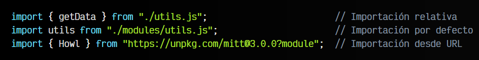
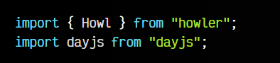
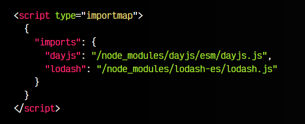
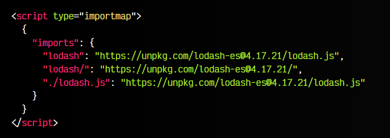
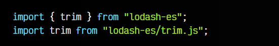
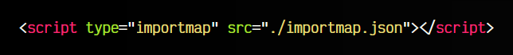

# 
Import Maps.

Los Import Maps (o mapas de importación) es una característica de ECMAScript orientada a permitir controlar de forma sencilla la URL desde donde se van a descargar ciertos módulos importados mediante mecanismos como [import](https://lenguajejs.com/javascript/modulos/import/) o [import()](https://lenguajejs.com/javascript/modulos/dynamic-import/) donde utilizamos un bare import.

## ¿Qué es un Bare Import?.
Cuando realizamos importaciones de módulos en nuestro código, generalmente lo hacemos de una de las siguientes formas, donde cargamos el módulo de nuestra estructura de ficheros (forma relativa) o desde una URL remota:

Observa que siempre indicamos en el from un texto que comienza por ./, ../, / o una URL. Sin embargo, existe otra forma muy extendida de realizar importaciones, que es denominada bare import (importación «desnuda»). Se trata de realizar un import en el que, en lugar de establecer una ruta relativa o una URL, establecemos simplemente el texto con el nombre de un paquete o librería:

En este caso, se está importando un paquete con el nombre indicado, que se ha instalado con el gestor de paquetes [NPM](https://lenguajejs.com/npm/), por lo que, lo que en realidad se está importando es el fichero principal de la carpeta con ese nombre que está en la carpeta [node_modules](https://lenguajejs.com/npm/administracion/carpeta-node_modules/).

Esta forma no es estándar, sino que es una característica que introdujo NodeJS para trabajar más cómodamente junto a NPM. Si realizamos importaciones de este estilo, no funcionará en el navegador salvo que usemos un automatizador (Webpack, Vite, Rollup o similar) para procesar el código y convertirlo en algo compatible con el navegador.

## ¿Qué son los Import Maps?.
Como hemos mencionado, los bare imports no son una característica estándar, sino que es algo propio de NodeJS, y por lo tanto, necesitamos NodeJS para que funcionen. Los bare imports son un mecanismo muy extendido y hay una gran cantidad de código que los usa, por lo que si no utilizamos Node, el código sería inservible o habría que modificar gran cantidad de archivos de código, ya que nos mostraría un error similar al siguiente:

    Uncaught TypeError: Failed to resolve module specifier "lodash-es". Relative references must start with either "/", "./", or "../".

Para solucionar este problema, se ha creado una característica denominada import maps, que no es más que una especie de índice de paquetes, el cuál nos permitirá utilizar los bare imports sin necesidad de Node o NPM.

Para ello, en nuestro archivo .html crearemos el siguiente código:

Observa que en el interior de este  script type="importmap" indicamos un fichero .json que actua de índice, de forma similar a como lo hace el [package.json](https://lenguajejs.com/npm/administracion/package-json/) para las dependencias de NPM. Con este sistema, el navegador consultará este índice para saber a que ficheros hace referencia y poder importarlos correctamente.

## Importaciones a una URL/CDN.
Nuestro documento sólo puede tener un sólo mapa de módulos, y este puede incluir tanto módulos únicos dirigidos a un archivo .js, como a rutas o carpetas específicas. Observa este ejemplo, donde en lugar de una ruta relativa de nuestra estructura de carpetas, lo dirigimos a una URL o CDN:

Observa que en este caso hemos añadido dos versiones:

Observa que en este caso hemos añadido dos versiones:

   - 📜 Una primera versión, lodash, que hace referencia al archivo principal, alojado en el CDN unpkg.
   - 📁 Una segunda versión, lodash/, que hace referencia a la carpeta, alojada en el CDN unpkg.
   - 🔄 Una tercera versión, ./lodash.js, que reasigna un módulo normal a una alternativa en el CDN unpkg.

De esta forma, podemos utilizar las siguientes formas de importar módulos con bare imports (observa que no empieza por punto, por barra, ni es una URL):

   - En el primer caso, coincide con lodash, por lo que buscará el fichero lodash.js en la URL https://unpkg.com/lodash-es@4.17.21/ e importará la función trim.

   - En el segundo caso, coincide con lodash/, por lo que buscará el fichero trim.js en la URL https://unpkg.com/lodash-es@4.17.21/ e importará ese fichero.

   - En el tercer caso, se trata de una reasignación de un módulo local de nuestra estructura de carpetas. Es decir, no estamos limitados a usar bare imports, si no que también podemos modificar y reasignar rutas relativas propias.

Ten en cuenta que las importaciones deben hacerse mediante la palabra clave import. Si intentas hacer un import directamente mediante un script type="module", no funcionará.

## Diferentes importaciones.
Un detalle interesante y curioso de los Import Maps, es que puedes realizar un versionado diferente dependiendo de la URL desde donde estás realizando la importación. Para ello, utilizaremos los scopes.

Observa que el JSON del importmap, ahora, en lugar de tener solo una key imports, también tiene una key scopes. En la key imports tenemos las reasignaciones de las importaciones generales, donde para lodash lo enviamos a una URL de un CDN, y para howler lo envíamos a una ruta relativa.

Sin embargo, observa la parte de scopes:

Los scopes permiten sobreescribir los anteriores, dependiendo de la URL en la que estemos donde se ha hecho la importación. Por ejemplo, si estamos en la URL /local/, modificamos lodash para que cargue en una ruta local en la carpeta /libs/. Si estamos en la URL /cdn/, modificamos howler para que cargue en una ruta URL de un CDN.

Esto puede ser especialmente interesante para establecer un versionado de la librería en determinadas partes del sitio web que pueden tener exigencias de utilización de diferentes versiones.

## Mapa de importaciones externo.
Hasta ahora, hemos definido un mapa de importaciones en el propio documento HTML. De momento, es la única forma de hacerlo, sin embargo, en el futuro se podrá hacer desde ficheros .json externos, de la siguiente forma:

Las importaciones externas serán también soportadas en navegadores, pero actualmente no están disponibles. Hablan de ello por aquí, en [GitHub](https://github.com/WICG/import-maps/issues/235).

Si intentamos hacerlas actualmente en Chrome, nos muestra este mensaje:

      External import maps are not yet supported

Por otro lado, en Firefox, se nos muestra este mensaje:

      Los mapas de importación externa no son compatibles: actualmente no se admite <script type='importmap'> con un atributo src.

Por lo tanto, aún habrá que esperar un poco.

