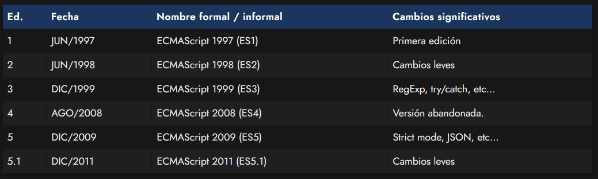
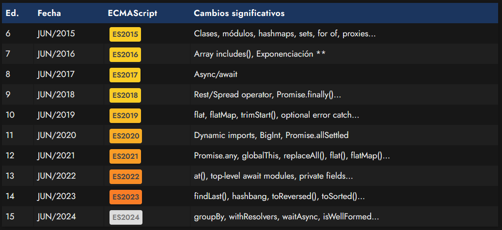

# 
La especificación ECMAScript

ECMAScript es la especificación donde se mencionan todos los detalles de cómo debe funcionar y comportarse Javascript. De esta forma, los diferentes navegadores (Chrome, Firefox, Opera, Edge, Safari...) saben como deben desarrollar los motores de Javascript para que cualquier código o programa funcione exactamente igual, independientemente del navegador que se utilice.

ECMAScript suele venir acompañado de un número que indica la versión o revisión de la que hablamos (algo similar a las versiones de un programa). En cada nueva versión de ECMAScript, se añaden nuevas funcionalidades, manteniendo Javascript vivo y con novedades que lo hacen un lenguaje de programación moderno y cada vez mejor preparado.

Teniendo esto en cuenta, debemos saber que los navegadores web intentan cumplir la especificación ECMAScript al máximo, pero no todos ellos lo consiguen. Por lo tanto, pueden existir ciertas discrepancias. Por ejemplo, pueden existir navegadores que cumplan la especificación ECMAScript al 80% y otros que sólo la cumplan al 60%. Esto significa que pueden haber características que no funcionen en un navegador específico (y en otros sí).

Además, todo esto va cambiando a medida que se van lanzando nuevas versiones de los navegadores web, donde su compatibilidad ECMAScript suele aumentar.

## Versiones de ECMAScript.
A lo largo de los años, Javascript ha ido sufriendo modificaciones que los navegadores han ido implementando para acomodarse a la última versión de ECMAScript cuanto antes. La lista de versiones de ECMAScript aparecidas hasta el momento son las siguientes.

## El pasado de Javascript.
La siguiente lista de versiones las podemos considerar el pasado de Javascript:

## El presente de Javascript.
A partir del año 2015, se marcó un antes y un después en el mundo de Javascript, estableciendo una serie de cambios que lo transformarían en un lenguaje moderno, partiendo desde la específicación de dicho año, hasta la actualidad:

En ocasiones, algunos navegadores deciden implementar pequeñas funcionalidades de versiones posteriores de ECMAScript antes que otras, para ir testeando y probando características, por lo que no es raro que algunas características de futuras especificaciones puedan estar implementadas en algunos navegadores.

Una buena forma de conocer en que estado se encuentra un navegador concreto en su especificación de ECMAScript es consultando la [tabla de compatibilidad Kangax](https://compat-table.github.io/compat-table/es6/). En dicha tabla, encontramos una columna «Desktop browsers» donde podemos ver el porcentaje de compatibilidad con las diferentes características de determinadas especificaciones de ECMAScript.

    A partir de 2015, se toma como regla nombrar a las diferentes especificaciones por su año, en lugar de por su número de edición. Es por esto, que se recomienda hablar de ECMAScript 2015 en lugar de ECMAScript 6, por ejemplo.

## Estrategia «crossbrowser».
Dicho esto, y teniendo en cuenta todos estos detalles, es muy habitual que el programador esté confuso en como empezar a programar y como escribir código para que sea compatible con los diferentes navegadores.

¿Cómo puede hacer el programador para garantizar que el código funcione en todos los navegadores? Generalmente, toma una de las siguientes estrategias como filosofía a la hora de escribir código:

   - Enfoque conservador: El programador decide crear código en una versión ECMAScript antigua, de modo que sea compatible en la mayoría de navegadores. Este enfoque implica que para muchas tareas deberá escribir mucho código, código antiguo o no podrá disfrutar de las últimas novedades de Javascript. Por otro lado, no necesita configurar herramientas externas y puede escribir el código directamente.

   - Enfoque delegador: El programador decide delegar la responsabilidad de funcionar en los diferentes navegadores a un framework o librería. Este enfoque tiene como ventaja que es mucho más cómodo para el programador. Hay que tener en cuenta que se heredan todas las ventajas y desventajas de dicho framework/librería, así como que se adopta como dependencia (sin dicho framework/librería, nuestro código no funcionará). Se suele perder algo de rendimiento y control sobre el código, aunque en la mayoría de los casos es prácticamente inapreciable.

   - Enfoque evergreen: El programador decide no preocuparse de la compatibilidad con navegadores antiguos, sino dar soporte sólo a las últimas versiones de los navegadores (evergreen browsers), o incluso sólo a determinados navegadores como Google Chrome o Mozilla Firefox.

   - Enfoque transpilador: El programador decide crear código con las últimas versiones de ECMAScript y para asegurarse de que funcione en todos los navegadores, utiliza un transpilador (herramienta que traduce el código a una versión antigua de ECMAScript), que es la que leerá el navegador.
  
Quizás, el enfoque más común hoy en día de los mencionados es utilizar transpiladores, que vienen incorporados en muchas librerías o frameworks. Automatizadores como Vite o Webpack son de los más utilizados, e incorporan herramientas de transpilado.

## Otros conceptos.
Independientemente del enfoque que se decida utilizar, el programador también puede utilizar polyfills o fallbacks para asegurarse de que ciertas características funcionarán en navegadores antiguos. También puede utilizar enfoques mixtos.

    Un polyfill no es más que una librería o código Javascript que actúa de «parche» o «relleno» para dotar de una característica que el navegador aún no posee, hasta que una actualización del navegador la implemente.

    Un fallback es algo también muy similar: un fragmento de código que el programador prepara para que en el caso de que algo no entre en funcionamiento, se ofrezca una alternativa.
