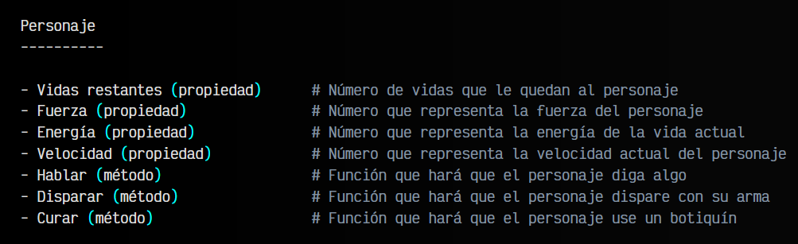

# 
Orientación a objetos.

La Programación Orientada a Objetos (POO, o en inglés OOP) es un estilo de programación muy utilizado, donde creas y utilizas estructuras de datos de una forma muy similar a la vida real, lo que facilita considerablemente la forma de planificar y preparar el código de tus programas o aplicaciones.

Una de las partes más complejas cuando estás empezando en el mundo de la programación (o incluso cuando ya llevas tiempo) es a la hora de crear las estructuras de datos. Con ejemplos sencillos, esto no es un problema, sin embargo, cuando los ejercicios se complican, una buena elección de una estructura de datos adecuada puede simplificar mucho el ejercicio, o complicarlo demasiado.

## Problemas comunes.
Cuando comenzamos a programar, nuestros ejemplos son bastante sencillos y faciles de controlar y modificar. Sin embargo, a medida que tenemos que programar cosas más complejas, todo se vuelve más complicado de organizar. Uno de los problemas más faciles de observar, es que comenzamos a tener una gran cantidad de variables y funciones, que al estar inconexas en nuestro código, es fácil que al seguir añadiendo más variables y funciones, nuestro código se descontrole y se vuelva muy difícil de entender.

Por esa razón, necesitamos una forma de organizar las variables y constantes, las funciones y tenerlo todo bien agrupado, de modo que con el tiempo, sea sencillo de entender, modificar y ampliar. Esa agrupación, en programación, se denomina Clase.

## Orientación a objetos.
El concepto de orientación a objetos se ve muy claro cuando tenemos en nuestra mente el concepto de Clase. Todos los elementos relacionados con esa Clase los vamos a incluir en su interior. Por un lado, las variables y constantes que teníamos «sueltas» en nuestro programa, las agruparemos dentro de una clase, donde también incluiremos todas las funciones.

    Las variables y constantes incluidas en una clase se denominan propiedades, y se utilizan para guardar información relacionada (se suele denominar estado). Por otro lado, las funciones incluidas en una clase se denominan métodos y se utilizan para realizar una acción relacionada con la clase.

## Ejemplo.
Piensa, por ejemplo, en el protagonista (héroe) de un juego. Tiene una serie de variables relacionadas con él (vidas, fuerza, energía, etc...), pero también tiene una serie de funciones relacionadas con él (hablar, disparar, curar, etc...). Todas ellas, las podríamos agrupar en una clase porque tienen relación con ese concepto de personaje:

Sin embargo, el concepto de Clase es un concepto abstracto. En el juego, por ejemplo, podríamos tener dos héroes que podemos elegir al principio. Ambos héroes tienen los mismos atributos y funciones, pero son dos personajes diferentes. Por esa razón, en la programación orientada a objetos se tiene un concepto llamado Clase y otro concepto llamado Objeto:

El primero de ellos, la Clase se refiere al concepto abstracto de personaje, mientras que el segundo de ellos, el objeto se refiere a un elemento particular. Por ejemplo, la clase podría ser Personaje, mientras que los objetos serían Mario y Luigi, ya que ambos se basan en un Personaje, pero tienen sus detalles particulares (Mario podría tener más vida, o Luigi más energía, diferentes velocidades, etc...).

## Similitud con la vida real.
Además de proveernos una forma de agrupar y organizar nuestro código y crear nuevos elementos basados en ellas sin repetirnos, las clases nos ofrecen una forma similar a la vida real de crear estructuras de datos, que de otra forma podría ser mucho más complejo.

Si por ejemplo, necesitaramos añadir una variable que indique la velocidad que tiene el personaje, podríamos añadir una propiedad denominada velocidad que contenga un 5. Luego, podríamos incluir un método denominado correr que cambie esa propiedad velocidad a 10, y un método denominado caminar que la vuelva a cambiar a 5.

Como ves, se trata de una forma que se asemeja bastante al mundo real, y puede ser mucho más sencillo para nosotros crear estructuras de datos para nuestros programas porque sólo tenemos que pensar en el elemento en la vida real, e imitarlo al programarlo.

Todo esto puede complicarse bastante, pero una vez sentadas estas bases, ya podemos comenzar a ver un poco de código para entender como funciona la Programación orientada a objetos en Javascript.

