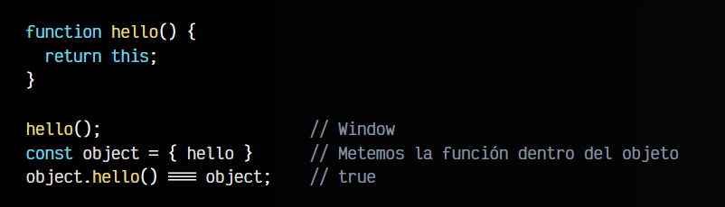

# 
Clases en Javascript.

Una vez dominamos las bases de la programación y nuestro código va creciendo cada vez más, comprobaremos que las variables y funciones no suelen ser suficiente como para que nuestro código esté bien organizado y los mecanismos que tenemos a nuestro alcance quizás no resultan todo lo prácticos que deberían ser.

Tradicionalmente, Javascript no soportaba clases de forma nativa, pero en ECMAScript 2015 se introdujo la posibilidad de usar clases simulando como se utilizan en otros lenguajes de programación. Internamente, Javascript traduce estas clases al sistema basado en prototipos que usa en realidad, sin embargo, los programadores no necesitarán saber como funcionan los prototipos, sino que les bastará con utilizar las clases a modo de azúcar sintáctico, es decir, un sistema que «endulza» la forma de trabajar para que sea más agradable y familiar.

## ¿Qué es una Clase?.
Como mencionamos en el apartado anterior, una clase sólo es una forma de organizar código de forma entendible con el objetivo de simplificar el funcionamiento de nuestro programa. Además, hay que tener en cuenta que las clases son «conceptos abstractos» de los que se pueden crear objetos de programación, cada uno con sus características concretas.

Esto puede ser complicado de entender con palabras, pero se ve muy claro con ejemplos:

Clases y objetos

En primer lugar tenemos la clase. La clase es el concepto abstracto de un objeto, mientras que el objeto es el elemento final que se basa en la clase. En la imagen anterior tenemos varios ejemplos:

   - En el primer ejemplo tenemos dos objetos: pato y ratón. Ambos son animales, por lo que son objetos que están basados en la clase Animal. Tanto pato como ratón tienen las características que estarán definidas en la clase Animal: color, sonido que emiten, nombre, etc...

   - En el segundo ejemplo tenemos dos objetos seat y opel. Se trata de dos coches, que son vehículos, puesto que están basados en la clase Vehículo. Cada uno tendrá las características de su clase: color del vehículo, número de ruedas, marca, modelo, etc...

   - En el tercer ejemplo tenemos dos objetos cuadrado y c2. Se trata de dos formas geométricas, que al igual que los ejemplos anteriores tendrán sus propias características, como por ejemplo el tamaño de sus lados. El elemento cuadrado puede tener un lado de 3 cm y el elemento c2 puede tener un lado de 6 cm.

## Instanciar una clase.
Se le llama instanciar una clase, crear un objeto o crear una instancia a la acción de crear un nuevo objeto basado en una clase particular. Esta acción la realizamos a través de la palabra clave new, seguida del nombre de la clase, la cuál puede tener parámetros, en cuyo caso se controlarían desde un constructor, concepto que veremos más adelante.

En Javascript, para instancia una clase, se utiliza una sintaxis muy similar a otros lenguajes como, por ejemplo, Java. Es tan sencillo como escribir lo siguiente:

El nombre elegido debería hacer referencia a la información que va a contener dicha clase. Piensa que el objetivo de las clases es almacenar en ella todo lo que tenga relación (en este ejemplo, con los animales). Si te fijas, es lo que venimos haciendo hasta ahora con objetos como REGEXP, DATE, ARRAY u otros.

Observa que luego creamos una variable donde hacemos un new Animal(). Estamos creando un objeto pato que es de tipo Animal, y que contendrá todas las características definidas dentro de la clase Animal (de momento, vacía).

   - Una norma de estilo en el mundo de la programación es que las clases deben siempre empezar en mayúsculas (nomenclatura llamada PascalCase). Esto nos ayudará a diferenciarlas sólo con leerlas. Si te interesa este tema, puedes echar un vistazo al tema de las https://lenguajejs.com/fundamentos/introduccion/convenciones-de-nombres/.

## Miembros de una clase.
Una clase tiene diferentes características que la forman, que generalmente se denominan miembros, y que normalmente son de dos tipos: propiedades y métodos. Vamos a ir explicándolas detalladamente. Pero primero, una tabla general para verlas en conjunto, con sus tipos:

Como vemos, todos estas características se dividen en dos grupos:

   - Las propiedades: a grandes rasgos, variables dentro de clases
   - Los métodos: a grandes rasgos, funciones dentro de clases

Un ejemplo sencillo de cada uno:

En los siguientes capítulos veremos que son exactamente, como se utilizan y que tipos de propiedades y métodos diferentes existen dentro del mundo de la programación orientada a objetos y sus clases.

## La palabra clave this.
Más adelante utilizaremos mucho la palabra clave this. Esta es una palabra clave que se utiliza mucho dentro de las clases para hacer referencia al objeto instanciado. Ojo, que hace referencia al objeto instanciado y no a la clase:

Observa que la palabra clave this no se refiere a la clase Animal exactamente, sino a la variable que utilizamos al instanciarla. Es decir, si hacemos un const pato = new Animal(), se ejecutaría el constructor y la palabra clave this haría referencia a pato, por lo que this.name estaría haciendo referencia a pato.name.

Es importante tener mucho cuidado con la palabra clave this, ya que en muchas situaciones creemos que devuelve una referencia al elemento padre que la contiene, pero en su lugar, devolverá el objeto Window, ya que se encuentra fuera de una clase o dentro de una función con otro contexto:

En este caso, podemos ver que si ejecutamos la función hello() en un contexto global, nos devuelve el padre, es decir, el objeto Window. Sin embargo, si metemos la función hello() dentro de un objeto OBJECT, al ejecutar object.hello() nos devuelve el padre, es decir, el propio objeto object.

Ten cuidado al utilizar this. Asegúrate siempre de que this tiene el valor que realmente crees que tiene.

## Buenas prácticas.
Veamos una serie de buenas prácticas a la hora de trabajar con clases, antes de profundizar en sus características.

## Clases en ficheros externos.
Generalmente, para tener el código lo más organizado posible, las clases se suelen almacenar en ficheros individuales, de forma que cada clase que creamos, debería estar en un fichero con su mismo nombre:

Luego, si queremos crear objetos basados en esta clase, lo habitual suele ser importar el fichero de la clase en cuestión y crear el objeto a partir de la clase. Algo similar al siguiente fragmento de código:

Si nuestra aplicación se complica mucho, podríamos comenzar a crear carpetas para organizar mejor aún nuestros ficheros de clases, y por ejemplo, tener la clase Animal.js dentro de una carpeta classes (o algo similar). Esto nos brindaría una mejor experiencia de desarrollo, pero el nombre de las carpetas o su organización ya dependería del desarrollador o del equipo de desarrollo.

## Nombrado de miembros.
En los próximos capítulos ya profundizaremos en las propiedades y los métodos de una clase, pero una buena práctica para no confundirnos a la hora de utilizarlos, es a la hora de ponerles nombres. Es muy aconsejable que las propiedades de una clase tengan nombre de sustantivos (son elementos, valores, ítems...), mientras que los métodos de una clase deberían tener nombre de verbos (son acciones, operaciones, etc...).

Otro buen consejo, mucho más general, es que intentes escribir código en inglés, ya que eso hará que el código que hagas sea mucho más universal, y sea más fácil de modificar por otras personas.

## Clases con pocas líneas.
Otro consejo interesante a la hora de trabajar con clases sería intentar que las clases se mantengan pequeñas, con pocas líneas de código. El número de líneas de código ideal es difícil de saber, pero un buen número, por ejemplo, podría ser entre 100-500 líneas de código, como menciona la regla [max-lines](https://eslint.org/docs/latest/rules/max-lines) de la herramienta de revisión de código [ESLint](https://lenguajejs.com/javascript/calidad-de-codigo/eslint/).

Si descuidamos la cantidad de líneas de código por fichero al programar, es muy probable que con el tiempo la clase (o el fichero) vaya creciendo en líneas y se vuelva muy dificil de mantener y modificar.

Para evitar esto, lo ideal siempre es mantener, siempre que sea posible, un número bajo de líneas de código, y si la clase se está haciendo muy grande, intentar dividirla en varias clases. Es decir, buscar una serie de criterios para poder refactorizar y separar ciertos detalles en una nueva clase:

En este ejemplo, hemos separado en una nueva clase Vida en el fichero Vida.js, los conceptos Vidas restantes, Energía y Curar ya que tienen relación entre sí (hacen referencia a la vida del personaje), de modo que ahora en la clase Personaje simplemente tenemos una propiedad que hace referencia a un objeto de esa clase Vida, con sus valores particulares.

Esto hará que, si el fichero Personaje.js ocupaba demasiadas líneas, consigamos reducirlas, puesto que hemos movido parte de su código a otro fichero, y de paso hemos mejorado mucho nuestro código, ya que ahora está separado en temas más específicos, que son más pequeños y más fáciles de controlar.

