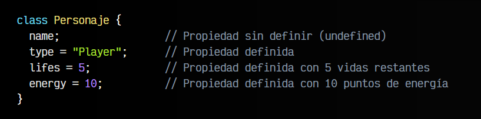
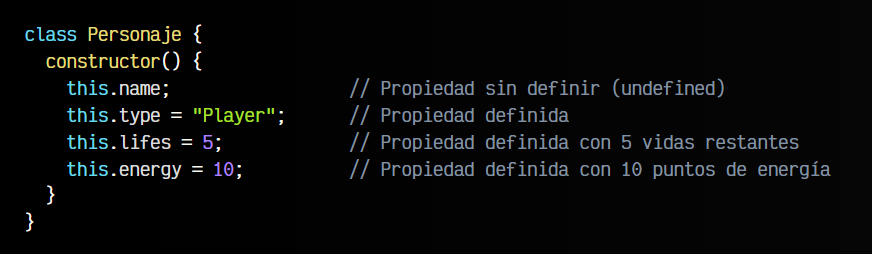
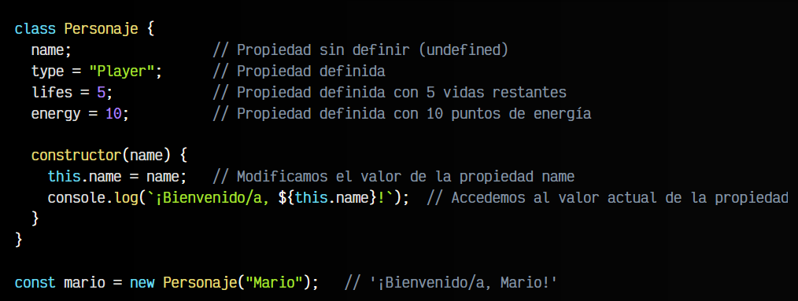
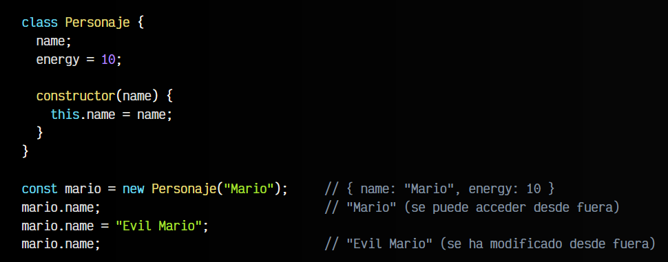
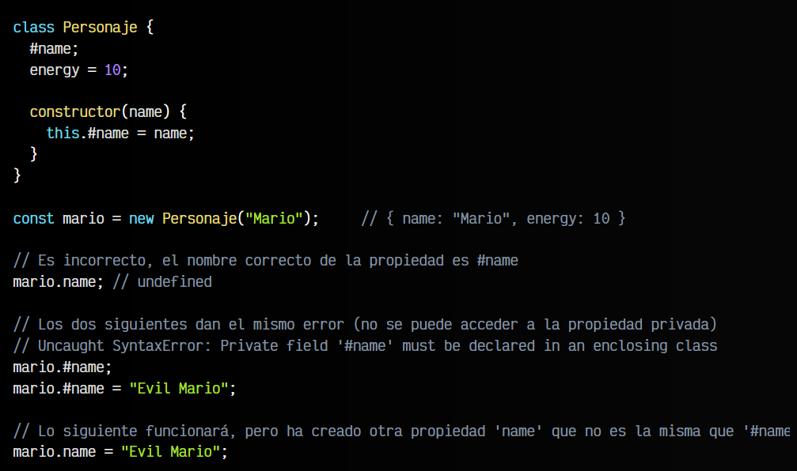
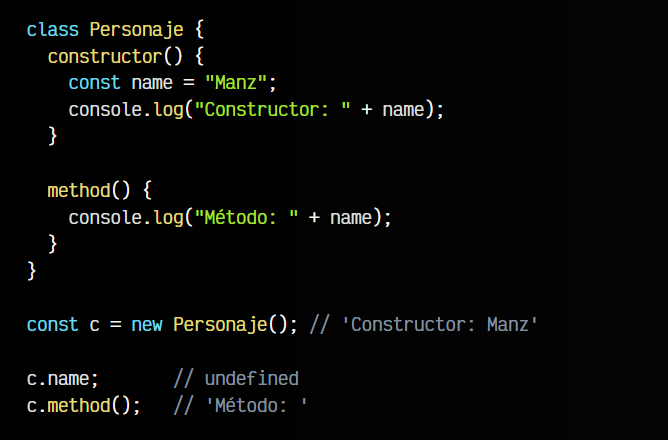
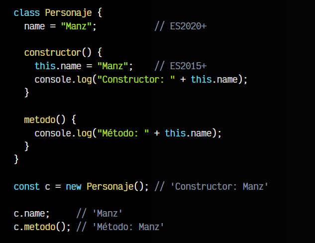
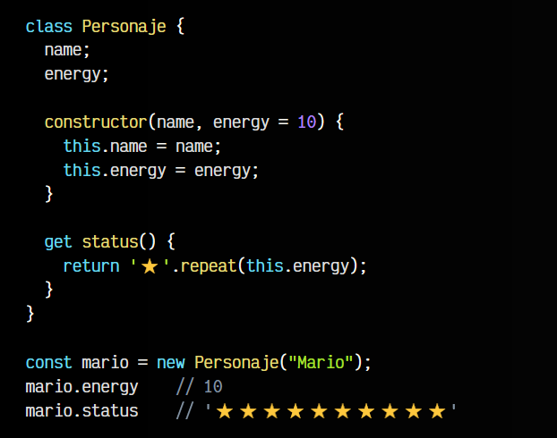
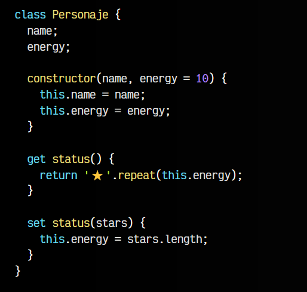
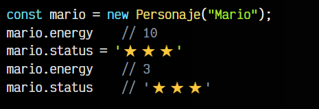

# 
Propiedades de clase.

Hasta ahora, hemos hablado de Programación orientada a objetos (OOP) y del concepto de clase dentro de este estilo de programación. Sin embargo, tenemos que profundizar en los miembros de clase, que a grandes rasgos son propiedades o métodos. En este artículo vamos a explicar las propiedades de clase.

## ¿Qué es una propiedad de clase?.
Las clases, siendo estructuras para guardar y almacenar información, tienen unas variables que viven dentro de la clase. Esta información (también llamada estado) se denomina propiedad o propiedad de clase y desde ECMAScript 2020 para crearlas se hace de la siguiente forma:

Tradicionalmente en Javascript, las propiedades acostumbraban a definirse a través del constructor, mediante la palabra clave this, por lo que es muy probable que también te las encuentres declaradas de esta forma, sin necesidad de declararlas fuera del constructor:

Puesto que se trata de propiedades de clase y el constructor() es un método que se ejecuta cuando se crea el objeto (instancia de clase), ambas son equivalentes, ya que al crear un objeto se ejecutará el constructor y se crearán esas propiedades.

A la hora de utilizarlas, simplemente accedemos a ellas de la misma forma que vimos en el último ejemplo, haciendo uso de la palabra clave this. Veamos un ejemplo un poco más elaborado, utilizando propiedades y métodos:

Como se puede ver, estas propiedades existen en la clase, y se puede establecer de forma que todos los objetos tengan el mismo valor, o como en el ejemplo anterior, tengan valores diferentes dependiendo del objeto en cuestión, pasándole los valores específicos por parámetro.

## Visibilidad de propiedades.
Observa que, las propiedades de clase siempre van a tener una visibilidad específica, que puede ser pública (por defecto) o privada. En el primer caso, las propiedades pueden ser leídas o modificadas tanto desde dentro de la clase como desde fuera, en el segundo caso, sólo pueden ser leídas o modificadas desde el interior de la clase.

Vamos a echar un vistazo a un ejemplo para entenderlo mejor.

## Propiedades públicas.
Por defecto, las propiedades en las clases son públicas. Observa que siempre vamos a poder acceder a las propiedades desde el constructor u otros métodos (dentro de la clase), ya sean propiedades públicas o privadas:

Observa también que en las últimas líneas, accedemos a la propiedad name desde fuera de la clase y la modificamos. Esto ocurre porque es una propiedad pública, y es posible hacerlo.

## Propiedades privadas.
A partir de la versión ECMAScript 2020, se introduce la posibilidad de crear propiedades de clase privadas. Por defecto, todas las propiedades y métodos son públicos por defecto, sin embargo, si añadimos el carácter # justo antes del nombre de la propiedad, se tratará de una propiedad privada:

Como se puede ver, las propiedades precedidas del carácter # son automáticamente privadas y sólo se podrá acceder a ellas desde un método de clase, ya que si se hace desde fuera obtendremos un error similar al siguiente:

Sin embargo, si se llama a un método público, que a su vez accede a la propiedad privada mediante this.#name todo funcionará correctamente, ya que ese método público si es accesible desde fuera de la clase y la propiedad privada si es accesible desde dentro de la clase.

## Ámbitos de propiedades de clase.
Dentro de una clase tenemos dos tipos de ámbitos: ámbito de método y ámbito de clase. En primer lugar, veamos el ámbito dentro de un método. Si declaramos propiedades dentro de un método con let o const, estos elementos existirán sólo en el método en cuestión. Además, no serán accesibles desde fuera del método:

Observa que la variable name solo se muestra cuando se hace referencia a ella dentro del constructor() que es donde se creó y el ámbito donde existe.

En segundo lugar, tenemos el ámbito de clase. Si creamos propiedades de las dos formas que vimos al principio del artículo:

   - Precedidas por this. desde dentro del constructor ES2015
   - Al inicio de la clase, fuera del constructor ES2020
  
En cualquiera de estos dos casos, las propiedades tendrán alcance en toda la clase, por lo que podremos acceder a ellas tanto desde el constructor, como desde otros métodos de la clase:

Recuerda que si quieres evitar que estas propiedades de clase se puedan modificar desde fuera de la clase, añade el # antes del nombre de la propiedad al declararla. De esta forma serán propiedades privadas, y sólo se podrá acceder a ellas desde el interior de los métodos de la clase.

## Propiedades computadas.
En algunos casos nos puede interesar utilizar lo que se llaman propiedades computadas. Las propiedades computadas son un tipo de propiedad especial que se declara como una función, y que se ejecuta cuando accedemos a la propiedad con dicho nombre. Hay dos tipos de propiedades computadas, los getters y los setters.

## Propiedades get (getters).
Veamos el primer caso, la propiedad computada get o también llamada getter. Para definirla, simplemente añadimos la palabra clave get antes del nombre de la función. De resto, se define exactamente igual que una función:

Observa que aunque la definimos como una función status(), luego accedemos a ella como una propiedad mario.status. Por eso se llama propiedad computada. La idea de este tipo de propiedades, es permitir pequeñas modificaciones sobre propiedades ya existentes (en nuestro caso, energy). En lugar de devolver el valor numérico, devolvemos el número de estrellas que representa la vida del personaje.

Ten mucho cuidado con acceder a la misma propiedad definida desde dentro del get. Si dentro del get status() accedes a this.status, se produciría un bucle infinito que podría bloquear el navegador.

## Propiedades set (setters).
De la misma forma que podemos crear un get para obtener un valor, podemos utilizar un set para establecerlo. La idea es exactamente la misma, pero para modificar el valor. En este caso, el ejemplo no es tan didáctico, pero vamos a dar la funcionalidad inversa. Si establecemos un número de estrellas a status, las cuenta y asigna el número a energy:

Observa que ahora la "magia" está en el set status(stars). Se comporta como una función, y al asignar tres estrellas a mario.status, automágicamente se ha cambiado el valor de mario.energy. Estas propiedades computadas nos pueden venir muy bien cuando queramos modificar ligeramente ciertos elementos de una forma automática y organizada.