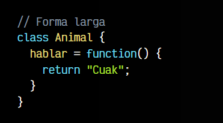

# 
Métodos de clase.

Simplificando mucho, un método es el nombre que recibe una función que existe dentro de una clase. Se utilizan para englobar comportamientos o funcionalidades relacionadas en conjunto con la clase y mediante las cuales podemos segmentar y separar en bloques de código.

Por ejemplo, en el siguiente fragmento de código definimos una constante text que contiene el STRING "Manz". En la siguiente línea, ejecutamos el método .repeat(), que es una función que pertenece a todos los objetos que son definidos como STRING, y que simplemente repite el texto el número de veces que le pasamos por parámetro:

Cada variable de un determinado tipo de dato, tiene métodos asociados a dicho tipo de dato, los puedes ver muy claramente en la CheatSheet de Javascript. Los objetos de tipo STRING tienen sus propios métodos, los objetos de tipo NUMBER tienen los suyos, etc...

## ¿Qué es un método?.
En nuestro caso, hablamos de métodos cuando nos referimos a funciones que existen en el interior de una clase. Observa el siguiente ejemplo, donde tenemos una función independiente:

Esta función no está asociada a ningún otro elemento. Simplemente existe en el ámbito global de nuestro programa. Vamos ahora a convertirla en un método de la clase Animal (y por lo tanto, devolver en ella algo más acorde):

Observa que esto no es más una forma de incluir la función anterior dentro de nuestra clase Animal. Realmente, podríamos también hacerlo de la siguiente forma, sin embargo, la anterior es mucho más compacta y sencilla, por lo que es la que más se suele utilizar, pero quizás con esta te resulte más claro lo que se está haciendo dentro de la clase:

Una vez declarado el método hablar() dentro de la clase Animal, podemos instanciar el objeto mediante un new Animal() y tener ese método disponible. Ten en cuenta que podemos crear varias variables de tipo Animal y serán totalmente independientes cada una:

Observa que el método hablar() existe tanto en las variables pato como donald porque ambas son de tipo Animal. Al igual que ocurre con una función normal, se le pueden pasar varios parámetros al método y trabajar con ellos como venimos haciendo normalmente con las funciones.

## Constructor de clase.
Se le llama constructor a un método de clase especial que se ejecuta automáticamente cuando se hace un new de dicha clase (al instanciar el objeto). Una clase solo puede tener un constructor, y en el caso de que no se especifique un constructor a una clase, tendrá uno vacío de forma implícita.

Veamos el ejemplo anterior, donde añadiremos un constructor a la clase:

El constructor es un mecanismo muy interesante y utilizado para tareas de inicialización o que quieres realizar tras haber creado el nuevo objeto. Otros lenguajes de programación tienen concepto de destructor (el opuesto al constructor), sin embargo, en Javascript no existe este concepto.

## ¿Qué es un método estático?.
En el caso anterior, al utilizar un método como por ejemplo hablar(), debemos crear el objeto basado en la clase haciendo un new Animal(). Es lo que se denomina crear un objeto, crear una instancia de clase o instanciar un objeto.

Sin embargo, nos podría interesar crear métodos estáticos en una clase, ya que este tipo de métodos no requieren crear una instancia, sino que se pueden ejecutar directamente sobre la clase:

Como veremos más adelante, lo habitual suele ser utilizar métodos normales (no estáticos), ya que normalmente nos suele interesar crear múltiples objetos y guardar información (estado) en cada uno de ellos, y para eso necesitaríamos instanciar un objeto.

Una de las limitaciones de los métodos estáticos es que en su interior sólo podremos hacer referencia a elementos que también sean estáticos. No podremos acceder a propiedades o métodos no estáticos.

    Los métodos estáticos se suelen utilizar para crear funciones de apoyo que realicen tareas genéricas que no necesiten estado de la clase, pero siguen estando relacionadas con la clase y no queremos mantenerlas separadas.

## Inicialización estática.
Una reciente característica denominada Class static initialization blocks ES2022 nos permite ejecutar un bloque de código de forma muy similar a una especie de constructor estático.

La diferencia radica en que, mientras el constructor se ejecuta cuando se crea el objeto (se crea una instancia de clase), el bloque estático static {} se ejecuta nada más declarar la clase (antes de la instancia), por lo que puede ser realmente útil para realizar tareas de inicialización donde no necesitas la instancia del objeto, o previas al constructor:

Ten en cuenta que desde el bloque static {} tendrás acceso a propiedades estáticas, pero no a propiedades de clase (necesitan instancia de clase). Por otro lado, desde el constructor() podrás acceder tanto a las propiedades de clase como a las propiedades estáticas.

## Visibilidad de métodos.
Al igual que ocurre con las propiedades de clase, los métodos de una clase tienen una visibilidad específica que por defecto es pública. Esto es, los métodos son accesibles tanto desde fuera de la clase como desde dentro.

Veamos un ejemplo de cada caso.

## Métodos públicos.
Por norma general, los métodos de una clase son públicos, por lo que podemos acceder tanto desde dentro de la clase como desde fuera. Observa que desde el constructor estamos accediendo a hablar() desde dentro de la clase y al crear el objeto, se llamará a ese método:

Por otro lado, al llamar a mario.hablar() se puede ver que se permite acceder desde fuera de la clase.

## Métodos privados.
¿Qué es lo que ocurre si definimos el método hablar() como un método privado? Para ello, simplemente le añadimos el símbolo # antes del nombre, asegurándonos también de incluirlo en las llamadas al método. Quedaría algo así:

Como se puede contemplar, en el caso de definir el método privado, no es posible ejecutarlo desde fuera de una clase, salvo que lo hagamos a través de un método público que llame internamente al método privado.

En el siguiente artículo seguiremos explorando las clases, centrándonos en esta ocasión en la denominada herencia de clases.