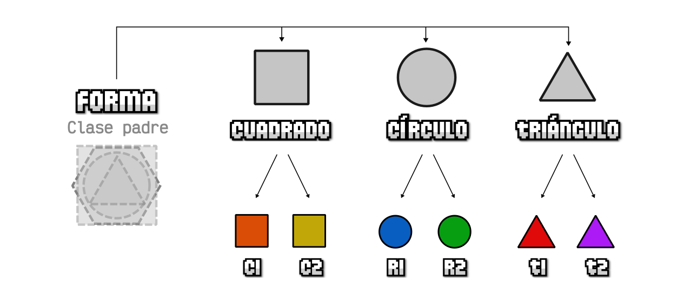
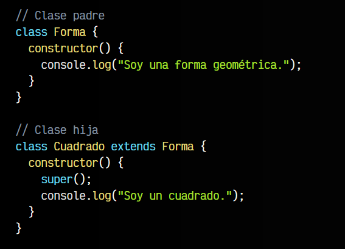
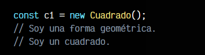
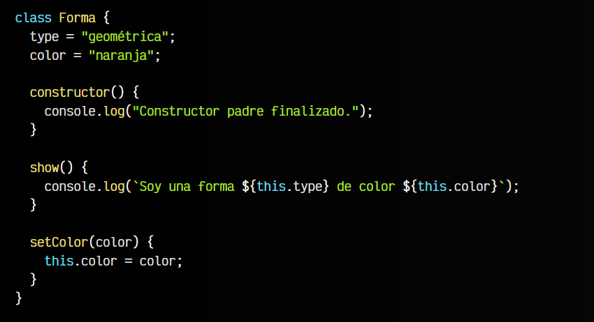
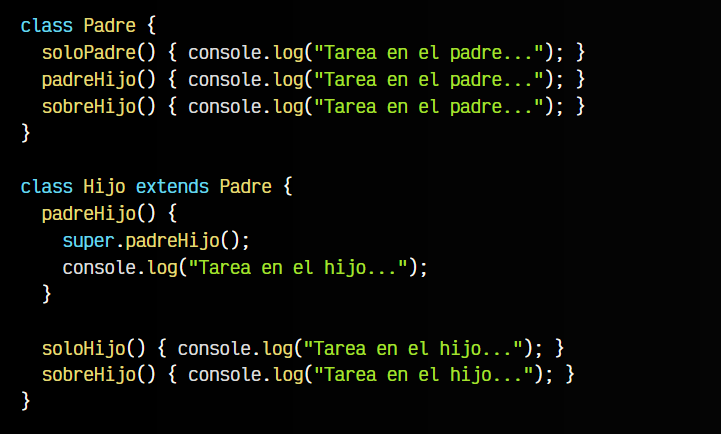
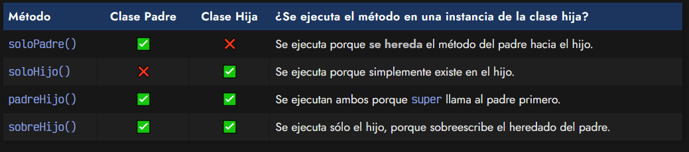

# 
Herencia de Clases.

A medida que trabajamos con Clases y objetos en nuestro código, una de las características fundamentales que nos ayudan a reutilizar y simplificar código es la herencia de Clases. Con esta característica podemos establecer una jerarquía de elementos y reutilizar código según en que nivel se encuentre cada elemento.

## ¿Qué es la herencia de clases?.
A grandes rasgos, se puede denominar herencia de clases a la característica donde una clase hija obtiene las propiedades y métodos de una clase padre porque se ha establecido una relación entre ambas. Esa relación se establece a través de la palabra clave extends, como veremos más adelante.

Por ejemplo, tomemos el caso del capítulo anterior donde teníamos formas geométricas para trabajar con él. Observa que en primer lugar tenemos una clase padre llamada Forma que representa una forma geométrica abstracta. Dicha forma geométrica tendrá las características comunes a todos los elementos inferiores (el color, grosor del borde, etc...):

Luego, tenemos varias clases más concretas denominadas clases hijas: Cuadrado, Circulo y Triangulo. Dichas clases tendrán las características propias que necesitará cada una de ellas:

   - El Cuadrado tendrá una propiedad que será lado.
   - El Círculo tendrá una propiedad radio y otra diametro.
   - El Triángulo tendrá una propiedad base y otra altura.

Además, estas clases heredan las características comunes de su padre, en este caso de la clase Forma. Así, finalmente tendremos una jerarquía de clases que se basa en clases anteriores heredadas.

Por ejemplo, en el primer caso, los elementos c1 y c2 son cuadrados, objetos generados (instanciados) a partir de la clase Cuadrado, que tienen cada uno una propiedad lado, definida en Cuadrado, y además heredan propiedades comunes de la clase Forma, como color. De la misma forma, ocurrirá con el resto de elementos

## Extender una clase.
En Javascript, a partir de ECMAScript , podemos «extender clases» de forma muy similar a como se hace en otros lenguajes de programación. Vamos a pasar a código el ejemplo anterior, utilizando herencia. Observa que en la clase hija se utiliza la palabra clave extends seguida de la clase padre que va a heredar:

Fíjate que la clase padre Forma muestra un mensaje en su constructor. Cada clase hija extiende de su clase padre, por lo que la clase Cuadrado será una mezcla de lo que tiene la clase Forma más lo que tiene la clase Cuadrado. Vamos a instanciar los objetos del ejemplo y a comprobarlo:

Observa que al crear la instancia c1 a partir de la clase Cuadrado, se ha ejecutado el constructor de Cuadrado, el cuál tiene una llamada a super(). Esta es una función especial que llama al constructor de la clase padre, por lo que antes de continuar, pasa a ejecutarse el constructor de Forma, donde se muestra el mensaje Soy una forma geométrica. Al terminar, se vuelve al constructor de la clase Cuadrado, y se muestra el texto Soy un cuadrado.

## El método super.
Como hemos visto, el método especial super() se encarga de llamar al constructor de la clase padre (también denominada superclase, de ahí su nombre), por lo que funcionará en cascada e irá ejecutando primero el constructor del padre, y luego el texto del constructor del hijo. Hagamos algunos cambios interesantes en el ejemplo anterior, para reutilizar algunos elementos heredados.

Observa el siguiente ejemplo. La clase padre tiene una propiedad type y otra color. Además, tiene un método show() y otro método setColor(). Estos cuatro elementos son elementos que pertenecen a la clase padre, pero que cualquier clase hija que extienda de ella, heredará esos elementos. Por otro lado, fíjate que la clase hijo sobreescribe la propiedad type:

Vamos a crear los dos objetos del gráfico anterior. Al crear la instancia del objeto c1 a partir de Cuadrado y luego ejecutar el método .show() heredado del padre, veremos que se está ejecutando el código del método del padre, pero obtiene la información de type sobreescrita por el hijo.

Si miramos el segundo ejemplo, del objeto c2, veremos que en él ejecutamos el método .setColor() del padre, que modifica la propiedad color del hijo, cambiándola por el color "amarillo". Al ejecutar el método .show() comprobaremos que nos muestra la información sobreescrita por la clase hijo.

    Recuerda que es obligatorio llamar a super() en el constructor de la clase hija antes de acceder a una propiedad mediante this. De lo contrario, te aparecerá el siguiente mensaje: Uncaught ReferenceError: Must call super constructor in derived class before accessing 'this' or returning from derived constructor.

## Acceder a métodos del padre.
Como hemos visto, la palabra clave super() hace referencia a la superclase, es decir, a la clase padre. No obstante, también podemos utilizarlas en métodos para llamar a métodos del padre según nos interese heredar o no:

Observa que la clase Padre implementa los métodos soloPadre(), padreHijo() y sobreHijo(). Por otro lado, la clase Hijo implementa los métodos padreHijo(), soloHijo() y sobreHijo(). Veamos como se comportan si creamos una instancia de la clase hija por medio de un new Hijo() y ejecutamos cada uno de ellos:

