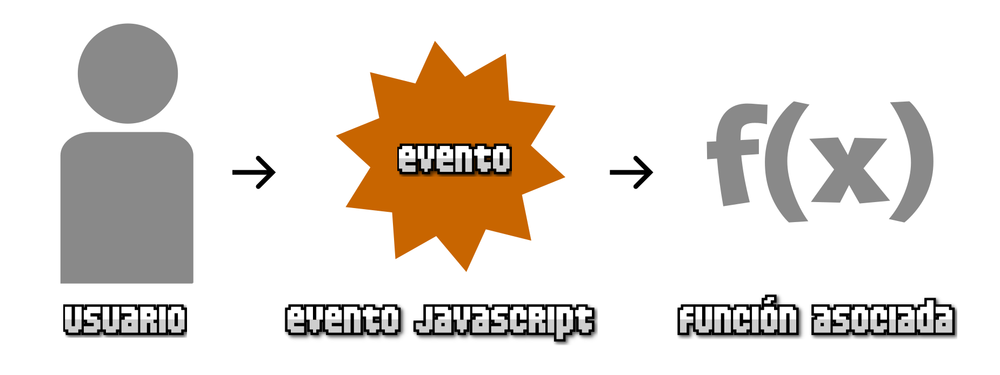
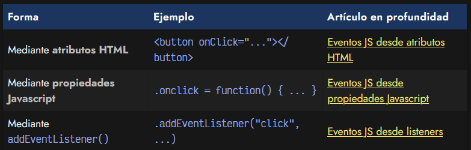

# 
¿Qué son los eventos?.

Hay situaciones en las que necesitamos realizar una acción cuando ocurra un determinado caso. En estas situaciones, no sabemos exactamente cuando tenemos que activar nuestra funcionalidad, ya que no podemos predecir cuando el usuario de nuestra página realizará dicha acción (y además, podrá ser diferente en cada situación).

En estas situaciones es cuando entran en juego los eventos.

## ¿Qué es un evento?.
En Javascript existe un concepto llamado evento, que no es más que una notificación de que alguna característica interesante acaba de ocurrir, generalmente relacionada con el usuario que navega por la página.

Dichas características pueden ser muy variadas:

   - Click de ratón del usuario sobre un elemento de la página
   - Pulsación de una tecla específica del teclado
   - Reproducción de un archivo de audio/video
   - Scroll de ratón sobre un elemento de la página
   - El usuario ha activado la opción «Imprimir página»

Como desarrolladores, nuestro objetivo es preparar nuestro código para que cuando ocurra un determinado evento, se lleve a cabo una funcionalidad asociada. De esta forma, podemos preparar nuestra página o aplicación para que cuando ocurran ciertos eventos (que no podemos predecir de otra forma), reaccionen a ellos:

Uno de los eventos más comunes, es el evento click, que es el que se produce cuando el usuario hace click con el ratón en un elemento de la página. Vamos a utilizar este evento a modo de ejemplo en las siguientes secciones de la página, pero recuerda que hay muchos tipos de eventos diferentes.

## Formas de manejar eventos.
Existen varias formas alternativas de manejar eventos en Javascript. Vamos a ver cada una de ellas por separado, con sus particularidades, pero antes hagamos un pequeño resumen:

Cada una de estas opciones se puede utilizar para gestionar eventos en Javascript de forma equivalente, pero cada una de ellas tiene sus ventajas y sus desventajas. En los siguientes apartados veremos detalladamente sus características, pero por norma general, lo aconsejable es utilizar la última, los listeners, ya que son las más potentes y flexibles.