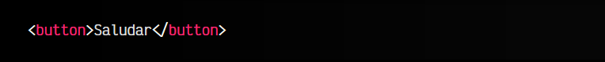
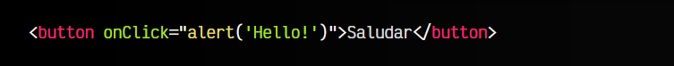
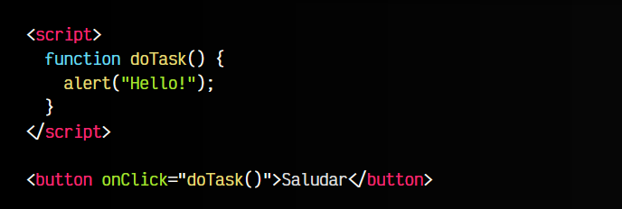
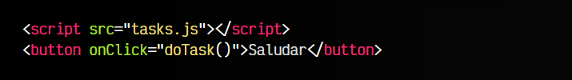

# 
Eventos mediante HTML.

Probablemente, la forma más fácil de trabajar con eventos Javascript es mediante atributos de una etiqueta HTML. Sin embargo, aunque es la más sencilla, también es la menos recomendable, pero es un buen punto de partida para comenzar a trabajar con eventos.

## ¿Qué es un evento Javascript?.
Un evento Javascript es una característica especial que ha sucedido en nuestra página y a la cuál le asociamos una funcionalidad, de modo que se ejecute cada vez que suceda dicho evento. Por ejemplo, el evento click se dispara cuando el usuario hace click en un elemento de nuestra página.

Imaginemos el siguiente código HTML:

En nuestro navegador nos aparecerá un botón con el texto «Saludar». Sin embargo, si lo pulsamos, no realizará ninguna acción ni tendrá funcionamiento. Para solucionar esto, podemos asociarle un evento:

En este ejemplo, cuando el usuario haga click con el ratón en el botón Saludar, se disparará el evento click en ese elemento HTML (button). Dicho botón, al tener un atributo onClick (cuando hagas click), ejecutará el código que tenemos asociado en el valor del atributo HTML (en este caso un alert()), que no es más que un mensaje emergente con el texto indicado.

  - Ten en cuenta que el nombre del evento es click, sin embargo, en los atributos HTML se coloca siempre precedido de on. Las minúsculas/mayúsculas dan igual, aunque lo más habitual es utilizar [camelCase](https://lenguajejs.com/fundamentos/introduccion/convenciones-de-nombres/).

## Organizando la funcionalidad.
El valor del atributo onClick llevará la funcionalidad en cuestión que queremos ejecutar cuando se produzca el evento. En nuestro ejemplo anterior, hemos colocado un alert(), pero lo habitual es que necesitemos ejecutar un fragmento de código más extenso, por lo que lo ideal sería meter todo ese código en una función, y en lugar del alert(), ejecutar dicha función:

Ahora sí, todo está un poco mejor organizado. Sin embargo, no es muy habitual tener bloques <script> de código Javascript en nuestro HTML, sino que lo habitual suele ser externalizarlo en ficheros .js para dividir y organizar mejor nuestro código:

Ahora aparece un nuevo problema que quizás puede que aún no sea muy evidente. En nuestro <button> estamos haciendo referencia a una función llamada doTask() que, aparentemente, confiaremos en que se encuentra declarada dentro del fichero tasks.js.

Esto podría convertirse en un problema, si posteriormente, o dentro de cierto tiempo, nos encontramos modificando código en el fichero tasks.js y le cambiamos el nombre a la función doTask(), ya que podríamos olvidar que hay una llamada a una función Javascript en uno (o varios) ficheros .html.

    Por esta razón, suele ser buena práctica no incluir llamadas a funciones Javascript en nuestro código .html, sino que es mejor hacerlo desde el fichero externo .js, localizando los elementos del DOM con un .querySelector() o similar.

En resumen:

   - Gestionar eventos Javascript desde HTML es muy sencillo.
   - Hay que tener en cuenta que «mezclamos» código Javascript dentro de HTML.
   - Para que el código sea más legible y fácil de mantener, se recomienda gestionar [eventos desde Javascript (DOM)](https://lenguajejs.com/javascript/eventos/eventos-javascript/) o, mejor aún, gestionar [eventos mediante addEventListener()](https://lenguajejs.com/javascript/eventos/addeventlistener/).

