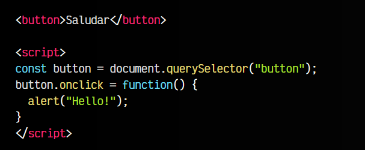
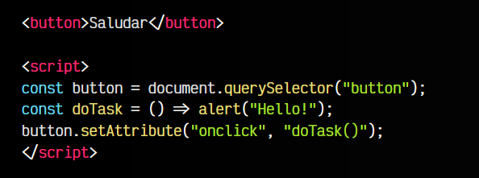

# 
Eventos mediante Javascript.

En los artículos anteriores explicamos [que es un evento Javascript](https://lenguajejs.com/javascript/eventos/que-son-eventos/) y como [gestionar eventos a través del HTML](https://lenguajejs.com/javascript/eventos/eventos-html/), concretamente, desde un atributo de una etiqueta HTML. Sin embargo, vimos que es preferible hacerlo todo desde el código Javascript, en nuestros ficheros .js a tener llamadas a funciones Javascript sueltas en nuestro código HTML.

## Eventos a través del DOM.
Existe una forma de gestionar eventos Javascript sin necesidad de hacerlo desde nuestros ficheros .html. No obstante, se trata de una «trampa», puesto que seguimos haciéndolo desde HTML, sólo que ese HTML se crea desde Javascript, y nos permite llevarlo a los ficheros .js.

## Utilizando propiedad Javascript.
La idea es la misma que vimos en el artículo anterior, sólo que en esta ocasión haremos uso de una propiedad Javascript, a la que le asignaremos la función con el código asociado.

Vamos a realizar el mismo ejemplo anterior para verlo claramente:

Observa que en este caso, en lugar de añadir el atributo onClick a nuestro <button style="height:10px;value='boton'"></button>botón, lo que hacemos es localizarlo mediante querySelector(). Esto podríamos hacerlo mediante una clase, pero en este ejemplo lo hemos hecho directamente mediante el botón, para simplificar.

En la linea siguiente, observa que asignamos una función con el código deseado (el código que queremos ejecutar cuando ocurre el evento) en la propiedad .onclick del elemento button. Esta es una propiedad especial que pasaremos a explicar a continuación.

es una propiedad especial que pasaremos a explicar a continuación.

    La propiedad .onclick (o del evento en cuestión) siempre irá en minúsculas, ya que se trata de una propiedad Javascript, y Javascript es sensible a mayúsculas y minúsculas.

## Utilizando setAttribute().
Realmente lo que estamos haciendo es equivalente a añadir un atributo onclick en nuestro botón <button></button>, solo que lo hacemos a través de la API de Javascript. Otra forma similar, donde si se verá más claro, sería la siguiente:

Observa que en este caso, si vemos la similitud con la forma del artículo anterior, ya que estamos utilizando el método .setAttribute(), donde añadimos el atributo onclick con el valor indicado a continuación.

En resumen:

   - A grandes rasgos, se trata de una forma alternativa a gestionar los eventos Javascript desde HTML, pero creando el HTML mediante la API del DOM de Javascript.

   - En el caso de que necesitemos añadir más de una función al evento, la cosa se puede complicar. Podríamos tener una función que ejecute varias funciones, pero sin duda alguna, utilizar el método .addEventListener() será mucho más cómodo, sencillo y legible.

