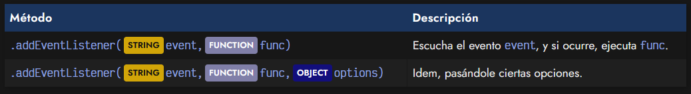
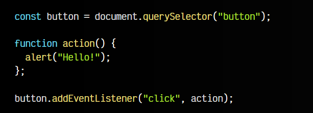
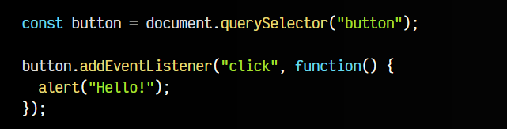
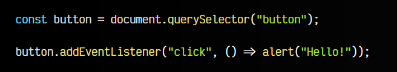
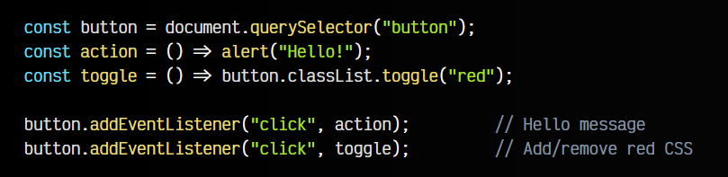
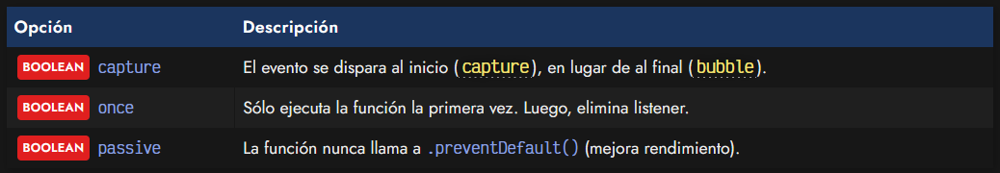
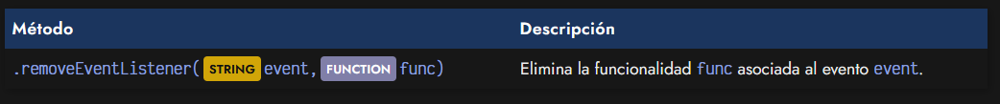
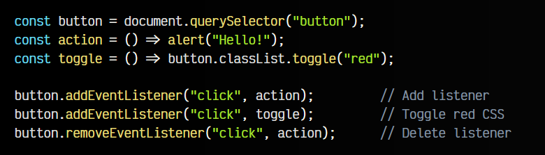

# 
El método addEventListener.

En los artículos anteriores hemos visto que son los eventos Javascript y como gestionarlos a través de código HTML, o a través de código Javascript, utilizando la API del DOM. Sin embargo, la forma más recomendable es hacer uso del método .addEventListener(), el cuál es mucho más potente y versatil para la mayoría de los casos.

   - Con .addEventListener() se pueden añadir fácilmente múltiples funcionalidades.
   - Con .removeEventListener() se puede eliminar una funcionalidad previamente añadida.
   - Con .addEventListener() se pueden indicar ciertos comportamientos especiales.

## Método .addEventListener().
Con el método .addEventListener() permite añadir una escucha del evento indicado (primer parámetro), y en el caso de que ocurra, se ejecutará la función asociada indicada (segundo parámetro). De forma opcional, se le puede pasar un tercer parámetro OBJECT con ciertas opciones, que veremos más adelante:

Para verlo en acción, vamos a crear a continuación, el mismo ejemplo de apartados anteriores, de esta forma veremos como funciona y podremos comparar con los anteriores:

button.addEventListener("click", action);

Observa detenidamente lo que hacemos en este ejemplo:

   - 1️⃣ Buscamos el elemento que tendrá el evento, en este caso <button></button> button
   - 2️⃣ Creamos una función action() que realizará la acción deseada.
   - 3️⃣ En el botón, escuchamos el evento click y le asociamos la función action.

Ten muy en cuenta los siguientes detalles:

   - En el primer parámetro indicamos el nombre del evento, en nuestro ejemplo, click. Con .addEventListener() no se precede con on los nombres de eventos y se escriben en minúsculas, sin camelCase.
   - En el segundo parámetro indicamos la función con el código que queremos que se ejecute cuando ocurra el evento.
  
Aunque es posible que al principio veas más organizado este código, es muy habitual escribir los eventos de esta otra forma:

En lugar de tener la función definida fuera, la utilizamos en el propio .addEventListener() y nos ahorramos ponerle un nombre, es decir, utilizamos una función anónima. Si prefieres utilizar las [funciones flecha](https://lenguajejs.com/javascript/fundamentos/funciones/#arrow-functions) de Javascript, quedaría incluso más legible:

Una de las características más cómodas de utilizar .addEventListener() es que puedes añadir múltiples listeners de forma sencilla, así que lo veremos a continuación.

## Múltiples listeners.
Dicho método .addEventListener() permite asociar múltiples funciones a un mismo evento, algo que, aunque no es imposible, es menos sencillo e intuitivo en las modalidades de gestionar eventos que vimos anteriormente:

Observa que en este ejemplo, hemos añadido una clase .red de CSS, que coloca el color de fondo del botón en rojo. Además, hemos creado dos funcionalidades:

   - action, que muestra un mensaje de saludo
   - toggle, que añade o quita el color rojo del botón

Observa que al pulsar el botón se efectuan ambas acciones, ya que hay dos listeners en escucha.

## Opciones de .addEventListener().

Al utilizar el método .addEventListener(), se puede indicar un tercer parámetro opcional. Se trata de un OBJECT opcional en el cual podemos indicar alguna de las siguientes opciones para modificar alguna característica del listener en cuestión que vamos a crear:

Repasemos cada una de estas opciones:

   - En primer lugar, la opción capture nos permite modificar la modalidad en la que escuchará el evento (capture/bubbles, ver más adelante). Esto, básicamente, lo que hace es modificar en que momento se procesa el evento.

   - En segundo lugar, la opción once nos permite indicar que el evento se procesará solo la primera vez que se dispare un evento. Internamente, lo que hace es ejecutarse una primera vez y luego llamar al .removeEventListener(), eliminando el listener una vez ha sido ejecutado.

   - En tercer y último lugar, la opción passive nos permite crear un evento pasivo en el que indicamos que nunca llamaremos al método .preventDefault() para alterar el funcionamiento del evento. Esto puede ser muy interesante en temas de rendimiento (por ejemplo, al hacer scroll en una página), ya que los eventos pasivos son mucho menos costosos.

   ## Método .removeEventListener().
El ejemplo anterior, se puede completar haciendo uso del método .removeEventListener(), que sirve como su propio nombre indica para eliminar un listener que se ha añadido previamente al elemento. Para ello es muy importante indicar la misma función que añadimos con el .addEventListener() y no una función diferente que haga lo mismo que la primera.

Veamos el ejemplo anterior, eliminando la funcionalidad action mediante .removeEventListener(), es decir, sólo debería actuar la funcionalidad toggle:

button.removeEventListener("click", action);      // Delete listener

   - Ten en cuenta que es posible eliminar el listener del evento porque hemos guardado en una constante la función, y tanto en .addEventListener() como en .removeEventListener() estamos haciendo referencia a la misma función. Si en lugar de esto, añadieramos la función literalmente, aunque hagan lo mismo, serían funciones diferentes y no realizaría lo que esperamos.

