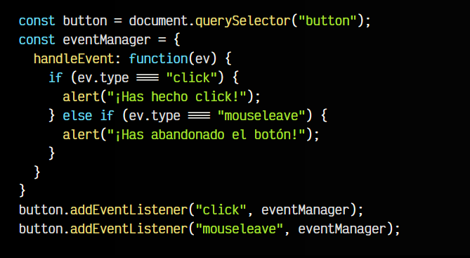

# 
Escuchar eventos y handleEvent.

En el artículo anterior, hemos visto como funciona el método .addEventListener(). Sin embargo, sólo hemos visto la superficie, ya que existen multitud de formas de asociar una función a un evento determinado. Recordemos la forma más simple y habitual de utilizar .addEventListener(), que es mediante una función:

Veamos que otras formas existen, y a repasar cada una de ellas y verlas aplicadas a un ejemplo.

## Escuchar eventos con funciones.
Primero, establezcamos unas bases para jugar con los diferentes ejemplos que veremos a continuación y entender mejor cada uno de ellos. Vamos a trabajar con la clase EventManager, que básicamente gestionará nuestros eventos de una forma más cómoda:

Observa que al hacer un new EventManager() y pasarle el botón por parámetro, el constructor() de la clase empezará a escuchar el evento y en el caso de que se produzca (evento de tipo click) ejecutará el método de clase sendMessage(). Sin embargo, hay un error en este código.

Es muy frecuente que se cometa este error, y es que si nos fijamos en el segundo parámetro del .addEventListener(), se espera una función FUNCTION, sin embargo, lo que estamos haciendo realmente es ejecutar una función y pasarle lo que devuelva.

En este caso, sendMessage() no devuelve nada, pero si pusieramos un 42 en su interior, estaríamos realmente haciendo un .addEventListener("click", 42), lo que obviamente, es incorrecto. Veamos como solucionarlo.

## Mediante funciones (referencia).
Al asociar una función a un evento utilizando .addEventListener() dentro de una clase, se nos podría ocurrir definirla con this.sendMessage(). Sin embargo, como hemos visto antes, esto es incorrecto.

La forma correcta de hacerlo, es pasando por parámetro la referencia de la función. Es decir, la opción anterior no nos vale porque estamos ejecutando el método sendMessage(). En su lugar, podríamos indicar this.sendMessage (sin especificar los paréntesis que hacen que se ejecute el método). Con esto, estaríamos efectivamente pasando una referencia al método de clase y nos funcionaría correctamente:

Sin embargo, esta opción tiene un pequeño inconveniente. Si no necesitamos hacer referencia a la clase, perfecto. En caso contrario, no nos vale. El método de clase se ejecutará correctamente, pero habremos perdido el contexto de this dentro del método, que en este caso, será una referencia al elemento que contiene el evento (button) y no a la clase del componente.

Por lo tanto, dentro de sendMessage() no podríamos, por ejemplo, llamar a otro método de clase o guardar información como propiedad. Además, al no poder añadirle los paréntesis, tampoco podríamos pasarle parámetros.

## Mediante funciones con bind.
Otra opción, es escribir this.sendMessage.bind(this), que lo que hace es llamar al método .bind() pasandole this por parámetro, del método de clase que queremos ejecutar. ¿Qué hace esto realmente? Pues en pocas palabras, realiza una copia de la función que queremos ejecutar, y le pasa por parámetro el elemento al que va a apuntar this.

De esta forma solucionamos el problema anterior, ya que ahora cuando se ejecute el método sendMessage(), this si hará referencia a la clase en cuestión, siendo posible ejecutar otros métodos o consultar y guardar información en las propiedades. Si queremos añadirle parámetros, basta con incluirlos después del this del primer parámetro del .bind().

   - Esta era la solución usada en Javascript y anteriores. Personalmente, me parece bastante confusa de entender y leer, y prefiero evitarla siempre que sea posible.

## Mediante funciones anónimas.
Una de mis preferidas es utilizar las funciones flecha anónimas. Como el segundo parámetro de .addEventListener() se espera una función, podemos pasar una función flecha anónima que «envuelva» y ejecute la función que nos interesa y devuelva su resultado. Al estar dentro de una [función flecha](https://lenguajejs.com/javascript/introduccion/funciones/#arrow-functions), no tiene concepto propio de this, por lo que no pierde el valor, y this sigue haciendo referencia a la clase del componente.

Además de ser mucho más legible, permite el paso de parámetros a la función de forma sencilla y clara.

## Escuchar eventos con objetos.
Como hemos visto, aunque el trabajo con eventos no es especialmente complejo, dependiendo de la situación se puede complicar mucho. Además, cuando tenemos muchos eventos, se vuelve tedioso de organizar, y corremos el riesgo de que se vuelva muy complejo. Existe un patrón Javascript muy interesante y desconocido que permite organizar y administrar los eventos de una forma muy elegante.

En lugar de a una función FUNCTION, es posible asociar un evento a un objeto OBJECT. Este objeto debe contener un método mágico .handleEvent(). Si lo hacemos, dicho método recibirá el evento y podremos gestionarlo desde su interior:

De esta forma, si tenemos múltiples eventos, podemos centralizar su administración desde dicho objeto, accediendo a ev, que es el objeto con información sobre el evento disparado, donde podemos consultar muchas de sus propiedades, que nos brindan información interesante:

   - ev.type devuelve el tipo de evento disparado: click
   - ev.target devuelve el elemento que disparó el evento: <button>
   - ev.ctrlKey devuelve BOOLEANsi la tecla CTRL estaba pulsada
   - etc...

Veamoslo con un ejemplo:

## Escuchar eventos con clases.
Como ya habrás imaginado, esto se puede trasladar a un objeto instanciado a partir de una clase. Podemos crear una clase, o incluso varias instancias del objeto, de forma que sea mucho más flexible y reutilizable para nosotros.

Ten en cuenta que this en el contexto del método handleEvent() apunta al propio objeto eventManager, por lo que podemos utilizarlo para acceder a otros métodos o propiedades del objeto:

Trabajando y ampliando un poco más la clase, podríamos incluso pasarle el objeto que queremos escuchar en el new y que el constructor realice los addEventListener() necesarios para gestionarlo todo de una forma limpia y legible.