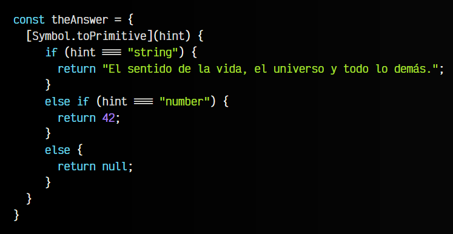

# Tipos de datos en Javascript
En Javascript disponemos de muchos tipos de datos, sin embargo, se suelen catalogar en dos grupos: tipos de datos primitivos (básicos) y tipos de datos no primitivos (complejos).

## Tipos de datos primitivos
Para empezar, nos centraremos en introducir los tipos de datos numéricos, de texto y booleanos, denominados los tipos de datos primitivos de Javascript. En próximos temas iremos descubriendo más detalles sobre cada uno de ellos y profundizando en cada sección.

Para saber que tipo de dato tiene una variable, debemos observar el valor que le hemos dado.

  -  Si es un valor numérico, será de tipo number.
  -  Si es un valor de texto, será de tipo string.
  -  Si es verdadero o falso, será de tipo boolean.

Veamos un ejemplo en el que identificaremos que tipo de dato tiene cada variable:

Como se puede ver, estos son los tipos de datos primitivos básicos de Javascript. Cada uno de ellos tiene sus particularidades, sus características y una serie de operaciones que se puede realizar con ellos. Las iremos viendo a lo largo de los diferentes temas.

## El tipo de dato undefined
Por otro lado, existe un tipo de dato especial denominado undefined (sin definir). Este es el valor que tienen las variables a las que no se les ha dado ningún valor específico (es decir, que están sin definir).

Tanto notDefined como sinDefinir no se han definido y tienen el valor undefined.

## El valor especial null
El valor especial null indica la ausencia intencional de información. Es decir, a diferencia de undefined, que indica que el valor aún no se ha definido, null indica que el valor ha sido definido explícitamente, pero representa una ausencia de valor.

Veamos un ejemplo con la variable selectedUser de la reserva de una habitación, donde se puede observar el matiz:

En el primer caso, la variable selectedUser tiene el valor undefined indicando que posiblemente el usuario aún no ha sido seleccionado (no se ha realizado la asignación de un huésped a esa habitación). En el segundo caso, la variable selectedUser tiene el valor null, indicando que el usuario ha sido seleccionado intencionalmente, pero no es ningún usuario (la habitación está vacía, no tiene huésped).

## Tipos de datos no primitivos
Al margen de los tipos de datos que hemos visto hasta ahora, en Javascript cualquier tipo de dato no primitivo se considera un object, lo que suele indicar que se trata de un tipo de dato más complejo.

Veamos un ejemplo de tipos de datos no primitivos:

En estos dos casos, los tipos de datos de cada constante se consideran object, ya que son tipos de datos primitivos, y como vemos más adelante, más concretamente el primero es un Objeto y el segundo un Array.
Nos encontraremos que muchas veces no resulta tan sencillo saber cuál es el tipo de dato de una variable o constante. Por ejemplo, cuando una función devuelve un valor que en principio desconocemos.

Hay varias formas de saber que tipo de dato tiene una variable en Javascript.

## El operador typeof
Si tenemos dudas, podemos utilizar la función typeof, que nos devuelve el tipo de dato primitivo de la variable que le pasemos por parámetro. Veamos que nos devuelve typeof sobre algunas variables:

Como se puede ver, mediante la función typeof podremos determinar que tipo de dato se esconde en una variable. Observa también que la variable notDefined, al haber sido declarada sin valor, Javascript le da un tipo de dato especial: undefined (sin definir).

OJO: La función typeof no nos servirá para variables con tipos de datos más complejos, ya que siempre los mostrará como object y no sabremos exactamente el tipo de dato concreto:

Como veremos a continuación, para esto puede ser mejor utilizar constructor.name.

## La propiedad constructor.name
En muchos casos, nos encontraremos que typeof resulta insuficiente porque en tipos de datos más avanzados simplemente nos indica que son objetos, pero no sabes que clase de objeto específico. Con constructor.name, que es una parte de la Orientación a objetos podemos obtener el tipo de constructor que se utiliza, un concepto que veremos más adelante dentro del tema de clases.

De momento, si lo necesitamos, podemos comprobarlo así:

Observa que en tipo de datos no primitivos, que veremos más adelante, como los arrays, no nos dice object como hacía el typeof, sino que nos devuelve específicamente Array.

## Cadena de prototipos
Para entender un poco mejor todo esto, debemos saber que Javascript funciona de modo que cada elemento tiene una cadena de prototipos, esto es, cada elemento hereda de otros elementos. Observa el siguiente ejemplo de código, donde la función getPrototypeChain() devuelve una lista de prototipos de un elemento pasado por parámetro:

Observa que los prototipos de "Hola" (un String) son String, Object y null. Esto quiere decir que "Hola" hereda de los prototipos String, Object y null. Por otro lado, los prototipos de 42 son Number, Object y null. Algunas consideraciones interesantes sobre esto:

    1️⃣ El primer prototipo es el tipo de dato de la variable. Por ejemplo, String en el primer ejemplo.
    2️⃣ Como String, puede usar todas las operaciones para String (lo veremos más adelante).
    3️⃣ El segundo prototipo es un Object, por lo que también puede usar las operaciones de Objet.
    4️⃣ Por último, null es el terminador de la cadena de prototipos. Simplemente hemos llegado al final.

## El operador instanceof
Ahora que conocemos el concepto de cadena de prototipos también podemos utilizar instanceof para saber si una variable hereda de uno de los tipos que hemos visto en el apartado anterior. Por ejemplo:

Pero al igual que con vimos con typeof, hay una desventaja. Mientras que typeof sólo sirve para tipos de datos primitivos, instanceof sólo sirve para tipos de datos no primitivos.

## Conversiones de tipo de dato
En Javascript, podemos forzar que valores de un tipo de dato se conviertan a otro, simplemente escribiendo el tipo de dato como si fuera una función. Por ejemplo, observa este caso donde convertimos un número en un String:

Podemos hacer esto con múltiples tipos de datos como por ejemplo Number(), String(), Boolean(), RegExp(), Array() y muchos más, aunque lo más habitual es que, de usarlo, lo hagamos con los tres primeros. Hablaremos de las conversiones de tipos de datos más adelante, pero de momento nos sirve con esto para continuar.

## Valores Falsy y Truthy
En Javascript, cuando trabajamos con valores BOOLEANOS  es fácil predecir cuando un valor es verdadero o falso. Sin embargo, cuando trabajamos con valores que no son booleanos, y los utilizamos  como booleanos, es más complejo determinar que valor tienen, pudiendo ocurrir cosas inesperadas.

Se le llama Falsy a un valor que aunque realmente no es un booleano false se comporta como tal. Por el lado opuesto, los valores Truthy son valores que aunque no sean booleanos, se comportan como un booleano true. JavaScript tiene reglas específicas para determinar si un valor es truthy o falsy:

   - Cualquier valor boolean false, obviamente, se considera false.
   - Cualquier valor number que sea 0, incluyendo 0.0 o 0n (bigint).
   - Cualquier valor string que sea una cadena vacía ("").
   - Los valores especiales null, undefined y NaN también se consideran false.
   - El resto de valores, se consideran truthy.

Observa el siguiente ejemplo, donde estamos forzando números para convertirlos en booleanos y comprobar el valor que devuelve:

Como puedes ver, y como pasa en muchos lenguajes de programación, un valor numérico que es 0 equivale a false mientras que cualquier otro equivale a true. En este ejemplo se puede ver claramente, porque estamos realizando la conversión de forma explícita.

Sin embargo, hay situaciones donde esa conversión no se realiza de forma explícita, y puede que no se aprecie bien. Veamos estos ejemplos con Number y String:

Como puedes ver, los casos donde se realiza la conversión de forma implícita son más difíciles de predecir, por lo que hay que tener mucho cuidado. Observa ahora los siguientes casos que quizás podrían confundirte, ya que son casos engañosos que aparentan cosas distintas a las que son:

En Javascript hay que tener mucho cuidado con estas conversiones implícitas, ya que pueden generar resultados engañosos e impredecibles. Una buena práctica es utilizar siempre el comparador de identidad === en lugar del comparador de igualdad ==, ya que el primero compara también el tipo de dato, y por lo tanto evita muchos errores, pero esto lo veremos un poco más adelante, en el apartado de Operadores de comparación.

## ¿Qué es un Symbol?
En Javascript, existe un tipo de dato llamado Symbol que no suele ser muy conocido. Se trata de una forma alternativa de crear identificadores únicos que ofrece algunas ventajas y garantías sobre usar nombres o números.

Antes de ver un ejemplo práctico, vamos a entender como funcionan los Symbol, ya que su funcionamiento es realmente simple:

Declarando un Symbol() y pasándole por parámetro un String, Javascript creará un símbolo (identificador único) para ese texto y lo devuelve como resultado. Es una forma rápida y simple de tener algo realmente único. Además, es inmutable, por lo que no podemos modificarlo intencional ni accidentalmente.

Observa que en la última línea, a pesar de crear dos símbolos con el mismo String, los dos objetos realmente no son el mismo, son diferentes porque son únicos.

Si lo que queremos es comprobar si su parámetro es el mismo, podemos acceder a su descripción:

Veamos ahora, donde puede resultar interesante utilizar estos símbolos.

## Crear identificadores únicos
Vamos a crear un ejemplo de un videojuego. De momento, no vamos a utilizar Symbol , sino que utilizaremos String como identificadores «supuestamente únicos» para los tipos de enemigos del videojuego:

Observa que utilizando String la responsabilidad de «recordar los nombres» de los ID de los enemigos corre de parte del programador. En este caso, el programador ha olvidado que existe otro esqueleto, y en lugar de establecer GLEAMING_SKELETON (caso ideal) ha establecido SKELETON (que es el mismo identificador que el primero que ya existía).

Por lo tanto, si más tarde buscamos el esqueleto resplandeciente por su identificador, nos devolverá el primero que encuentre, es decir, el SKELETON original (y no el último que hemos añadido).

Veamos ahora esta aproximación utilizando Símbolos, que recordemos que son únicos:

Observa que al nuevo elemento le hemos asignado un símbolo que tiene SKELETON como descripción, igual que el esqueleto original. Sin embargo, como los símbolos son únicos, se consideran diferentes. Recuerda que simplemente los estamos metiendo en constantes (o en un objeto o una estructura más organizada) para mejorar su semántica y organización.

## Crear símbolos globales
Los símbolos anteriores son locales. Es decir, sólo existen dentro de un ámbito concreto. Pero también podemos crear símbolos globales para que existan en un ámbito global de nuestra aplicación, incluso fuera de los módulos de Javascript.

Por otro lado, también podemos usar Symbol.keyFor() para pasar un símbolo global y obtener el String pasado como descripción:

## Símbolos conocidos
En Javascript, internamente, se utilizan símbolos para el funcionamiento de ciertas características del lenguaje. Por ejemplo, puedes utilizar símbolos concretos para definir iteradores o para devolver valores primitivos, entre muchos otros.

Veamos algunos ejemplos, como por ejemplo, Symbol.iterator o Symbol.toPrimitive.

## Símbolo Symbol.iterator
El símbolo Symbol.iterator se utiliza para definir como iterar un objeto. Observa el siguiente fragmento de código, donde hemos creado un objeto counter que tiene las propiedades start y end. La idea es que ese objeto pueda recorrerse entre esos dos elementos.

Observa también que tiene una una función que utiliza el símbolo Symbol.iterator para definir como debe iterarse el objeto:

Ahora, al tener definido ese métod next(), podemos iterar sobre el objeto counter utilizando un bucle for...of o incluso desestructurando:

De la misma forma que tenemos Symbol.iterator, podemos utilizar Symbol.asyncIterator para definir un iterador asíncrono que utiliza operaciones que son propiamente asíncronas.

## Símbolo Symbol.toPrimitive
Otro símbolo conocido es Symbol.toPrimitive, mediante el cuál podemos definir funciones que se ejecutarán cuando se esté realizando una conversión implícita al tipo de dato en cuestión.

Por ejemplo, observa este fragmento de código donde hemos creado un objeto llamado theAnswer:

Al definir el símbolo Symbol.toPrimitive como función, mediante su parámetro podemos definir la lógica a ejecutar dependiendo del tipo de dato al que se convierta.

Por ejemplo, ahora podemos hacer lo siguiente:

