# ¿Qué es una variable numérica?
En Javascript, crear variables numéricas es muy sencillo, pero hay muchísimos matices que se deben conocer y que necesitamos dominar para trabajar correctamente con números y anticiparnos a posibles situaciones.

En Javascript, los números son uno de los tipos de datos básicos (tipos primitivos), que, para crearlos, simplemente basta con escribirlos literalmente. No obstante, como en Javascript todo se puede representar con objetos (como veremos más adelante) también se pueden declarar mediante la palabra clave new:

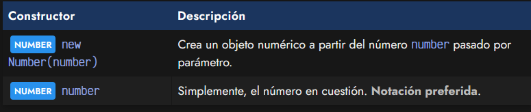

Sin embargo, aunque existan estas dos formas de declararlas, no se suele utilizar la notación new con números, ya que es bastante más tedioso y complicado, por lo que lo preferible es utilizar la notación de literales:

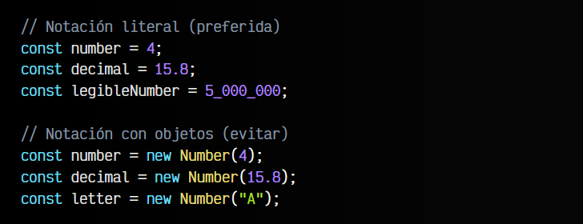

Observa que los números con decimales, en Javascript los separamos con un punto ( . ), mientras que de forma opcional, podemos utilizar el guión bajo ( _ ) para separar visualmente y reconocer las magnitudes que usamos, teniendo en cuenta que para Javascript es lo mismo:

Cualquier parámetro pasado al new Number() que no sea un número (por ejemplo, la "A"), dará como resultado un valor NaN (Not A Number), algo en lo que profundizaremos un poco más adelante, en el tema ¿Qué es NaN (Not A Number)?.

También hay casos, donde un número muy grande (o muy pequeño) tenga un comportamiento extraño, como el siguiente:

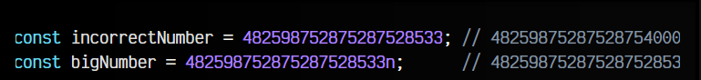

Observa que incorrectNumber no muestra realmente el mismo número, sino que es diferente. Sin embargo, si le añadimos una n al final, si que guarda la cantidad exacta.

   - En el primer caso, estamos guardando un número más grande de los que Javascript puede representar, entonces pierde precisión. Hablaremos de ello en el siguiente apartado.

   - En el segundo caso, en lugar de crear un tipo Number, añadiendo la n creamos un tipo BigInt, del que hablaremos más adelante, en el tema BigInt en Javascript.

## Rangos numéricos seguros
Algo que hay que tener muy claro en Javascript (y en general, en programación, ya que no es algo propio de Javascript) es que cuando trabajamos con datos numéricos, es posible que ciertos números no se puedan representar exactamente, y no sean tan precisos como nos gustaría. Esto ocurre porque se guardan en un formato llamado coma flotante de doble precisión.

Observa la siguiente gráfica donde se puede ver claramente:

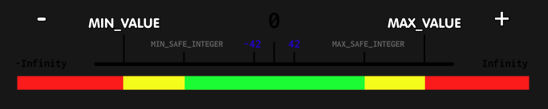

Fíjate en la gráfica de color inferior:

   - Los números en la franja verde se pueden usar con seguridad.
   - Los números en la franja amarilla al operarse con otros podrían no ser seguros.
   - Los números de la franja roja no se pueden representar.

Existe una serie de constantes definidas en relación a este tema, que marcan los límites mínimo o máximo. Veamos cuales son y su significado:

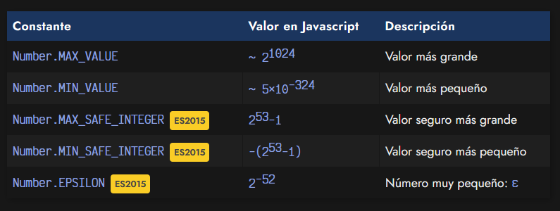

El valor Number.EPSILON es un número que se suele utilizar para representar cantidades matemáticas muy pequeñas. Por otro lado, la diferencia entre Number.MAX_VALUE y Number.MAX_SAFE_INTEGER es que, el primero es el valor máximo que es posible representar en Javascript. Por otro lado, el segundo es el valor máximo para realizar cálculos con seguridad en Javascript.

## Valores infinitos en Javascript
Si simplemente quieres representar un número muy alto, sin importar el valor en sí, puedes utilizar la constante Infinity. De la misma forma, la constante -Infinity se puede utilizar para valores muy bajos donde no importa el valor en sí:

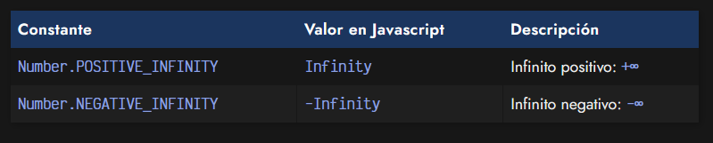

Los valores infinitos se pueden operar con números, pero ten en cuenta las reglas de los infinitos, y que en algunos casos, puede resultar una indeterminación, por lo que nos dará como resultado NaN (not a number).

## Comprobaciones numéricas
Si queremos conocer la naturaleza de una variable numérica (número finito, número entero o número seguro), las podemos comprobar con uno de los métodos estáticos de Number que tenemos a continuación:

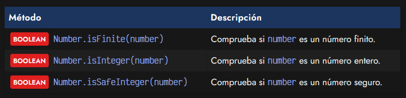

Ten en cuenta que estas funciones devuelven un boolean(verdadero o falso), lo que lo hace ideales para usarlas como condiciones en bucles o condicionales. A continuación veamos dos ejemplos para cada una de estas funciones:

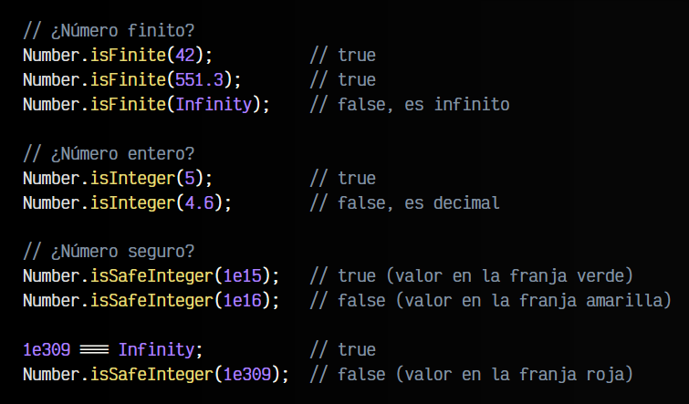

Ten en cuenta que la notación 1e5 significa «5 ceros seguidos de un 1», es decir, 100000.

## Representación numérica
En Javascript tenemos dos formas de representar los números: la notación exponencial (basada en potencias de 10) y la notación de punto fijo (una cantidad de dígitos para la parte entera, y otra para la parte decimal).

Podemos cambiar entre ellas utilizando los siguientes métodos:

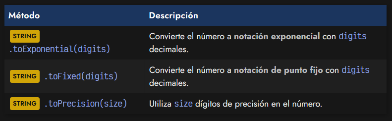

Además, observa el método .toPrecision() mediante el cuál puedes cambiar la precisión de un número. Observemos ahora el siguiente ejemplo aplicando las funciones anteriores al número decimal 1.25 y al 523.75 para cambiar la precisión:

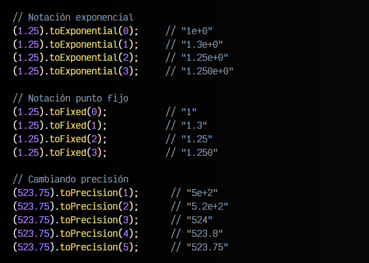

No olvides que en todos los casos, el número se convierte a tipo de dato String.

## ¿Qué es NaN (Not A Number)?
El acrónimo NaN es un valor especial de Javascript que significa literalmente Not A Number (No es un número). Sin embargo, no hay que dejarse llevar por su significado literal, ya que nos podría dar lugar a malentendidos. El valor NaN, a pesar de su significado, se usa para representar valores numéricos (y ahora es donde viene el matiz) que son indeterminados o imposibles de representar como número.

Dentro de esa categoría hay varios:

   - Indeterminación matemática: Por ejemplo, 0 / 0.
   - Valores imposibles: Por ejemplo, 4 - 'a', ya que es imposible restar una letra a un número.
   - Operaciones con NaN: Por ejemplo, NaN + 4, ya que el primer operando es NaN.

Uno de los más frecuentes es el segundo, ya que Javascript es un lenguaje flexible que no requiere tipos. Eso, unido a que la mayoría de datos que extraemos de una página web se obtienen como String, da como resultado operaciones de ese tipo, o concatenaciones inesperadas.

Por aquí puedes encontrar las propiedades y métodos relacionados con NaN que existen:

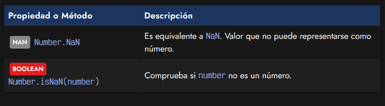

Observa que aunque NaN es un valor global, también existe un Number.NaN como propiedad de Number, para tenerlo modularizado y encapsulado como propiedad estática en el objeto Number.

## Todos los NaN son diferentes
Como hemos dicho, el valor NaN se utiliza para intentar representar un valor que no se puede representar. Sin embargo, no podemos compararlo literalmente con NaN, sino que tenemos que usar la función Number.isNaN():

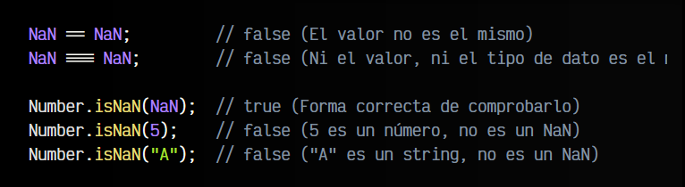

Recuerda que aunque desafortunamente, NaN significa Not A Number (no es un número), pero NaN sí que es un valor numérico, lo que ocurre es que ese valor no es representable de forma numérica:

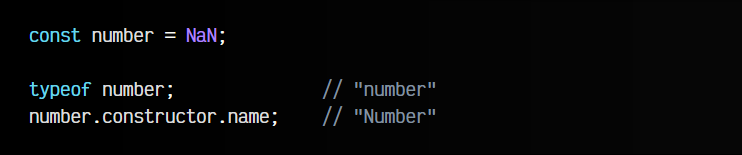

## Conversiones de valores NaN
Si intentamos convertir un valor NaN a otro tipo de dato primitivo utilizando un typecast (forzar conversión explícita), nos encontraremos lo siguiente:

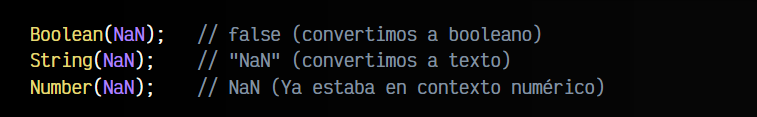

