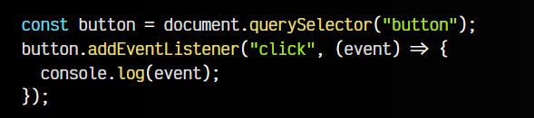
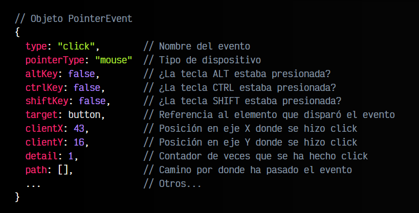
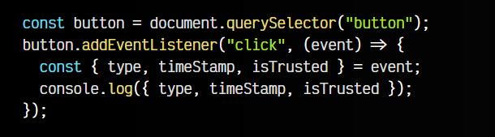
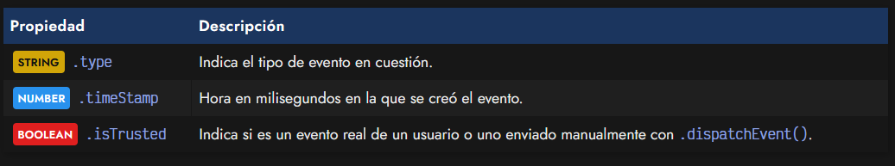
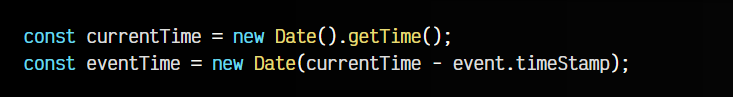
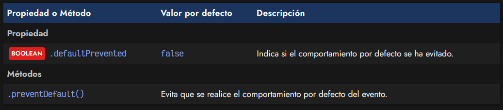
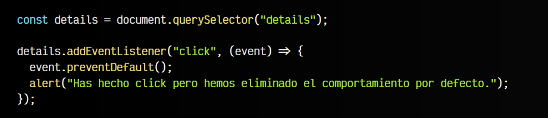

# 
El objeto Event.

Cuando se disparan ciertos eventos, hay casos en los que nos podría interesar obtener información relacionada con la naturaleza del evento en cuestión. Por ejemplo, si estamos escuchando un evento de tipo click de ratón, nos podría interesar saber con que botón del ratón se ha hecho click, en que punto concreto de la pantalla se ha hecho click, etc.

Estos detalles se pueden obtener de forma opcional a través de un objeto event que se proporciona en la función asociada al evento. Para ello, sólo es necesario indicar un primer parámetro en la función que gestiona el evento, y dicho parámetro, será de tipo evento con dicha información asociada.

Observa el siguiente ejemplo de código:

Simplemente se trata de una función que escucha los eventos de tipo click en un <button>
</button> button del HTML. Observa que la función asociada tiene el parámetro event. Si hacemos click en el botón, en la consola se nos mostrará la información de este evento, que en nuestro ejemplo anterior está basado en PointerEvent, ya que click es un evento realizado con un puntero (generalmente, de ratón).

Dicho evento contiene una serie de propiedades interesantes a la hora de trabajar con el evento en cuestión, y dependen del tipo de evento. Por ejemplo, en el ejemplo anterior hemos gestionado un evento click, por lo que el tipo de evento asociado es PointerEvent, y conlleva una serie de propiedades que no tienen porque estar presentes en otros tipos de eventos.

En nuestro ejemplo anterior, contendrían algo parecido a lo siguiente:

Ten en cuenta que en este caso, se trata de un objeto PointerEvent porque el evento que estamos escuchando es un evento click de un dispositivo que permite apuntar. Sin embargo, si utilizaramos otro evento, posiblemente obtendríamos un objeto con propiedades diferentes.

## Propiedades del evento.
Veamos algunas de la propiedades comunes, que están disponibles en cualquier tipo de evento. Ampliemos un poco la escucha del evento anterior, donde vamos a observar el contenido de cada una de las siguientes propiedades básicas:

Como se puede ver, [desestructuramos](https://lenguajejs.com/javascript/objetos/desestructuracion-objetos/) las tres propiedades siguientes del objeto event y las mostramos a través de una sentencia console.log(), de modo que podamos ver su contenido.

Analicemos cada una de ellas.

## Tipo de evento (type).
Mediante la propiedad .type podemos obtener el tipo de evento. Esto es, simplemente, el nombre del evento con el que escuchamos en el .addEventListener(), o en el caso de un [evento personalizado](https://lenguajejs.com/javascript/eventos/custom-events/), el establecido en el primer parámetro de la instancia del new CustomEvent().

En el ejemplo inicial de este artículo estabamos escuchando un evento nativo donde type sería click.
## Tipo de evento (type).
La propiedad .timeStamp devuelve NUMBER un donde tenemos el número de milisegundos transcurridos desde que se creó el evento. Generalmente, para que esto sea sencillo de gestionar, podemos hacer lo siguiente utilizando la [API de Fechas de Javascript:](https://lenguajejs.com/javascript/fechas/date-fechas-nativas/)

Observa que en la constante currentTime tenemos el timeStamp de la fecha actual, es decir, el número de milisegundos transcurridos desde el 01/01/1970. A ese número de milisegundos, le restaremos el número de milisegundos desde que se creó el evento, y de esta forma, obtendremos justo el momento exacto en el que que se creó.

## Evento de confianza.
Se denomina un evento de confianza al evento que ha lanzado el navegador por una acción del usuario, ya que un desarrollador puede falsear y crear eventos para simular una acción del usuario. La propiedad .isTrusted sirve precisamente para diferenciar uno de otro.

Mediante la propiedad .isTrusted a true podemos saber si el evento en cuestión que estamos examinando es un evento real que ha surgido de una acción del usuario, o de lo contrario, ha devuelto false y es un evento que ha sido emitido mediante código con un .dispatchEvent().

## Evitar la acción por defecto.
Algunos elementos tienen un comportamiento por defecto. Por ejemplo, el elemento 
 muestra el texto del elemento 
, si se pulsa sobre el, se despliega el resto del contenido de 
. Si se vuelve a pulsar, se oculta nuevamente. Ese es su comportamiento por defecto.

Sin embargo, pueden existir situaciones donde queremos que se anule este comportamiento y no se realice. Por ejemplo, para reimplementarlo nosotros, o cambiar su funcionalidad habitual. Para ello, tenemos a nuestra disposición una propiedad y un método que harán que sea muy sencillo:

Mediante el método .preventDefault() se establecerá el flag .defaultPrevented a true y podremos evitar el comportamiento base por defecto de dicho evento y añadirle otro diferente:

De esta forma, veremos que al pulsar sobre el elemento 
 ya no se expande ni se contrae, por lo que ahora podríamos crear nuestra propia lógica para reimplementar esta funcionalidad.

