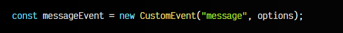
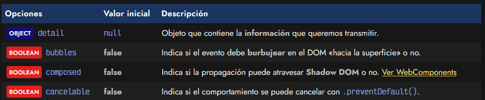
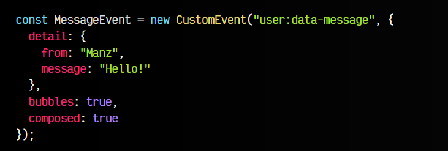
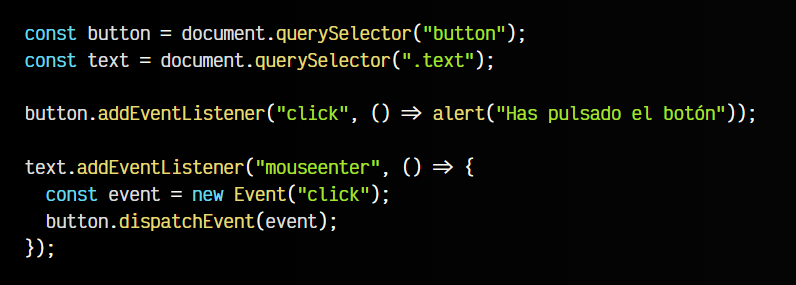
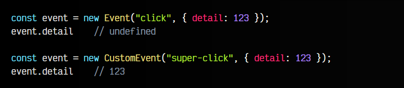

# 
¿Qué son los Custom Events?.

En Javascript, al igual que existen varios eventos nativos que podemos escuchar mediante .addEventListener() como click, keydown o mouseenter, sería fantástico poder crear nuestros propios eventos para que se disparen automáticamente al ocurrir un suceso determinado. Eso es exactamente lo que son los Custom Events (Eventos personalizados).

## Custom Events.
Crear un evento personalizado en Javascript es muy sencillo. Se basa en crear una instancia del objeto CustomEvent, al cuál le pasaremos un STRING con el nombre que le pondremos a nuestro evento. Como segundo parámetro le indicaremos un OBJECT de opciones, que explicaremos más adelante.

Así pues, definir un evento personalizado se haría de la siguiente forma:

En lugar de CustomEvent también se puede indicar simplemente Event (o alguno de sus objetos derivados). La diferencia radica en que CustomEvent se suele utilizar cuando queremos añadir datos personalizados, como vamos a hacer a continuación en las opciones.

## Nombre del evento.
En ejemplos sencillos no suele importar demasiado, pero una buena práctica a largo plazo es comenzar eligiendo una buena convención de nombres para los nombres de eventos, que sea «autoexplicativo» en cuanto la acción que vamos a realizar y a la vez sea coherente y fácil de recordar.

Aunque no hay una forma universal de hacerlo, algunos consejos:

  -  Los eventos son case sensitive, es preferible usar todo en minúsculas.
  -  Evita camelCase, suele inducir a dudas. Si has elegido todo en minúsculas, usa kebab-case.
 -   Usa namespaces y elige un separador: Por ejemplo, user:data-message o user.data-message.

Siempre puedes usar nombres simples si lo deseas, pero si planeas utilizar muchos eventos, es preferible usar namespaces para mantenerlo organizado. En este último caso, se ve claro y se entiende bien: un evento de usuario user, que recibe un data-message.

## Opciones del evento.
El segundo parámetro del CustomEvent es un OBJECT donde podremos especificar varios detalles en relación al comportamiento o contenido del evento.

A continuación, tienes una lista de las propiedades que pueden contener estas opciones:

En el siguiente fragmento de código vemos como se declara una instancia de CustomEvent llamada user:data-message, la cuál tiene ciertas opciones definidas, entre las que se encuentran que:

  -  El evento debe burbujear hacia arriba en el DOM (lo veremos más adelante)
  -  El evento puede atravesar Shadow DOM (útil cuando son WebComponents)
  -  El evento contiene información en el atributo detail

Veamos ahora el código:

Dentro del objeto de opciones, podemos ver que tenemos un objeto detail que es definido por el desarrollador, ya que es el diseñador del evento personalizado. El resto, son opciones del evento que explicaremos más adelante.

## Event vs CustomEvent.
Los eventos nativos Event se suelen utilizar de forma interna por el navegador para crear un evento de navegador disparado por una acción real del usuario. Así pues, si el usuario pulsa en un <button></button> button, el navegador dispara un evento Event que además, siendo más específicos es un evento PointerEvent.

Aún así, nosotros podemos «falsear» un evento de navegador y crearlo nosotros mismos, simulando que ha sido realizado por un usuario real. En el siguiente ejemplo, tenemos dos elementos: un <button></button> button y un  span:

Hemos añadido un evento para que muestre un mensaje cuando hagas click en el <button>. Sin embargo, también hemos añadido otro evento en el  para que cuando muevas el ratón sobre él, cree un nuevo evento de click de ratón y lo envíe al botón. De esta forma, se disparará el otro evento en escucha como si el usuario real hubiera hecho click en el botón.

Al margen de este detalle, normalmente los Event se usan solamente para eventos reales del navegador. Si necesitamos controlar alguna acción determinada utilizaremos CustomEvent, asignándole un nombre de evento y personalizando su funcionamiento.

Por ejemplo, entre otras cosas, los CustomEvent permiten añadir información adicional al crear el objeto, mientras que el objeto Event no lo permite.