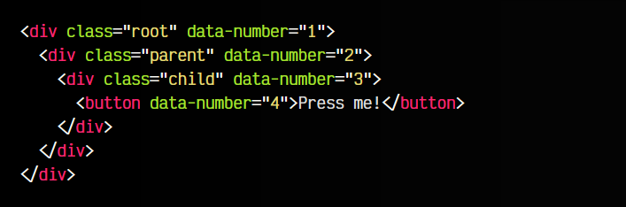

# 
Emisión de eventos.

En principio, puede parecer que emitir eventos en Javascript sea tarea fácil (y lo es), pero la emisión de eventos tiene muchos detalles que merece la pena abarcar en profundidad para entenderlos bien y no llevarnos sorpresas por no saber como funciona realmente.

Para verlo más claro, vamos a partir de un fragmento de código donde tenemos tres elementos 
 anidados, es decir, uno dentro de otro. Lo utilizaremos de base para los ejemplos:

Un poco más adelante, haremos lo siguiente:

   - El primer 
 tiene clase .root (abuelo), lo numeraremos con un 1
   - El segundo 
 tiene clase .parent (padre), lo numeraremos con un 2
   - El tercer 
 tiene clase .child (hijo), lo numeraremos con un 3
  
## ¿Cómo emitir eventos?.
Para emitir eventos en Javascript, lo primero y obvio es que necesitaremos crear un evento, que puede ser de varios tipos:

  - [ver eventos nativos](https://lenguajejs.com/javascript/eventos/objeto-event/) 
  - ver eventos [especificos del navegador](https://lenguajejs.com/javascript/eventos/eventos-navegador/)
  - ver [eventos personalizados](https://lenguajejs.com/javascript/eventos/custom-events/)
  
Una vez creado, podremos emitirlo hacia un elemento HTML utilizando la función dispatchEvent(). Dependiendo de lo que queramos hacer, tenemos varias opciones al emitir el evento:

  -  Enviar el evento directamente a un elemento específico
  -  Enviar el evento a un elemento específico y que burbujee hacia sus contenedores padres
  -  Enviar el evento a un elemento específico, que burbujee hacia sus padres, capturarlo y procesarlo en la vuelta

Analicemos cada una de estas formas.

## Emisión directa de un evento.
La primera forma, y la más básica, sería emitir el evento directamente a un elemento del DOM:

   - Creamos un evento. En nuestro ejemplo vamos a hacerlo con un CustomEvent.
   - Seleccionamos un elemento del DOM para enviárselo.
   - Lo emitimos hacia él usando .dispatchEvent().

El fragmento de código en cuestión sería el siguiente:

En este caso, al pulsar el botón, se ha emitido el evento a ese mismo elemento del DOM. Si este está escuchando el tipo de evento user:message con .addEventListener(), se disparará y ejecutará la función asociada.

    Este ejemplo quizás no tiene demasiado sentido, ya que es sólo un ejemplo teórico, sin demasiada utilidad práctica en muchos casos. Pero vamos a complicarlo un poco para hacerlo más interesante.

## Propagacion de eventos (bubles).
Vamos con el segundo caso, una emisión de eventos donde existe propagación. Esta modalidad es exactamente igual a la anterior, sólo que tenemos definida la opción bubbles a true, por lo que el evento no sólo se emitirá al elemento indicado, sino que además de ello, luego comenzará a emitirse sucesivamente a sus contenedores padres hasta llegar al tope.

Para verlo claramente, vamos añadir unos atributos data-number en el marcado HTML. Esto no es más que unos [metadatos de marcado HTML](https://lenguajehtml.com/html/introduccion/atributos-comunes-html/) que podremos obtener desde Javascript más adelante:

En tercer lugar, seguimos emitiendo el evento al elemento button <button></button>, la diferencia es que ahora escuchamos el evento en el elemento .root para comprobar si se ha propagado hasta él. En la modalidad directa anterior, si lo hicieramos, no recibiría nada. Pero en esta modalidad, donde hay propagación de eventos, si efectivamente el evento se está propagando, debería recibirlo:

Al establecer bubbles a true, en lugar de emitir el evento y detenerse en ese mismo elemento, el evento se irá propagando por cada uno de sus padres, hasta llegar al elemento padre del documento:

   - El evento se emite al <button></button> button.
   - El evento se propaga al elemento 
 div con clase .child.
   - El evento se propaga al elemento 
div con clase .parent.
   - El evento se propaga al elemento 
div con clase .root.
   - El evento se propaga al elemento <body>body, que es el contenedor que contiene todo el documento.
   - El evento se propaga al elemento <html>html, que es el contenedor de toda la página HTML.
   - El evento se propaga al elemento document, que es el que representa todo el DOM.
   - Finalmente, el evento se propaga al elemento Window, que es la referencia a la pestaña actual del navegador.

Observa también, que hemos utilizado como parámetro de la función event, lo que nos va a dar información sobre el evento. Por ejemplo, mediante event.target podemos acceder al elemento al que se ha emitido originalmente el evento, mientras que con event.detail podemos acceder a la información que se incluyó en el evento al crearlo.

    Podemos indicar expresamente que una propagación de eventos se detenga. Para profundizar en este tema, echa un vistazo al artículo https://lenguajejs.com/javascript/custom-events/propagacion-eventos/.

## Captura de eventos (capture).
Si registraramos como se emiten los eventos del ejemplo anterior, con un .addEventListener() en cada uno de los elementos 
, observaríamos que el orden de recepción de eventos es 3, 2, 1, es decir, primero se disparan los eventos en los elementos interiores, y luego en los elementos padres a medida que se burbujea hacia arriba.

Este es el comportamiento por defecto de la fase de burbujeo de Javascript, sin embargo, podemos activar la fase de captura, que invierte el orden. Realmente, lo que hace es ir capturando todos los eventos en cada fase del burbujeo y cuando termina toda la trayectoria de propagación, vuelve sobre sus pasos y realiza el mismo paso pero en orden inverso.

Para ello, solo tenemos que modificar el ejemplo anterior, añadiendo un tercer parámetro en el .addEventListener() que será un objeto de opciones que contendrá capture a true:

De esta forma, el orden terminaría siendo 1, 2, 3 en lugar de 3, 2, 1.

## Detectar fase del evento.
Si buscamos una forma más directa de saber en que fase nos encontramos, podemos acceder a la propiedad .eventPhase del evento. Esta propiedad nos devolverá un NUMBER que nos dará la fase concreta:

En el caso de devolvernos un valor 1, significa que el evento fue escuchado con el flag capture a true, si devuelve 2 es que el evento fue emitido directamente, y si devuelve 3 es que fue propagado con el flag bubbles a true.