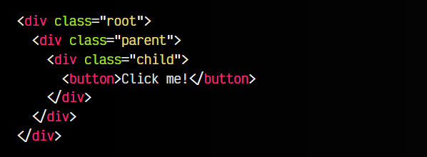
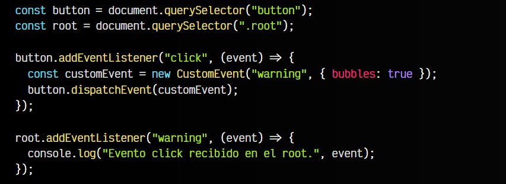
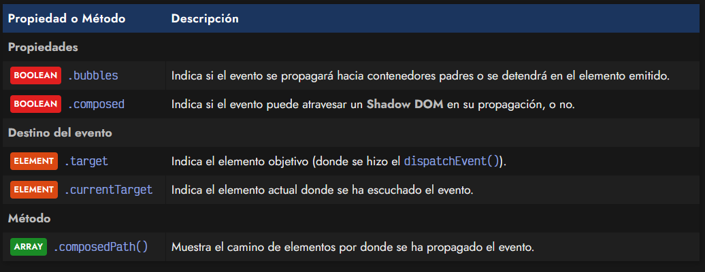
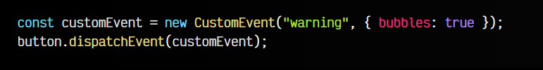
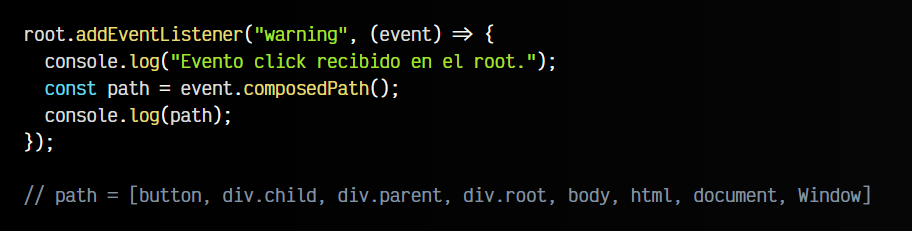
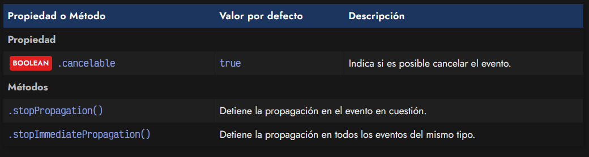
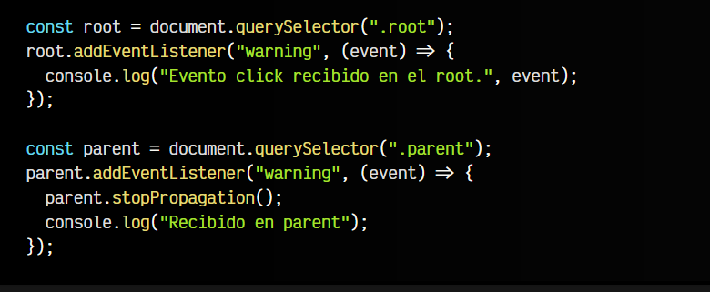

# 
Propagación de eventos.

Ahora que conocemos lo básico sobre los [eventos nativos](https://lenguajejs.com/javascript/eventos/objeto-event/) y los [eventos personalizados](https://lenguajejs.com/javascript/eventos/custom-events/), así como la emisión y propagación de eventos que afecta a ambos, vamos a aprender un poco más sobre esta propagación, como gestionarla, prevenirla y modificarla si es necesario.

En primer lugar, recordemos como gestionamos un evento y su propagación:

Tenemos esta estructura HTML, donde existe un botón dentro de tres elementos div anidados uno dentro del otro en el DOM. Vamos a escuchar los eventos de tipo click en el button y cuando ocurra alguno, crearemos un evento personalizado y lo enviaremos al botón. Como tenemos el bubbles activado, no se detendrá, sino que seguirá propagándose hacia sus contenedores padres:

Observa que al final nos hemos puesto a escuchar los eventos ocurridos en el elemento div raíz, es decir, el primero de todos. Si llega hasta ahí nuestro evento personalizado, ejecutará el console.log() mostrando dicho evento. De no tener el bubbles a true, el custom event nunca se habría propagado hasta al elemento root, sino que se habría quedado en el el elemento button <button></button>.

## Propagación de eventos.
Vamos a analizar como funciona la propagación de eventos en Javascript. Los eventos tienen una serie de propiedades que analizaremos a continuación. Son las siguientes:

Centremonos en el fragmento de código anterior, donde creamos el evento personalizado y establecemos si se va a propagar el evento. En el caso anterior, hemos activado la propiedad bubbles del segundo parámetro de opciones de la instancia del evento personalizado con new CustomEvent():

## Propagación y Shadow DOM.
Hay que tener en cuenta que pueden ocurrir varias cosas:

   - Si el flag bubbles está desactivado, el evento se emite a button <button></button> y se detiene ahí.
   - Si el flag bubbles está activado, el evento se emite a button <button></button>, luego a su contenedor padre, y así sucesivamente.
   - Si el flag composed está desactivado, el evento se detendrá al encontrar un Shadow DOM.
   - Si el flag composed está activado, el evento no se detendrá si encuentra un Shadow DOM.
  
## Trayectoria de propagación.
Si tienes dudas, una buena forma de comprobar el camino que ha seguido el evento emitido con bubbles es ejecutando el método .composedPath(). Este nos mostrará por donde ha ido pasando el evento:

Observa que la constante path tiene un ARRAY con los elementos por donde ha ido pasando. En primer lugar, el evento fue emitido al button, luego a su padre .child, luego a su padre .parent, luego a su padre .root, luego al body, luego al html y por último al document (el documento actual) y Window la pestaña actual del navegador.

Por otro lado, la propiedad .target nos dará el elemento desde donde se emitió el evento, button en nuestro caso, y la propiedad .currentTarget nos devolverá el elemento actual en el que se encuentra, .root en nuestro caso.

## Detener la propagación.
Por defecto, los eventos nativos tienen la propiedad .cancelable a true. Esto significa que los eventos pueden cancelar su propagación utilizando los métodos .stopPropagation() o .stopImmediatePropagation().

Vamos a modificar el ejemplo inicial que teníamos, y añadir un evento en el elemento intermedio .parent que cancele la propagación de eventos mediante .stopPropagation(). Esta detención de la propagación de eventos en .parent debería evitar que el evento llegue hasta .root, a pesar de tener el flag bubbles activo.

La diferencia de .stopPropagation() y .stopImmediatePropagation() es que este último detiene la propagación en todos los eventos de su mismo tipo, mientras que el primero sólo detiene el evento concreto donde lo escribimos. Recuerda que para que estos métodos funcionen, el evento debe tener el flag .cancelable a true.
